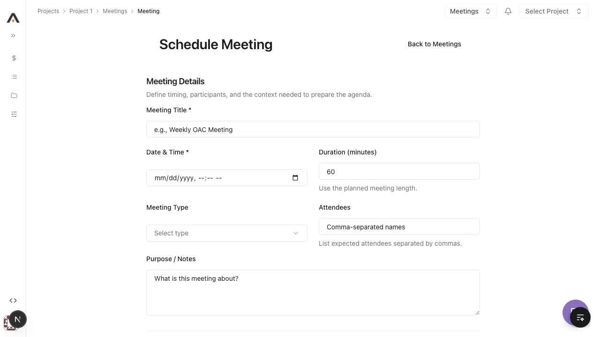

# Form Pages Audit

_Last updated: 2026-03-11_

## Status legend

- `Verified`: Manually checked in the browser during this pass.
- `Pass`: Visually consistent with the current shared form shell.
- `Partial`: Mostly aligned, but still has visible bespoke styling or layout drift.
- `Needs follow-up`: Clearly off the target system and should be migrated further.

## Screenshot evidence

## Form pages

| Route | Page file | Verification | Consistency | Screenshot | Notes |
|---|---|---|---|---|---|
| `/form-template` | `frontend/src/app/(main)/form-template/page.tsx` | Verified | Needs follow-up | `frontend/public/images/docs/form-audit-2026-03-11/form-template.png` | Not a clean canonical template yet. The audit card and embedded screenshot dominate the page and distort the reference layout. |
| `/create-project` | `frontend/src/app/(main)/create-project/page.tsx` | Verified | Pass | `frontend/public/images/docs/form-audit-2026-03-11/create-project.png` | Now uses the shared page shell and shared section/action treatment. |
| `/[projectId]/budget/line-item/new` | `frontend/src/app/(main)/[projectId]/budget/line-item/new/page.tsx` | Verified | Partial | `frontend/public/images/docs/form-audit-2026-03-11/budget-line-item-new.png` | Special-case table form is acceptable, but the footer/button treatment still drifts from the standard action bar. |
| `/[projectId]/change-events/new` | `frontend/src/app/(main)/[projectId]/change-events/new/page.tsx` | Verified | Pass | `frontend/public/images/docs/form-audit-2026-03-11/change-events-new.png` | Wide form, but spacing, labels, and section rhythm are aligned well. |
| `/[projectId]/change-orders/new` | `frontend/src/app/(main)/[projectId]/change-orders/new/page.tsx` | Verified | Pass | `frontend/public/images/docs/form-audit-2026-03-11/change-orders-new.png` | Matches the shared shell closely. |
| `/[projectId]/commitments/new?type=subcontract` | `frontend/src/app/(main)/[projectId]/commitments/new/page.tsx` | Verified | Partial | `frontend/public/images/docs/form-audit-2026-03-11/commitments-new-subcontract.png` | Shared page shell is working, but internal section/collapse patterns are still bespoke. |
| `/[projectId]/commitments/new?type=purchase_order` | `frontend/src/app/(main)/[projectId]/commitments/new/page.tsx` | Verified | Partial | `frontend/public/images/docs/form-audit-2026-03-11/commitments-new-purchase-order.png` | Major wrapper-card drift is removed; some internal field composition is still bespoke. |
| `/[projectId]/commitments/configure` | `frontend/src/app/(main)/[projectId]/commitments/configure/page.tsx` | Verified | Partial | `frontend/public/images/docs/form-audit-2026-03-11/commitments-configure.png` | Navigation and card treatment are improved, but it still reads as a settings surface more than a true form page. |
| `/[projectId]/direct-costs/new` | `frontend/src/app/(main)/[projectId]/direct-costs/new/page.tsx` | Verified | Pass | `frontend/public/images/docs/form-audit-2026-03-11/direct-costs-new.png` | Wide special-case form, but the current shell and field rhythm are consistent. |
| `/[projectId]/estimates/new` | `frontend/src/app/(main)/[projectId]/estimates/new/page.tsx` | Verified | Pass | `frontend/public/images/docs/form-audit-2026-03-11/estimates-new.png` | Clean alignment with the current form system. |
| `/[projectId]/invoices/new` | `frontend/src/app/(main)/[projectId]/invoices/new/page.tsx` | Verified | Partial | `frontend/public/images/docs/form-audit-2026-03-11/invoices-new.png` | Tabbed flow works, but the surface still has some custom composition compared with the simpler shared pages. |
| `/[projectId]/invoicing/new` | `frontend/src/app/(main)/[projectId]/invoicing/new/page.tsx` | Verified | Pass | `frontend/public/images/docs/form-audit-2026-03-11/invoicing-new.png` | Good match for the shared shell. |
| `/[projectId]/meetings/schedule` | `frontend/src/app/(main)/[projectId]/meetings/schedule/page.tsx` | Verified | Pass | `frontend/public/images/docs/form-audit-2026-03-11/meetings-schedule.png` | Migrated in this pass and now aligns with the system. |
| `/[projectId]/prime-contracts/new` | `frontend/src/app/(main)/[projectId]/prime-contracts/new/page.tsx` | Verified | Partial | `frontend/public/images/docs/form-audit-2026-03-11/prime-contracts-new.png` | Split layout is still specialized, but the section headings and page width are now much closer to the shared system. |
| `/[projectId]/prime-contracts/configure` | `frontend/src/app/(main)/[projectId]/prime-contracts/configure/page.tsx` | Verified | Partial | `frontend/public/images/docs/form-audit-2026-03-11/prime-contracts-configure.png` | Simpler than commitments configure, but still reads as a bespoke settings page. |
| `/[projectId]/rfis/new` | `frontend/src/app/(main)/[projectId]/rfis/new/page.tsx` | Verified | Pass | `frontend/public/images/docs/form-audit-2026-03-11/rfis-new.png` | Shared spacing and section treatment are consistent. |

## Notes

- This tracker reflects an actual browser pass against the authenticated app on `http://localhost:3010` using project `1`.
- Complex budget, direct cost, contract, and commitment forms can be wider than standard forms, but they should still keep the same header rhythm, section dividers, field spacing, and action bar treatment.
- Highest-priority follow-up pages are `commitments/configure`, `commitments/new?type=subcontract`, `commitments/new?type=purchase_order`, and `prime-contracts/new`.
