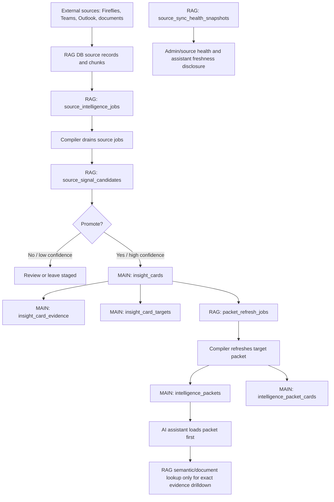

# Intelligence Table Cleanup Plan

Last updated: 2026-06-09

Current state: the MAIN mirror tables for `source_intelligence_jobs`,
`source_signal_candidates`, and `packet_refresh_jobs` were archived on
2026-06-09. Their live MAIN names no longer exist.

## Executive Summary

The current intelligence schema is too hard to reason about because it mixes
product-facing intelligence, backend compiler queues, staging candidates,
observability snapshots, stale MAIN database mirrors, and legacy risk tables.

The cleanup direction is:

- MAIN / PM APP keeps product-facing intelligence that the app and assistant read.
- RAG / AI Database keeps compiler infrastructure, source staging, health, and
  high-churn processing tables.
- MAIN mirror copies of RAG-owned queues should be deleted after the final
  reference and backup audit.
- Empty or unclear tables should either get a real owner/UI now or be archived.

## Table Decisions

| Table | Supabase project | Category | Description | Status |
|---|---|---|---|---|
| `intelligence_targets` | MAIN / PM APP (`lgveqfnpkxvzbnnwuled`) | Product intelligence | Registry of compile-able targets such as client projects. Active targets are the subjects that can receive current packets. | Keep |
| `intelligence_packets` | MAIN / PM APP (`lgveqfnpkxvzbnnwuled`) | Product intelligence | Current compiled briefing/snapshot for an intelligence target. This should be the assistant's first context layer for selected-project questions. | Keep |
| `intelligence_packet_cards` | MAIN / PM APP (`lgveqfnpkxvzbnnwuled`) | Product intelligence join | Join table linking a packet to selected `insight_cards` with section and rank. It is rebuilt on packet refresh and should not be treated as stable identity. | Keep for now |
| `insight_cards` | MAIN / PM APP (`lgveqfnpkxvzbnnwuled`) | Product intelligence | Durable promoted findings: risks, updates, obligations, decisions, follow-ups, document signals, and other project intelligence. | Keep |
| `insight_card_evidence` | MAIN / PM APP (`lgveqfnpkxvzbnnwuled`) | Evidence | Links insight cards to source documents/messages/snippets/pages. This is the audit trail that prevents unsupported AI claims. | Keep |
| `insight_card_targets` | MAIN / PM APP (`lgveqfnpkxvzbnnwuled`) | Attribution | Links insight cards to intelligence targets, including the primary target relationship. | Keep |
| `intelligence_reviews` | MAIN / PM APP (`lgveqfnpkxvzbnnwuled`) | Feedback / review | Human review queue for packet/card/evidence issues. There are insert/read paths, but the table is effectively empty/underused and no complete UI is shipped. | Archive unless review UI is built now |
| `project_risk_snapshots` | MAIN / PM APP (`lgveqfnpkxvzbnnwuled`) | Legacy risk rollup | Per-project risk roll-up snapshots. Existing docs say no clear app-level writer was found. This overlaps with packet/card risk intelligence. | Audit, then likely archive/delete |
| `source_intelligence_jobs` | RAG / AI Database (`fqcvmfqldlewvbsuxdvz`) | Compiler queue | Canonical durable job queue for source-level attribution, signal extraction, card upsert, and packet refresh work. Drained by the Render intelligence compiler cron. | Keep in RAG |
| `source_intelligence_jobs_archive_20260609` | MAIN / PM APP (`lgveqfnpkxvzbnnwuled`) | Archived mirror | Archived former MAIN job queue. The live table name was removed so hidden dependencies fail loudly instead of reading stale data. | Archived |
| `source_signal_candidates` | RAG / AI Database (`fqcvmfqldlewvbsuxdvz`) | Compiler staging | Canonical staging table for extracted signals before promotion to `insight_cards`. | Keep in RAG |
| `source_signal_candidates_archive_20260609` | MAIN / PM APP (`lgveqfnpkxvzbnnwuled`) | Archived mirror | Archived former MAIN candidate table. The live table name was removed so hidden dependencies fail loudly instead of reading stale data. | Archived |
| `packet_refresh_jobs` | RAG / AI Database (`fqcvmfqldlewvbsuxdvz`) | Compiler queue | Canonical queue for regenerating `intelligence_packets`. Written by source promotion and periodic refresh jobs; drained by the compiler cron. | Keep in RAG |
| `packet_refresh_jobs_archive_20260609` | MAIN / PM APP (`lgveqfnpkxvzbnnwuled`) | Archived mirror | Archived former MAIN packet-refresh queue. The live table name was removed so hidden dependencies fail loudly instead of reading stale data. | Archived |
| `source_sync_health_snapshots` | RAG / AI Database (`fqcvmfqldlewvbsuxdvz`) | Observability | Canonical source-sync and compiler-health snapshots. Used for source health, readiness, and pipeline diagnostics. | Keep in RAG |
| `source_sync_health_snapshots` | MAIN / PM APP (`lgveqfnpkxvzbnnwuled`) | Observability summary / duplicate | App-side copy or summary of source health. Keep only if the admin UI truly needs local low-latency reads; otherwise replace reads with a RAG-backed API and delete this copy. | Keep temporarily; replace or delete |

## Clean Workflow



## What Each Layer Is Allowed To Mean

| Layer | Allowed meaning | Not allowed meaning |
|---|---|---|
| RAG source records/chunks | Raw searchable corpus and source metadata. | Final project truth. |
| `source_intelligence_jobs` | Work still to be processed or compiler audit trail. | Assistant-facing context. |
| `source_signal_candidates` | Possible findings before promotion. | Trusted project insight. |
| `insight_cards` | Promoted durable intelligence item. | Full briefing by itself. |
| `insight_card_evidence` | Evidence pointer for a card. | Project-level summary. |
| `insight_card_targets` | Attribution of a card to a target/project. | Evidence source. |
| `packet_refresh_jobs` | Work queue to rebuild a packet. | User-facing state. |
| `intelligence_packets` | Current target briefing and assistant starting context. | Exact clause/source proof. |
| `intelligence_packet_cards` | Packet presentation/order/section selection. | Stable identity or long-term fact. |
| `source_sync_health_snapshots` | Pipeline freshness and source availability. | Project intelligence content. |

## Deletion / Archive Candidates

### Archived On 2026-06-09

- MAIN `source_intelligence_jobs_archive_20260609`
- MAIN `source_signal_candidates_archive_20260609`
- MAIN `packet_refresh_jobs_archive_20260609`

Reason: the stale live MAIN names were removed and replaced with archive names.
That gets them out of the active runtime surface immediately while preserving
recoverability.

### Archive Or Delete After Product Decision

- `intelligence_reviews`
- `project_risk_snapshots`

Reason:

- `intelligence_reviews` has code paths but appears underused without a complete
  review UI. If review is important, build it now; otherwise archive it.
- `project_risk_snapshots` overlaps with packet/card risk intelligence and has
  no clear current writer in the repo audit. If historical risk trend UI is not
  using it, archive/delete it.

### Keep But Simplify Access

- MAIN `source_sync_health_snapshots`

Reason: source health is useful, but a duplicated health table should exist only
if the app UI needs a compact local read model. Preferred future state is a
single RAG-backed health API that returns a compact summary to the app.

## Required Cleanup Audit Before Dropping Tables

1. Confirm no active code writes to the MAIN mirror tables.
2. Confirm no production API reads the MAIN mirror tables.
3. Confirm Render compiler cron reads/writes only RAG copies.
4. Export a final backup of each table to storage or local archive.
5. Add a migration that renames tables to `*_archive_YYYYMMDD` first, not drops.
6. Run production smoke checks for:
   - source-sync health page
   - AI assistant source-health questions
   - intelligence compiler health check
   - selected-project packet load
7. After one stable release window, drop the archived MAIN mirror tables.

## Live Audit Evidence (2026-06-09)

The audit used live Supabase service-role reads against both databases.

| Table | MAIN count | RAG count | MAIN latest activity | RAG latest activity | MAIN-only IDs | RAG-only IDs | Audit read |
|---|---|---|---|---|---|---|---|
| `source_intelligence_jobs` | 11,109 | 13,511 | 2026-05-14 22:21 UTC (`queued`) | 2026-06-08 20:43 UTC (`failed`) | 51 | 2,453 | MAIN is stale and not a pure subset. |
| `source_signal_candidates` | 7,548 | 8,063 | 2026-05-14 20:01 UTC (`promoted`) | 2026-06-08 20:32 UTC (`promoted`) | 10 | 525 | MAIN is stale and not a pure subset. |
| `packet_refresh_jobs` | 1,534 | 1,750 | 2026-05-14 22:22 UTC (`queued`) | 2026-06-08 20:37 UTC (`failed`) | 19 | 235 | MAIN is stale and not a pure subset. |

Sample MAIN-only rows were not harmless placeholders:

- `source_intelligence_jobs` includes MAIN-only `queued` rows from May 2026 and
  MAIN-only `succeeded` rows tied to real Outlook/Teams source documents.
- `source_signal_candidates` includes MAIN-only `promoted` rows tied to real
  projects and promoted insight cards.
- `packet_refresh_jobs` includes MAIN-only `queued` and `succeeded` rows tied
  to real target packets and promoted insight cards.

That means the safe migration rule is:

1. Archive MAIN mirrors first.
2. Decide whether MAIN-only rows should be backfilled into RAG or intentionally
   discarded.
3. Only then drop the archived MAIN tables.

## Recommended Migration Sequence

### Phase 1: Guardrail

- Keep `scripts/verify/verify_rag_client_boundary.mjs` as the guardrail that
  fails frontend code if it queries RAG-owned tables through the app DB client:
  - `source_intelligence_jobs`
  - `source_signal_candidates`
  - `packet_refresh_jobs`
  - `source_sync_health_snapshots`
- Run it before any archive/drop migration:

```bash
node scripts/verify/verify_rag_client_boundary.mjs
```

- Keep explicit RAG access allowed through `createRagServiceClient()`.

### Phase 2: Archive

- Completed on 2026-06-09:
  - `source_intelligence_jobs` -> `source_intelligence_jobs_archive_20260609`
  - `source_signal_candidates` -> `source_signal_candidates_archive_20260609`
  - `packet_refresh_jobs` -> `packet_refresh_jobs_archive_20260609`
- No compatibility views were left behind. Any hidden dependency now fails on
  the missing old name instead of silently reading stale rows.

### Phase 3: Reconcile MAIN-Only Rows

- Diff the archived MAIN tables against RAG by ID.
- For each MAIN-only row, choose one:
  - backfill into RAG
  - explicitly discard as dead historical residue
- Record the decision before dropping anything.

### Phase 4: Delete

- Drop the archived MAIN mirror tables after no release, cron, or admin UI path
  needs them.

### Phase 5: Simplify Docs And Assistant Policy

- Assistant policy: selected-project questions load `intelligence_packets` first.
- RAG source lookup is only drilldown for exact evidence.
- Compiler queues/candidates are never user-facing truth.
