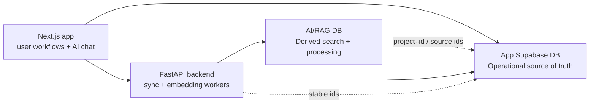

# RAG Database Isolation Plan

Date: 2026-05-13

## Decision

Move high-churn RAG, embedding, and source-ingestion workloads out of the production app Supabase project and into a separate AI/RAG Supabase project or dedicated Postgres database.

This is not because vector tables are inherently wrong in the app database. It is because Alleato's current failure mode is load concentration: sync jobs, repair scans, embedding writes, vector search, source health checks, and user-facing app workflows are competing for the same database resources. A degraded Fireflies, Teams, Graph, or embedding backlog should not make budgets, contracts, commitments, directory, project home, or invoicing unreliable.

## Target Boundary

The production app database remains the operational source of truth. The AI/RAG database becomes a rebuildable derived index and processing ledger.

## Table Classification

| Table or surface | Target | Reason |
|---|---|---|
| `projects`, budgets, contracts, commitments, change orders, invoices, directory, permissions | Keep in app DB | Authoritative operational records. These must stay fast and reliable even if AI ingestion is degraded. |
| `project_documents`, `emails`, `email_attachments` | Keep in app DB | User-visible document/email index and attachments belong to the app workflow. |
| `document_chunks` | Move to AI/RAG DB | High-volume vector corpus with embedding writes, backfills, and vector indexes. This is the clearest isolation candidate. |
| `document_metadata` | Split | Keep a skinny app-facing document/meeting index in app DB. Move processing state, source payload metadata, summary embeddings, parsing status, and RAG-only fields to AI/RAG DB. |
| `document_metadata.summary_embedding` | Move to AI/RAG DB | Vector/search field. It should not bloat or load the operational table. |
| `fireflies_ingestion_jobs` | Move to AI/RAG DB | Queue/backlog table with retries, errors, stage churn, and repair scans. |
| Microsoft Graph embedding state and source processing ledgers | Move to AI/RAG DB | Same queue/backfill profile as Fireflies. Keep only connector status summaries in app DB. |
| `source_sync_runs` | Split | Detailed run logs move to AI/RAG DB or observability storage. App DB keeps only latest source status summaries needed by admin UI. |
| `source_sync_health_snapshots` | Keep summarized in app DB | The admin UI needs current health without querying the AI database heavily. Limit this to latest compact snapshots. |
| `source_rag_health` watchdog output | Keep summarized in app DB | Persist compact alerts and source statuses. Do not persist large sampled row sets in the app DB. |
| `graph_subscriptions` | Keep in app DB | Connector subscription configuration is operational configuration, not derived RAG content. |
| `ai_memories` | Move unless product-critical | Retrieval memory is AI infrastructure. If user-visible memory management is required, keep a skinny app index and move embeddings/details. |
| `company_knowledge` | Move unless edited as app content | Retrieval corpus belongs in AI/RAG DB. If the knowledge UI edits records, keep only title/status/owner/project references in app DB. |
| `ai_insights`, `meeting_action_items` | Keep or dual-write | These can become user-facing operational outputs. Keep normalized, actionable records in app DB; store raw extraction provenance and embeddings in AI/RAG DB. |
| `ai_feedback_events`, `ai_retrieval_feedback`, `ai_learning_promotions`, `ai_retrieval_weights` | Keep initially | These are low-volume product tuning/admin records. Move later only if volume or query load becomes material. |
| RAG eval run artifacts under `docs/ai-plan/evals` | Keep out of DB | Continue storing run artifacts as files unless a dashboard requires summarized metrics. |

## Required Contract Between Databases

Do not use cross-database joins as the product contract. Use stable identifiers and explicit hydration.

Required shared fields:

- `project_id`
- `source_system`
- `source_item_id`
- `app_document_id` or `project_document_id`
- `rag_document_id`
- `source_web_url`
- `storage_bucket`
- `storage_path`
- `last_synced_at`
- `last_indexed_at`

Retrieval flow:

1. AI chat authenticates the user against the app DB.
2. The backend receives allowed `project_id` values and query intent.
3. The backend queries the AI/RAG DB for candidate chunks and documents.
4. The backend hydrates authoritative project, contract, budget, directory, or permission records from the app DB.
5. The response cites source IDs and refuses or degrades loudly when either side is unavailable.

## Guardrails Required Before Or During Split

### Query and Index Guardrails

- Every RAG queue query must use indexed filters for stage/status/source/project/time windows.
- Backlog repair queries must be cursor-based and bounded by hard limits.
- Anti-join repair scans must be replaced with materialized missing-work queues or bounded partial-index scans.
- Vector tables need source/project/date metadata indexes in addition to vector indexes.
- Health checks must sample from compact summary tables before touching raw chunks or job queues.

### Connection and Lock Guardrails

- Separate connection pools for app traffic and ingestion workers.
- Hard connection caps for sync/embedding workers.
- Statement timeouts on repair jobs and health checks.
- Advisory locks or lease rows for each source job so cron collisions fail loudly.
- One active embedding repair job per source family.

### Operational Guardrails

- Stagger Render cron schedules by source family.
- Persist one compact source health row per source/resource, not unbounded status noise.
- Alert on queue growth rate, not only absolute backlog.
- Alert when a source has successful ingestion but missing embeddings, because those are different failures.
- Alert when health checks time out or are skipped, because missing health data is itself a failure.

### Failure Behavior

The app must fail loudly and narrowly:

- If AI/RAG DB is down, app pages still load.
- AI assistant says retrieval is temporarily unavailable and names the degraded source.
- Admin source-sync page shows stale health with `last_checked_at` and the failed check reason.
- Sync jobs stop acquiring new batches when DB pressure, connection saturation, or timeout thresholds are hit.
- Backfills cannot run without an explicit source, limit, and dry-run summary.

## Migration Sequence

1. Create the AI/RAG Supabase project with pgvector enabled and separate service credentials.
2. Add backend configuration for `APP_DATABASE_URL` and `RAG_DATABASE_URL`; keep existing `DATABASE_URL` as app DB until cutover is complete.
3. Introduce a repository layer in the backend so ingestion code does not call arbitrary Supabase tables directly.
4. Copy `document_chunks`, RAG-only `document_metadata` fields, and `fireflies_ingestion_jobs` to the AI/RAG DB.
5. Create compact app DB summary tables or views for source health and document/meeting index rows.
6. Switch ingestion writers to the AI/RAG DB.
7. Switch retrieval readers to the AI/RAG DB, with app DB hydration for permissions and authoritative records.
8. Run parity checks for retrieval result counts, source coverage, and project filtering.
9. Remove or stop writing vector fields from app DB tables once parity passes.
10. Add a rebuild runbook that can recreate the AI/RAG DB from source documents and app DB references.

## Definition Of Done

- Operational app pages do not query `document_chunks` or ingestion job queues.
- RAG retrieval works when the app DB is healthy and the AI/RAG DB is healthy.
- Operational app pages still work when the AI/RAG DB is degraded.
- Health checks report app DB health and AI/RAG health separately.
- Render cron failures cannot create unbounded concurrent repair work.
- There is a documented backfill command with hard source, limit, and dry-run requirements.
- Alerts include cause, detection gap, and prevention step.

## Recommended First Slice

Start with `document_chunks` and `fireflies_ingestion_jobs`.

Those tables carry the highest direct risk: high row counts, embedding writes, backfills, retry churn, and source-specific repair scans. Moving them first gives the most isolation benefit while leaving user-visible document and meeting indexes in the app DB during the transition.
