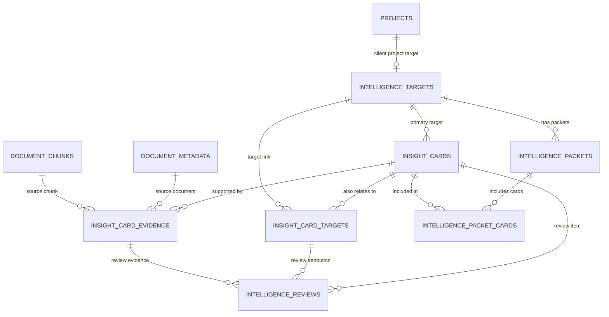

# RAG Storage Model V1

Date: 2026-04-30
Status: Planning draft, not a migration
Scope: Storage model for compiled intelligence, insight cards, intelligence packets, source evidence, target attribution, and review workflow.

Related documents:

- [RAG Strategy Working Decisions](RAG-STRATEGY-WORKING-DECISIONS-2026-04-30.md)
- [Client Project Intelligence PRP Scope](CLIENT-PROJECT-INTELLIGENCE-PRP-SCOPE-2026-04-30.md)
- [JobPlanner Replacement Intelligence Packet V1](JOBPLANNER-REPLACEMENT-INTELLIGENCE-PACKET-V1-2026-04-30.md)
- [RAG Compiler And Assistant Behavior V1](RAG-COMPILER-AND-ASSISTANT-BEHAVIOR-V1-2026-04-30.md)
- [AI and JobPlanner Internal Initiatives](AI-JOBPLANNER-INTERNAL-INITIATIVES-IDEATION-2026-04-30.md)
- [AI Assistant RAG Strategy](AI-ASSISTANT-RAG-STRATEGY-2026-04-29.md)

## Storage Principle

The database should store compiled intelligence, not just retrieved text.

Raw source records stay in existing source tables like `document_metadata` and `document_chunks`.

The new storage layer should answer:

- What target is this about?
- What business insight was extracted?
- What evidence supports it?
- How confident are we?
- Was it reviewed?
- Is it current or stale?
- Should it update the assistant's briefing packet?

## Key Design Decision

Use a generalized `intelligence_targets` table instead of creating separate logic for projects, internal initiatives, vendor platforms, and company processes.

Reason:

The assistant should not care whether the target is a client project or an internal initiative when it loads a briefing. It should ask for the target's current packet and related insight cards.

This lets the same packet/card system support:

- client project: Westfield Collective
- internal initiative: JobPlanner Replacement
- internal initiative: AI Implementation
- vendor platform: JobPlanner
- company process: Change Management

Existing `projects` remain the source of truth for client projects. `intelligence_targets.project_id` links client-project targets back to `projects.id`.

V1 priority: client project targets are the primary implementation and acceptance path. Internal initiatives should remain supported by the same model, but they are not the primary proof case.

## Proposed Tables

### 1. `intelligence_targets`

Purpose: one row for anything that can have intelligence, a packet, insight cards, and evidence.

Examples:

- Westfield Collective
- JobPlanner Replacement
- AI Implementation
- JobPlanner
- Change Management

Suggested fields:

```sql
id uuid primary key
target_type text not null
name text not null
slug text not null unique
description text
status text not null default 'active'
priority text
owner_person_id uuid null
project_id integer null references projects(id)
metadata jsonb not null default '{}'
created_at timestamptz not null default now()
updated_at timestamptz not null default now()
last_signal_at timestamptz
```

Target types:

- `client_project`
- `internal_initiative`
- `vendor_platform`
- `company_process`

Important rule:

- If `target_type = 'client_project'`, `project_id` should be set.
- If `target_type != 'client_project'`, `project_id` should usually be null unless the row represents a project-specific derivative target.

Seed examples:

| target_type | name | project_id |
|---|---:|---:|
| `internal_initiative` | JobPlanner Replacement | null |
| `internal_initiative` | AI Implementation | null |
| `vendor_platform` | JobPlanner | null |
| `company_process` | Change Management | null |
| `client_project` | Westfield Collective | existing `projects.id` |

### 2. `insight_cards`

Purpose: one structured business claim extracted from one or more source records.

This is the core compiled intelligence object.

Suggested fields:

```sql
id uuid primary key
primary_target_id uuid not null references intelligence_targets(id)
title text not null
card_type text not null
summary text not null
why_it_matters text
current_status text not null default 'open'
confidence text not null
attribution_status text not null default 'candidate'
suggested_owner_person_id uuid null
suggested_owner_label text
next_action text
first_seen_at timestamptz
last_seen_at timestamptz
stale_after timestamptz
source_count integer not null default 0
compiler_version text
metadata jsonb not null default '{}'
created_at timestamptz not null default now()
updated_at timestamptz not null default now()
```

Card types:

- `risk`
- `decision`
- `blocker`
- `task`
- `product_need`
- `process_issue`
- `project_update`
- `open_question`
- `requirement`

Current status:

- `open`
- `resolved`
- `blocked`
- `needs_review`
- `stale`
- `rejected`

Confidence:

- `high`
- `medium`
- `low`

Attribution status:

- `auto_assigned`
- `candidate`
- `needs_review`
- `approved`
- `rejected`

### 3. `insight_card_targets`

Purpose: many-to-many target attribution.

One insight can belong to multiple targets.

Example:

The JobPlanner plugin conversation belongs to:

- JobPlanner Replacement
- AI Implementation
- Union Collective
- Allisonville
- JobPlanner vendor platform

Suggested fields:

```sql
id uuid primary key
insight_card_id uuid not null references insight_cards(id) on delete cascade
target_id uuid not null references intelligence_targets(id)
relationship text not null
confidence text not null
attribution_status text not null default 'candidate'
matched_terms text[] not null default '{}'
reason text
reviewed_by uuid null
reviewed_at timestamptz
created_at timestamptz not null default now()
updated_at timestamptz not null default now()
```

Relationships:

- `primary`
- `related`
- `tested_on`
- `implementation_example`
- `vendor_platform`
- `source_of_pain`
- `overlaps_with`

Rule:

Every `insight_cards.primary_target_id` should also have a matching `insight_card_targets` row with `relationship = 'primary'`.

### 4. `insight_card_evidence`

Purpose: trace every card back to source records.

The source of truth remains `document_metadata` and related raw-source tables. This table stores the evidence link and the reason the evidence matters.

Suggested fields:

```sql
id uuid primary key
insight_card_id uuid not null references insight_cards(id) on delete cascade
source_document_id text null references document_metadata(id) on delete set null
source_chunk_id uuid null references document_chunks(id) on delete set null
source_type text not null
source_title text
source_occurred_at timestamptz
source_message_id text
participants text[] not null default '{}'
excerpt text
summary text
relevance_reason text not null
evidence_role text not null
confidence text not null
created_at timestamptz not null default now()
```

Source types:

- `email`
- `teams`
- `meeting`
- `document`
- `daily_report`
- `database`
- `manual_note`

Evidence roles:

- `direct_requirement`
- `repeated_pain`
- `blocker`
- `decision_source`
- `task_source`
- `project_reference`
- `user_quote`
- `supporting_context`

Important rule:

Do not copy large raw transcripts into this table. Store concise excerpts/summaries and source IDs so the assistant can fetch raw source records only when needed.

### 5. `intelligence_packets`

Purpose: the current and historical briefing packet for a target.

Recommended design: store both current state and snapshots in the same table.

Reason:

- The assistant needs the latest packet quickly.
- Product/debugging needs history to understand how a packet changed over time.

Suggested fields:

```sql
id uuid primary key
target_id uuid not null references intelligence_targets(id)
packet_type text not null default 'current'
packet_version text not null
generated_at timestamptz not null default now()
covered_start_at timestamptz
covered_end_at timestamptz
freshness_status text not null
executive_summary text not null
current_status text
strategic_read text
why_it_matters text
recommended_next_moves text[] not null default '{}'
confidence_summary jsonb not null default '{}'
source_coverage jsonb not null default '{}'
review_queue_count integer not null default 0
stale_item_count integer not null default 0
packet_json jsonb not null default '{}'
compiler_version text
created_at timestamptz not null default now()
```

Packet types:

- `current`
- `snapshot`
- `manual_gold_standard`

Freshness statuses:

- `fresh`
- `stale`
- `partial`
- `working_sample`
- `failed`

Rule:

There should be at most one `current` packet per target.

### 6. `intelligence_packet_cards`

Purpose: snapshot which insight cards were included in a packet at generation time.

Suggested fields:

```sql
id uuid primary key
packet_id uuid not null references intelligence_packets(id) on delete cascade
insight_card_id uuid not null references insight_cards(id)
section text not null
rank integer not null default 0
included_reason text
created_at timestamptz not null default now()
```

Sections:

- `recent_changes`
- `active_risks`
- `active_blockers`
- `decisions`
- `open_tasks`
- `product_needs`
- `open_questions`
- `recommended_next_moves`
- `stale_items`
- `review_queue`

### 7. `intelligence_reviews`

Purpose: human review queue for uncertain cards, target attribution, and evidence quality.

Suggested fields:

```sql
id uuid primary key
review_type text not null
status text not null default 'open'
insight_card_id uuid null references insight_cards(id) on delete cascade
target_link_id uuid null references insight_card_targets(id) on delete cascade
evidence_id uuid null references insight_card_evidence(id) on delete cascade
review_reason text not null
proposed_value jsonb not null default '{}'
reviewed_value jsonb
reviewed_by uuid null
reviewed_at timestamptz
created_at timestamptz not null default now()
updated_at timestamptz not null default now()
```

Review types:

- `target_attribution`
- `confidence`
- `duplicate_card`
- `stale_status`
- `evidence_quality`
- `owner_assignment`
- `packet_update`

Statuses:

- `open`
- `approved`
- `rejected`
- `edited`
- `deferred`

## Relationship Model



## How This Supports JobPlanner Replacement

### Target rows

The first seed targets should include:

- `JobPlanner Replacement` as `internal_initiative`
- `AI Implementation` as `internal_initiative`
- `JobPlanner` as `vendor_platform`
- `Westfield Collective` as `client_project`
- `Union Collective` as a secondary `client_project` attribution example, if it exists in `projects`
- `Allisonville` as `client_project`

### Insight cards

The first cards should be created from the gold-standard packet:

- Keep project records current without manual chasing.
- Automatically sort incoming information to the proper job.
- Make project information usable from a phone.
- Update schedule progress from daily reports.
- Reduce JobPlanner admin and account friction.
- JobPlanner API/support dependency.
- Produce a working demo or recording.
- Decide whether JobPlanner work is integration, transition, or replacement.

### Evidence links

The first evidence links should point to:

- Teams direct message conversation from 2026-04-27.
- Email thread about JobPlanner users over contracted allotment.
- Email thread about API access and integration support.

The next planning pass should attach exact `document_metadata.id` values.

## Query Patterns The Assistant Needs

### Load current packet

Question:

> What should the assistant read first?

Query shape:

```sql
select *
from intelligence_packets
where target_id = :target_id
  and packet_type = 'current'
order by generated_at desc
limit 1;
```

### Load active cards for a target

Question:

> What are the current risks, blockers, tasks, decisions, and needs?

Query shape:

```sql
select c.*
from insight_cards c
join insight_card_targets t on t.insight_card_id = c.id
where t.target_id = :target_id
  and c.current_status in ('open', 'blocked', 'needs_review')
  and t.attribution_status in ('auto_assigned', 'approved', 'candidate')
order by c.last_seen_at desc nulls last;
```

### Load evidence for a card

Question:

> What proves this?

Query shape:

```sql
select *
from insight_card_evidence
where insight_card_id = :insight_card_id
order by source_occurred_at desc nulls last;
```

### Load review queue

Question:

> What needs human confirmation before becoming trusted intelligence?

Query shape:

```sql
select *
from intelligence_reviews
where status = 'open'
order by created_at asc;
```

## Compiler Write Flow

### Step 1: Read new raw source records

Read from:

- `document_metadata`
- `document_chunks`
- future daily report tables
- future external-system imports

### Step 2: Cluster source records

Group related source records by:

- Teams conversation thread
- email thread
- meeting segment
- source document
- project candidate
- initiative candidate
- time window

Why:

Teams and email should not be interpreted as isolated one-line chunks. A useful insight often comes from the conversation arc.

### Step 3: Extract insight card candidates

For each cluster, extract:

- title
- type
- summary
- why it matters
- target candidates
- confidence
- suggested owner
- next action
- evidence refs

### Step 4: Link targets

Use `intelligence_targets` plus existing `projects` metadata to identify:

- primary target
- related targets
- project references
- vendor/platform references
- company process references

### Step 5: Write cards and evidence

Create or update:

- `insight_cards`
- `insight_card_targets`
- `insight_card_evidence`

### Step 6: Create review items

Add `intelligence_reviews` rows when:

- confidence is low
- multiple targets are plausible
- the card conflicts with an existing card
- the evidence is thin
- source data is stale
- the card would change the current packet materially

### Step 7: Generate packet

Update:

- `intelligence_packets`
- `intelligence_packet_cards`

The packet should include only cards that are:

- approved
- auto-assigned with high confidence
- candidate with medium confidence and clearly labeled as candidate

## Review And Approval Rules

### Auto-approve into packet

Allowed when:

- confidence is high
- source count is at least one direct source
- target attribution is exact or strongly inferred
- no conflicting target exists
- card type is not high-risk financial/legal claim

### Candidate into packet

Allowed when:

- confidence is medium
- the assistant can clearly label it as a likely inference
- the card is useful even if not final

### Keep out of packet

Required when:

- confidence is low
- source evidence is vague
- attribution is conflicting
- source text is too sensitive to summarize broadly
- the card would drive a major decision without review

## Assistant Read Flow

When the user asks a strategic question:

1. Resolve the target.
2. Load the current packet.
3. Check freshness and source coverage.
4. Load active cards if packet is stale or thin.
5. Load evidence only when the answer needs proof, exact wording, or conflict resolution.
6. Respond with:
   - current read
   - what changed
   - why it matters
   - risks or blockers
   - recommended next step
   - confidence and evidence caveat

When the user asks a source lookup question:

1. Resolve target if possible.
2. Search raw sources and evidence rows.
3. Return source-grounded answer.
4. Do not turn the source lookup into a broad strategic packet unless asked.

## Implementation Phases

### Phase 1: Schema planning complete

Deliverables:

- this storage model
- JobPlanner packet draft
- final decision on current-plus-snapshot packet storage
- final confidence threshold definitions

### Phase 2: Migration

Deliverables:

- SQL migration for proposed tables
- indexes for target, card status, evidence source, and review queue queries
- RLS policy review
- generated TypeScript types

### Phase 3: Seed and backfill

Deliverables:

- seed target rows
- manual JobPlanner gold-standard cards
- source evidence attachment to exact `document_metadata.id`
- first current packet row for JobPlanner Replacement

### Phase 4: Compiler

Deliverables:

- scheduled compiler job
- card extraction
- target attribution
- packet generation
- review queue insertion

### Phase 5: Assistant integration

Deliverables:

- assistant target resolution
- packet-first read path
- raw evidence fallback
- stale/thin packet warning
- response quality evals

## Open Decisions

1. Should `intelligence_targets.owner_person_id` reference a current people/team table, or remain loose until owner modeling is stable?
2. Should `source_chunk_id` be `uuid`, `bigint`, or `text` based on the actual `document_chunks.id` type in the live schema?
3. Should medium-confidence candidate cards appear in packets by default, or only after review?
4. Should packet snapshots be generated every compiler run or only when meaningful changes occur?
5. Should the planning page become the review UI, or should review live in a separate intelligence queue?
6. What source excerpts are safe to show broadly versus admin-only?

## Recommended Decision For V1

For the first implementation slice:

1. Create the generalized tables above.
2. Seed `JobPlanner Replacement`, `AI Implementation`, and `JobPlanner`.
3. Create client-project target rows only for projects referenced by the gold-standard packet.
4. Store one `manual_gold_standard` packet and one `current` packet for JobPlanner Replacement.
5. Allow high-confidence cards into the packet automatically.
6. Put medium-confidence target links into the packet only when clearly labeled as candidate.
7. Put low-confidence or conflicting records into `intelligence_reviews`.

This gives the assistant a real briefing layer without waiting for the full compiler to be perfect.
