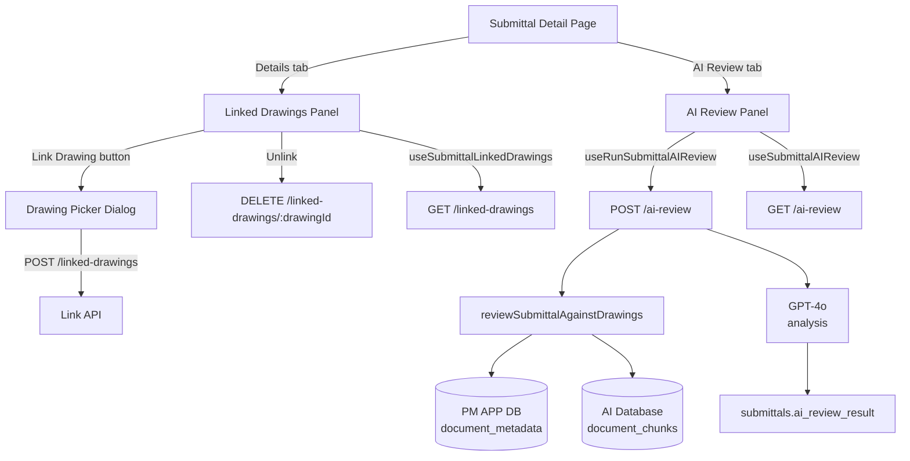
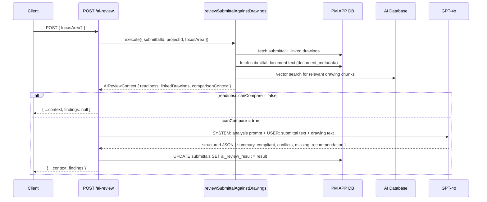

# AI Submittal Review — Developer Reference

> **Last verified:** 2026-06-24
> **Status:** Shipped

This document covers the architecture, data flow, API contracts, and key implementation decisions for the AI Submittal Review feature. It is written for developers extending or debugging this feature.

---

## Overview

The feature has three independent capabilities wired together:

1. **Linked Drawings** — a junction table (`submittal_linked_drawings`) with full CRUD UI and API
2. **Drawing Picker** — a modal that searches project drawings with text search and discipline filtering
3. **AI Review** — a two-step pipeline: context assembly via the `reviewSubmittalAgainstDrawings` tool, then GPT-4o structured analysis



---

## Database

### Tables

| Table | Database | Purpose |
|---|---|---|
| `submittal_linked_drawings` | PM APP (`lgveqfnpkxvzbnnwuled`) | Junction table linking submittals to drawings |
| `submittals` | PM APP | Stores `ai_review_result` (jsonb) and `ai_review_ran_at` (timestamptz) |
| `drawings` | PM APP | Drawing metadata — `drawing_number`, `title`, `discipline`, `revision` |
| `drawing_revisions` | PM APP | Links drawings to `document_metadata_id` |
| `document_metadata` | PM APP | OCR'd text from uploaded PDFs, including drawings |
| `document_chunks` | AI Database (`fqcvmfqldlewvbsuxdvz`) | Vector embeddings for semantic search |

### `submittal_linked_drawings` schema

```sql
CREATE TABLE public.submittal_linked_drawings (
  id          uuid PRIMARY KEY DEFAULT gen_random_uuid(),
  submittal_id uuid NOT NULL REFERENCES submittals(id) ON DELETE CASCADE,
  drawing_id   uuid NOT NULL REFERENCES drawings(id) ON DELETE CASCADE,
  CONSTRAINT uq_submittal_linked_drawings UNIQUE (submittal_id, drawing_id)
);

CREATE INDEX idx_submittal_linked_drawings_submittal_id ON public.submittal_linked_drawings(submittal_id);
CREATE INDEX idx_submittal_linked_drawings_drawing_id  ON public.submittal_linked_drawings(drawing_id);
```

> **Migrations:** `20260623200001_fix_submittal_linked_drawings_fk.sql` adds the FK + UNIQUE + indexes.
> `20260623200002_fix_submittal_linked_drawings_rls_with_check.sql` hardens RLS policies.

### AI review persistence

The `submittals` table stores the last review result directly:

```sql
ALTER TABLE public.submittals
  ADD COLUMN ai_review_result  jsonb,
  ADD COLUMN ai_review_ran_at  timestamptz;
```

This allows the GET endpoint to serve the cached result instantly on page load without re-running the AI pipeline.

---

## API Routes

All routes use `withApiGuardrails` from `@/lib/guardrails/api` and `GuardrailError` from `@/lib/guardrails/errors`. All Next.js 15 dynamic params must be `await`-ed.

### GET `/api/projects/[projectId]/submittals/[submittalId]/linked-drawings`

Returns all drawings linked to the submittal with drawing metadata and a content-readiness flag.

**Response**

```json
{
  "linkedDrawings": [
    {
      "id": "uuid",
      "submittal_id": "uuid",
      "drawing_id": "uuid",
      "drawing_number": "M411",
      "title": "Enlarged Mechanical Plan",
      "discipline": "Mechanical",
      "revision": "2",
      "has_vectorized_content": true
    }
  ]
}
```

**`has_vectorized_content` flag**

This flag is computed server-side by `checkVectorizedContent()` in `linked-drawings/route.ts`. It queries:

1. `drawing_revisions` — finds the `document_metadata_id` for each drawing
2. `document_metadata` — checks whether status is `raw_ingested` or `ocr_partial` (text available immediately after OCR, before the 30-min embedding cron)

This uses `createServiceClient()` (service role) to bypass RLS on `document_metadata`.

> **Note:** The flag reflects OCR-ready text in the PM APP, not `document_chunks` in the AI Database. This is intentional — OCR text is available within minutes of upload; chunks only appear after the embedding cron runs (~30 min). See `DRAWING-TEXT-PIPELINE-GATE.md` for the authoritative explanation.

---

### POST `/api/projects/[projectId]/submittals/[submittalId]/linked-drawings`

Links a drawing to the submittal. Idempotent — duplicate links return 200 rather than an error.

**Request body**

```json
{ "drawingId": "uuid" }
```

**Response — success (201)**

```json
{
  "linkedDrawing": {
    "id": "uuid",
    "submittal_id": "uuid",
    "drawing_id": "uuid",
    "drawing_number": "M411",
    "title": "Enlarged Mechanical Plan",
    "discipline": "Mechanical",
    "has_vectorized_content": false
  }
}
```

> `has_vectorized_content` is always `false` on POST to avoid the extra DB round-trip. The GET re-fetches and populates the flag correctly.

**Response — already linked (200)**

```json
{ "alreadyLinked": true }
```

Postgres unique violation (`error.code === "23505"`) triggers this path.

---

### DELETE `/api/projects/[projectId]/submittals/[submittalId]/linked-drawings/[drawingId]`

Removes the link. The `drawingId` path param is the `drawings.id` UUID, not the junction row id.

**Response (200)**

```json
{ "success": true }
```

---

### GET `/api/projects/[projectId]/submittals/[submittalId]/ai-review`

Returns the last saved review result from `submittals.ai_review_result`, or `null` if no review has been run. Used by `useSubmittalAIReview` to populate the panel on page load without triggering a new review.

**Response**

Returns an `AIReviewResult` object (see [Types](#types)) with an additional `_ranAt` timestamp field, or `null`.

---

### POST `/api/projects/[projectId]/submittals/[submittalId]/ai-review`

Runs a new AI review. Two-phase pipeline:

1. **Context assembly** — calls `reviewSubmittalAgainstDrawings.execute()` to gather submittal text, linked drawing text, and relevant drawing chunks
2. **GPT-4o analysis** — if `readiness.canCompare` is true, sends the assembled context to GPT-4o for structured findings

**Request body**

```json
{ "focusArea": "rebar sizing" }
```

All fields are optional. `focusArea` narrows the analysis (e.g. "pressure requirements", "fire rating").

**Response**

Returns `AIReviewResult` with `findings` populated. If context is not ready (`canCompare: false`), returns `{ ...context, findings: null }` without calling GPT-4o.

The result is persisted to `submittals.ai_review_result` before returning.

---

## AI Pipeline Detail



### Phase 1 — Context assembly

`createDocumentIntelligenceTools(userId, { pinnedProjectId })` is called at the top of the POST handler. This instantiates the tool factory. `tools.reviewSubmittalAgainstDrawings` is then called directly via `.execute!()` — it does **not** go through the chat stream.

The tool:
- Queries `submittal_linked_drawings` to find manually linked drawings
- Falls back to auto-matching by discipline/title if none are linked (sets `drawingsWereAutoMatched: true`)
- Reads submittal text from `document_metadata` (PM APP)
- Reads drawing text from `document_metadata` (PM APP) first, then from `document_chunks` (AI Database) for semantic chunk retrieval
- Returns `readiness.canCompare = false` with specific missing-content messages if either side has no text

### Phase 2 — GPT-4o structured analysis

Only runs when `readiness.canCompare` is `true`. The prompt is defined as `ANALYSIS_PROMPT` in the route file. It instructs the model to return **only** a JSON object — the response is parsed with markdown-fence stripping before `JSON.parse`.

Analysis failures are non-fatal: the `catch` block logs the error and returns the context with `findings: null`, so the client still shows readiness information and drawing chips.

**Model:** `gpt-4o` via `getOpenAI()` from `@/lib/ai/tools/tool-utils`. Temperature `0` for deterministic output. `max_tokens: 2000`.

---

## Components

### `SubmittalLinkedDrawingsPanel`

`features/submittals/submittal-linked-drawings-panel.tsx`

- Renders linked drawings list with discipline, revision, and **⚙ AI-readable** chip for vectorized drawings
- `onAddClick` prop opens the `DrawingPickerDialog` (owned by parent — avoids double-mounting)
- Unlink confirmation uses `<ConfirmDeleteDialog>` from `@/components/ds`
- Skeleton loading state (3 pulse rows) on initial fetch

### `DrawingPickerDialog`

`features/submittals/drawing-picker-dialog.tsx`

- Modal (not Sheet — uses `@/components/ui/unified-modal`)
- `<ExpandingSearch>` for text search, 300 ms debounce
- Discipline `<Select>` filter — derives unique disciplines from the fetched list; only renders when drawings have discipline data
- Calls `GET /api/projects/[projectId]/drawings` with `?search=&page_size=50`
- Discipline filtering is done client-side over the fetched list (no extra API param needed at current scale)
- `useAddLinkedDrawing` mutation; handles `alreadyLinked` response with an info toast

### `SubmittalAIReviewPanel`

`features/submittals/submittal-ai-review-panel.tsx`

- `useSubmittalAIReview` — GET hook, `staleTime: 10 min`, `gcTime: 30 min`, `retry: false`
- `useRunSubmittalAIReview` — mutation hook, on success updates the GET query cache directly (`queryClient.setQueryData`)
- `ReviewFindings` sub-component handles both the `canCompare = false` warning path and the full findings display
- Recommendation badge is coloured: Approve = `bg-primary`, Approve with Comments = `bg-warning`, Revise and Resubmit = `bg-destructive`

---

## Hooks

All hooks live in `frontend/src/hooks/use-submittals.ts`.

| Hook | Type | Purpose |
|---|---|---|
| `useSubmittalLinkedDrawings(projectId, submittalId)` | `useQuery` | Fetches linked drawings list |
| `useAddLinkedDrawing(projectId, submittalId)` | `useMutation` | POST to link a drawing |
| `useRemoveLinkedDrawing(projectId, submittalId)` | `useMutation` | DELETE to unlink a drawing |
| `useSubmittalAIReview(projectId, submittalId)` | `useQuery` | Fetches last saved review result |
| `useRunSubmittalAIReview(projectId, submittalId)` | `useMutation` | POST to trigger a new review |

### Query key structure

```typescript
submittalKeys.linkedDrawings(projectId, submittalId)
// → ["submittals", projectId, "detail", submittalId, "linked-drawings"]

["submittal-ai-review", projectId, submittalId]
// AI review uses its own flat key (not nested under submittalKeys)
```

---

## Types

### `LinkedDrawing`

```typescript
export interface LinkedDrawing {
  id: string;
  submittal_id: string;
  drawing_id: string;
  drawing_number: string;
  title: string;
  discipline: string | null;
  revision: string | null;
  has_vectorized_content: boolean;
}
```

### `AIReviewResult`

```typescript
export interface AIReviewResult {
  submittal: {
    id: string;
    number: string;
    title: string;
    status: string;
  };
  linkedDrawings: Array<{
    drawingNumber: string;
    title: string;
    discipline: string | null;
    hasVectorizedContent: boolean;
  }>;
  drawingsWereAutoMatched: boolean;
  comparisonContext: {
    submittalText: string | null;
    drawingText: string | null;
    additionalRelevantDrawingChunks: Array<{ title: string; excerpt: string }>;
    focusArea: string | null;
  };
  readiness: {
    canCompare: boolean;
    missingSubmittalText?: string;
    missingDrawingText?: string;
  };
  nextStep: string;
  findings: {
    summary: string;
    compliant: Array<{ item: string; drawingRef: string | null; detail: string }>;
    conflicts: Array<{ item: string; drawingRef: string | null; detail: string }>;
    missing: Array<{ item: string; drawingRef: string | null; detail: string }>;
    recommendation: string;
  } | null;
}
```

---

## Two-Database Awareness

This feature touches **both** Supabase projects. Using the wrong client silently returns empty data.

| Operation | Client | Why |
|---|---|---|
| `submittal_linked_drawings` queries | `createClient()` (user session) | RLS-protected; PM APP |
| `checkVectorizedContent` — `document_metadata` | `createServiceClient()` (service role) | Bypasses RLS; PM APP |
| `document_chunks` vector search | `get_rag_read_client()` | AI Database only |
| `submittals.ai_review_result` persist | `createClient()` (user session) | PM APP |

See `CLAUDE.md` — "Two Supabase Projects" for the full reference.

---

## Known Limitations

- **Discipline filter is client-side** — the picker fetches up to 50 drawings per search query. On projects with 300+ drawings in a single discipline, the filter may not show all sheets. The API `GET /drawings` supports a `discipline` query param if server-side filtering becomes necessary.
- **`has_vectorized_content` checks OCR status, not embedding status** — a drawing can have `has_vectorized_content: true` (OCR text present) but not yet be in `document_chunks` (embedding not run). The `reviewSubmittalAgainstDrawings` tool reads `document_metadata` content directly as a fallback, so this does not affect review quality.
- **Review result is not versioned** — `submittals.ai_review_result` stores only the most recent result. Re-running overwrites without history. If audit history of AI reviews is needed, a separate `submittal_ai_reviews` table with `ran_at` + `result` rows would be the right approach.

---

## Files Reference

| File | Purpose |
|---|---|
| `frontend/src/features/submittals/submittal-linked-drawings-panel.tsx` | Linked drawings list + unlink |
| `frontend/src/features/submittals/drawing-picker-dialog.tsx` | Drawing search + link modal |
| `frontend/src/features/submittals/submittal-ai-review-panel.tsx` | AI review trigger + findings display |
| `frontend/src/features/submittals/submittal-detail-client.tsx` | Tab host, DrawingPickerDialog mount |
| `frontend/src/hooks/use-submittals.ts` | All hooks + TypeScript types |
| `frontend/src/app/api/projects/[projectId]/submittals/[submittalId]/linked-drawings/route.ts` | GET + POST linked drawings |
| `frontend/src/app/api/projects/[projectId]/submittals/[submittalId]/linked-drawings/[drawingId]/route.ts` | DELETE linked drawing |
| `frontend/src/app/api/projects/[projectId]/submittals/[submittalId]/ai-review/route.ts` | GET + POST AI review |
| `frontend/src/lib/ai/tools/document-intelligence.ts` | `reviewSubmittalAgainstDrawings` tool |
| `supabase/migrations/20260623200001_fix_submittal_linked_drawings_fk.sql` | FK + UNIQUE + indexes |
| `supabase/migrations/20260623200002_fix_submittal_linked_drawings_rls_with_check.sql` | RLS hardening |
