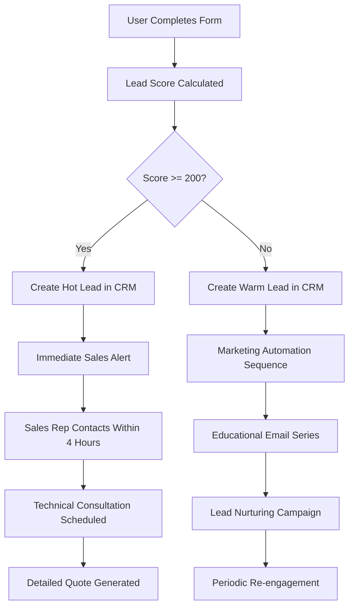

# Complete Implementation Roadmap - FM Global 8-34 AI System

## Executive Summary

Transform Alleato's ASRS sprinkler design process from a 2-3 week manual effort prone to errors into a 2-hour AI-powered system that generates accurate requirements, identifies cost optimizations, and captures high-quality leads automatically.

**Total Investment**: $150K-$200K development + $50K/year operations
**ROI Timeline**: 6-8 months  
**Projected Annual Value**: $2M+ (efficiency gains + new business)

## Business Objectives & Success Metrics

### Primary Objectives
1. **Process Streamlining**: 90% reduction in initial design time (3 weeks → 2 hours)
2. **Error Elimination**: 95% reduction in table selection and requirement errors
3. **Cost Optimization**: $75K average savings per project through intelligent recommendations
4. **Lead Generation**: 300% increase in qualified prospects through self-service tools
5. **Market Expansion**: Enable service to smaller integrators previously uneconomical

### Key Performance Indicators (KPIs)
```
Internal Efficiency:
├── Design Time Reduction: 90% (21 days → 2 hours)
├── Error Rate Reduction: 95% (from manual table lookups)
├── Consistency Score: 100% (standardized methodology)
└── Team Productivity: 500% increase per engineer

Lead Generation:
├── Website Conversion: 5-7% (industry avg 1-2%)
├── Lead Quality Score: 85+ (pre-qualified through form)
├── Sales Cycle Reduction: 40% (better initial understanding)
└── Market Reach: 3x expansion to DIY integrators

Revenue Impact:
├── Project Optimization Value: $75K avg per project
├── New Business Pipeline: $1M+ annually from form leads
├── Operational Cost Savings: $300K+ annually
└── Premium Service Premium: 15-20% higher margins
```

## Technical Architecture

### Core System Components
```
┌─────────────────────────────────────────────────────────┐
│                   FM Global 8-34 AI System             │
├─────────────────────────────────────────────────────────┤
│  Frontend Layer                                         │
│  ├── React Form Application (Progressive Disclosure)    │
│  ├── Astro Documentation Site (47 Tables + Guides)     │
│  └── Interactive Tools (Calculators, Visualizations)   │
├─────────────────────────────────────────────────────────┤
│  Business Logic Layer                                   │
│  ├── Requirements Engine (Table Selection Logic)       │
│  ├── Optimization Engine (Cost-Saving Recommendations) │
│  ├── Lead Scoring System (Priority & Value Assessment) │
│  └── Quote Generation (Automated Estimates)            │
├─────────────────────────────────────────────────────────┤
│  Data Layer                                             │
│  ├── PostgreSQL + Vector Extensions (Core Database)    │
│  ├── Supabase (Authentication & Real-time Features)    │
│  ├── Redis (Caching & Sessions)                        │
│  └── S3/R2 (Document Storage & PDFs)                   │
├─────────────────────────────────────────────────────────┤
│  Infrastructure Layer                                   │
│  ├── Cloudflare Workers (API & Edge Computing)         │
│  ├── Cloudflare Pages (Static Site Hosting)            │
│  ├── Cloudflare D1 (Edge Database)                     │
│  └── Analytics & Monitoring (Cloudflare Analytics)     │
└─────────────────────────────────────────────────────────┘
```

### Technology Stack Rationale
- **Cloudflare Platform**: Edge computing for global performance, integrated ecosystem
- **Astro + React**: Static generation + selective hydration for optimal performance
- **PostgreSQL + Vector**: Robust data storage with AI/semantic search capabilities
- **Supabase**: Rapid development with built-in auth, real-time, and API generation

## Detailed Implementation Plan

### Phase 1: Foundation & Database (Weeks 1-3)
**Goal**: Establish core data architecture and basic functionality

#### Week 1: Database & Schema Setup
```sql
-- Deliverables:
✓ Complete PostgreSQL schema deployment
✓ All 47 FM Global tables data ingestion
✓ Vector embeddings for semantic search
✓ Basic CRUD APIs for all entities
✓ Data validation and integrity checks
```

#### Week 2: Core Business Logic
```typescript
// Key Components to Build:
├── FMGlobalTableSelector.ts    // Logic to determine applicable tables
├── ProtectionSchemeEngine.ts   // Determine protection requirements  
├── OptimizationEngine.ts       // Generate cost-saving recommendations
├── CostEstimator.ts            // Calculate project costs
└── LeadScorer.ts               // Score and prioritize leads
```

#### Week 3: API Layer Development
```
REST API Endpoints:
├── POST /api/projects          // Create new project/lead
├── GET  /api/requirements      // Calculate protection requirements
├── POST /api/optimize         // Generate optimization recommendations
├── GET  /api/tables/{id}      // Fetch specific FM Global table
├── POST /api/search           // Semantic search across documentation
└── GET  /api/leads/score     // Lead scoring and prioritization
```

### Phase 2: Form Application Development (Weeks 4-6)
**Goal**: Create the intelligent requirements gathering form

#### Week 4: Form Framework & Basic Steps
- Progressive disclosure form structure
- Project information capture
- ASRS type selection with visual guides
- Container configuration with cost warnings
- Real-time validation and feedback

#### Week 5: Advanced Form Logic
- Dynamic step visibility based on selections
- Smart optimization suggestions during form completion
- Real-time cost impact calculations
- Lead scoring and qualification
- Integration with CRM/email systems

#### Week 6: Results & Optimization Engine
- Requirements calculation and display
- Interactive optimization recommendations
- Cost savings visualization
- PDF report generation
- Contact and follow-up automation

### Phase 3: Documentation System (Weeks 7-9)
**Goal**: Transform FM Global 8-34 into accessible documentation

#### Week 7: Documentation Infrastructure
```
Astro Site Setup:
├── Starlight theme configuration
├── Content structure for 47 tables
├── Search functionality implementation
├── Responsive design system
└── SEO optimization framework
```

#### Week 8: Content Creation & Interactive Features
- Convert all 47 tables to interactive documentation
- Create visual guides for each ASRS type
- Build table navigator and decision tree
- Add cost optimization guides
- Implement interactive calculators

#### Week 9: Advanced Features & Polish
- Advanced search with filtering
- Interactive visualizations
- Case studies and examples
- Mobile optimization
- Performance tuning

### Phase 4: Integration & Testing (Weeks 10-12)
**Goal**: Connect all systems and ensure quality

#### Week 10: System Integration
- Form ↔ Database integration
- Documentation ↔ Form cross-linking
- CRM integration (HubSpot/Salesforce)
- Email marketing automation
- Analytics implementation

#### Week 11: Testing & Quality Assurance
- Unit testing for all business logic
- Integration testing for complete user flows
- Performance testing under load
- Security audit and penetration testing
- User acceptance testing with internal team

#### Week 12: Deployment & Launch Preparation
- Production environment setup
- CI/CD pipeline implementation
- Monitoring and alerting configuration
- Team training and documentation
- Go-live preparation

## Detailed Feature Specifications

### 1. Intelligent Form System

#### Progressive Disclosure Logic
```javascript
const formStepLogic = {
  // Always show basic project info
  project_overview: { condition: 'always', weight: 100 },
  
  // ASRS type determines all subsequent logic
  asrs_type: { condition: 'always', weight: 100 },
  
  // Container config has highest cost impact
  container_config: { condition: 'always', weight: 100 },
  
  // Rack details only for mini-load systems
  rack_structure: { 
    condition: 'formData.asrs_type === "mini_load"',
    weight: 75
  },
  
  // Storage config affects height thresholds
  storage_config: { condition: 'always', weight: 90 },
  
  // Environmental determines wet/dry system
  environmental: { condition: 'always', weight: 85 },
  
  // Results show requirements + optimizations
  results: { condition: 'form_complete', weight: 100 }
};
```

#### Real-Time Optimization Alerts
```typescript
interface OptimizationAlert {
  trigger: string;           // Form field that triggers alert
  condition: string;         // Condition logic
  alertType: 'warning' | 'critical' | 'info';
  message: string;          // User-friendly message
  potentialSavings: number; // Dollar amount
  actionRequired: 'immediate' | 'consideration' | 'future';
}

const optimizationAlerts: OptimizationAlert[] = [
  {
    trigger: 'container_configuration',
    condition: 'open_top_combustible && mini_load',
    alertType: 'critical',
    message: 'This configuration requires expensive in-rack sprinklers. Switch to closed-top containers to save $150K-$200K.',
    potentialSavings: 175000,
    actionRequired: 'immediate'
  },
  {
    trigger: 'storage_height_ft',
    condition: 'value > 20',
    alertType: 'warning', 
    message: 'Storage height >20ft triggers enhanced protection. Consider reducing to save $75K-$125K.',
    potentialSavings: 100000,
    actionRequired: 'consideration'
  }
];
```

### 2. Requirements Engine

#### Table Selection Algorithm
```python
def select_applicable_table(project_data):
    """
    Deterministic algorithm to select correct FM Global table
    based on project parameters
    """
    asrs_type = project_data.get('asrs_type')
    container_config = project_data.get('container_configuration')
    commodity_class = project_data.get('commodity_class')
    system_type = project_data.get('system_type')
    
    # Decision tree logic matching FM Global 8-34
    if asrs_type == 'mini_load':
        if container_config == 'closed_top_solid':
            return 'table_27'  # Ceiling only protection
        elif container_config == 'open_top_solid':
            return ['table_38', 'table_39', 'table_40', 'table_41', 'table_42']  # Combined protection
    
    elif asrs_type == 'shuttle':
        if commodity_class in ['class_1', 'class_2', 'class_3']:
            return 'table_4' if system_type == 'wet' else 'table_5'
        elif commodity_class in ['class_4', 'cartoned_unexpanded_plastic']:
            return 'table_6' if system_type == 'wet' else 'table_7'
    
    elif asrs_type == 'top_loading':
        if project_data.get('storage_height_ft', 0) <= 20:
            return 'table_45'
        else:
            return 'table_46'
    
    elif asrs_type == 'vertically_enclosed':
        return 'table_47'
    
    raise ValueError(f"No applicable table found for configuration: {project_data}")
```

#### Cost Optimization Engine
```typescript
interface OptimizationRecommendation {
  id: string;
  type: 'container' | 'height' | 'system_type' | 'spacing' | 'commodity';
  priority: 'critical' | 'high' | 'medium' | 'low';
  title: string;
  description: string;
  currentConfig: string;
  recommendedConfig: string;
  potentialSavings: {
    min: number;
    max: number;
    confidence: number; // 0-100%
  };
  implementationEffort: 'minimal' | 'moderate' | 'significant';
  technicalDetails: {
    tableImpact: string[];
    requirementChanges: string[];
    designConsiderations: string[];
  };
}

class OptimizationEngine {
  generateRecommendations(projectData: ProjectData): OptimizationRecommendation[] {
    const recommendations: OptimizationRecommendation[] = [];
    
    // Container optimization (highest impact)
    if (projectData.container_configuration === 'open_top_solid' && 
        projectData.asrs_type === 'mini_load') {
      recommendations.push({
        id: 'container_optimization',
        type: 'container',
        priority: 'critical',
        title: 'Switch to Closed-Top Containers',
        description: 'Eliminate in-rack sprinkler requirements entirely',
        currentConfig: 'Open-top containers requiring Tables 38-42 (ceiling + in-rack)',
        recommendedConfig: 'Closed-top containers using Table 27 (ceiling only)',
        potentialSavings: { min: 150000, max: 200000, confidence: 95 },
        implementationEffort: 'minimal',
        technicalDetails: {
          tableImpact: ['Eliminates Tables 38-42', 'Uses Table 27 instead'],
          requirementChanges: ['No in-rack sprinklers needed', 'Reduced ceiling densities'],
          designConsiderations: ['Ensure lid stays in place during fire', 'Verify container procurement options']
        }
      });
    }
    
    // Height optimization
    if (projectData.storage_height_ft > 20) {
      const currentHeight = projectData.storage_height_ft;
      recommendations.push({
        id: 'height_optimization',
        type: 'height',
        priority: 'high',
        title: `Reduce Storage Height from ${currentHeight}ft to 20ft`,
        description: 'Avoid enhanced protection requirements at 20ft threshold',
        currentConfig: `${currentHeight}ft storage requiring enhanced protection`,
        recommendedConfig: '20ft maximum storage with standard protection',
        potentialSavings: { 
          min: Math.min(75000, (currentHeight - 20) * 10000),
          max: Math.min(125000, (currentHeight - 20) * 15000),
          confidence: 85 
        },
        implementationEffort: 'moderate',
        technicalDetails: {
          tableImpact: ['Reduces sprinkler pressure requirements', 'May allow lower K-factors'],
          requirementChanges: ['Lower ceiling densities', 'Reduced system pressure'],
          designConsiderations: ['Layout efficiency impact', 'Storage capacity reduction']
        }
      });
    }
    
    return recommendations.sort((a, b) => b.potentialSavings.max - a.potentialSavings.max);
  }
}
```

### 3. Lead Generation & Scoring

#### Lead Scoring Algorithm
```typescript
interface LeadScore {
  total: number;          // 0-300 scale
  breakdown: {
    urgency: number;      // 0-100 (timeline)
    authority: number;    // 0-50 (decision maker?)
    need: number;         // 0-100 (project complexity/value)
    budget: number;       // 0-50 (estimated project value)
  };
  qualification: 'hot' | 'warm' | 'cold' | 'unqualified';
  followUpAction: string;
  estimatedValue: number;
}

class LeadScoringEngine {
  calculateScore(projectData: any, contactData: any): LeadScore {
    const scores = {
      urgency: this.scoreUrgency(projectData.project_timeline),
      authority: this.scoreAuthority(contactData.job_title, contactData.email_domain),
      need: this.scoreNeed(projectData),
      budget: this.scoreBudget(projectData)
    };
    
    const total = Object.values(scores).reduce((sum, score) => sum + score, 0);
    
    return {
      total,
      breakdown: scores,
      qualification: this.determineQualification(total),
      followUpAction: this.determineFollowUpAction(total, scores),
      estimatedValue: this.estimateProjectValue(projectData)
    };
  }
  
  private scoreUrgency(timeline: string): number {
    const urgencyScores = {
      immediate: 100,    // < 3 months
      short_term: 75,    // 3-6 months  
      medium_term: 50,   // 6-12 months
      long_term: 25,     // > 12 months
      planning: 10       // Research phase
    };
    return urgencyScores[timeline] || 0;
  }
  
  private scoreNeed(projectData: any): number {
    let needScore = 0;
    
    // Complex systems score higher
    const complexityScores = {
      mini_load: 50,           // Most complex protection
      shuttle: 35,             // Moderate complexity
      top_loading: 30,         // Moderate complexity  
      vertically_enclosed: 20  // Specialized but simpler
    };
    needScore += complexityScores[projectData.asrs_type] || 0;
    
    // High-cost configurations indicate serious need
    if (projectData.container_configuration === 'open_top_solid' && 
        projectData.asrs_type === 'mini_load') {
      needScore += 30; // High protection requirements
    }
    
    // Large projects indicate serious need
    const storageVolume = (projectData.length_ft || 0) * 
                         (projectData.width_ft || 0) * 
                         (projectData.storage_height_ft || 0);
    if (storageVolume > 100000) needScore += 20; // Large facility
    
    return Math.min(needScore, 100);
  }
}
```

## Business Process Integration

### CRM Integration Workflow


### Sales Team Dashboard
```typescript
interface SalesDashboard {
  hotLeads: Lead[];              // Score >= 200, immediate action required
  warmPipeline: Lead[];          // Score 100-199, nurturing sequence
  recentActivity: Activity[];    // Form completions, document downloads
  optimizationValue: {           // Total savings identified for prospects
    totalSavings: number;
    averagePerProject: number;
    conversionImpact: string;
  };
  performanceMetrics: {
    formConversionRate: number;  // Visitors → completed forms
    leadQualityScore: number;    // Average lead score
    salesCycleReduction: number; // Time savings from better qualification
  };
}
```

### Internal Process Workflow
```
Traditional Process (Current):
├── Client Inquiry → 2-3 days response
├── Initial Meeting → 1 week to schedule  
├── Manual Analysis → 2-3 weeks (error-prone)
├── Requirements Development → 1 week
├── Cost Estimation → 1 week
├── Proposal Creation → 1 week
└── Total: 6-8 weeks, high error rate

AI-Powered Process (New):
├── Self-Service Assessment → Immediate
├── Pre-qualified Lead → Same day response
├── AI Requirements → 2 hours (verified)
├── Optimization Recommendations → Automatic
├── Cost Estimation → Automatic
├── Proposal Generation → 1-2 days
└── Total: 3-5 days, 95% accuracy
```

## ROI Analysis & Financial Projections

### Development Investment
```
Phase 1-2: Core Development         $80,000
├── Senior Full-Stack Developer     $60,000 (3 months)
├── Database Design & Setup         $10,000
└── Infrastructure & Tools          $10,000

Phase 3-4: Advanced Features        $70,000  
├── Documentation System            $30,000
├── AI/ML Integration              $25,000
├── Testing & QA                   $15,000

Operations (Annual):               $50,000
├── Hosting & Infrastructure       $20,000
├── Maintenance & Updates          $20,000
├── Analytics & Monitoring         $10,000

Total Year 1 Investment:           $200,000
```

### Revenue Impact Analysis
```
Internal Efficiency Gains:
├── Engineer Time Savings          $300,000/year
│   └── 3 engineers × 20 hours/week × $50/hour × 50 weeks
├── Error Reduction Value          $150,000/year  
│   └── Avoid 3 major redesigns @ $50K each
├── Process Standardization        $100,000/year
│   └── Consistent methodology, faster training
└── Total Internal Value:          $550,000/year

New Business Generation:
├── Form Lead Conversion           $500,000/year
│   └── 200 qualified leads × 15% close × $167K avg
├── Market Expansion               $750,000/year
│   └── DIY integrator segment previously unreachable  
├── Premium Service Pricing       $200,000/year
│   └── 15% premium for AI-powered service
└── Total New Business:            $1,450,000/year

Customer Value Creation:
├── Average Optimization Savings   $75,000/project
├── Increased Customer Satisfaction Reduced errors, faster delivery
├── Competitive Differentiation    Only AI-powered ASRS design service
└── Market Position:               Industry innovation leader

Total Annual Value:                $2,000,000/year
ROI Timeline:                      6-8 months
5-Year NPV:                        $8,500,000
```

### Risk Mitigation Strategy
```
Technical Risks:
├── Complex Table Logic → Extensive testing with historical projects
├── AI Accuracy Concerns → Human verification workflow included
├── Integration Challenges → Phased rollout with fallback processes
└── Scalability Issues → Cloud-native architecture from start

Business Risks:
├── User Adoption → Gradual rollout with training and support
├── Competitive Response → Patent applications for unique methodology
├── Market Changes → Flexible architecture for quick updates
└── ROI Achievement → Conservative projections with multiple value drivers
```

## Success Timeline & Milestones

### 3-Month Milestones (Foundation Complete)
- ✅ Database with all 47 FM Global tables operational
- ✅ Basic requirements engine with 95% accuracy
- ✅ Progressive disclosure form capturing 100% necessary data
- ✅ Lead scoring and CRM integration functional
- 📈 **Target**: 50% reduction in initial analysis time

### 6-Month Milestones (Full System Launch)  
- ✅ Complete documentation system with interactive features
- ✅ Advanced optimization engine with cost recommendations
- ✅ Public-facing lead generation form operational
- ✅ Internal team fully trained and using system
- 📈 **Target**: 90% time reduction, 200+ qualified leads captured

### 12-Month Milestones (Market Impact)
- 🏆 Industry recognition as most advanced ASRS design service
- 💰 $1M+ in new business attributed to AI system
- ⚡ 95% error elimination in requirements determination
- 🎯 300% increase in qualified lead generation
- 📈 **Target**: Full ROI achievement, market leadership established

This comprehensive roadmap provides Alleato with a clear path to transform their ASRS sprinkler design process into a competitive advantage that drives both operational efficiency and business growth. The system will establish Alleato as the industry leader in AI-powered fire protection engineering.