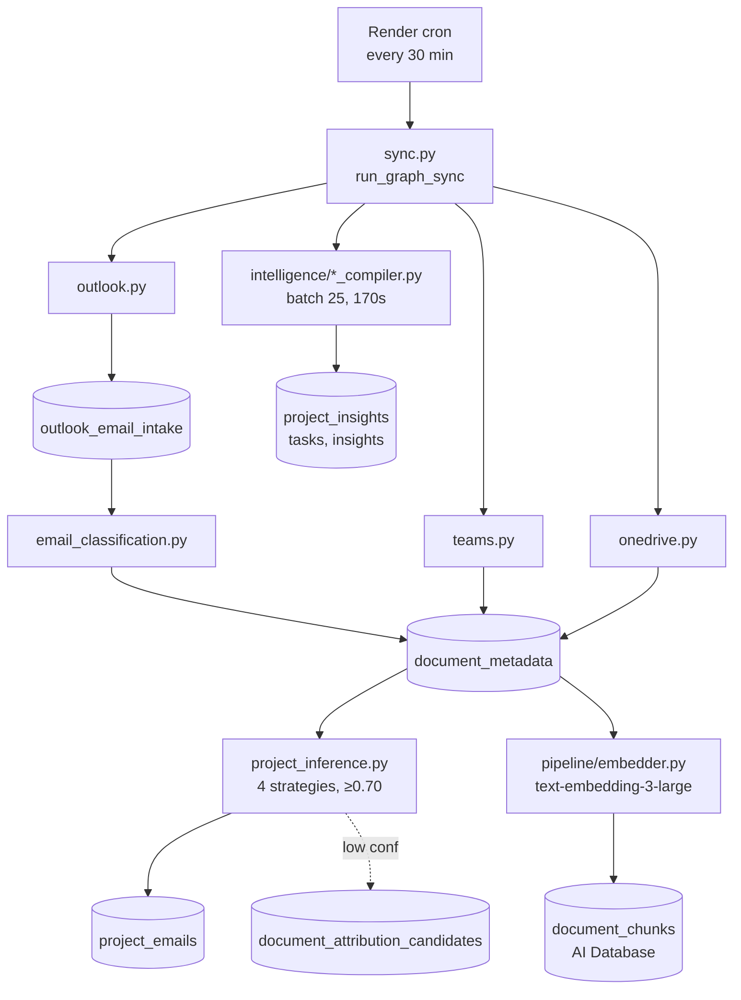

# Sync Pipeline

**Status:** 🟡 messy but working
**Owner:** backend / data infrastructure
**Last verified:** 2026-05-19

Pulls everything the AI Assistant knows about into the database: emails (Outlook), chats (Teams), files (OneDrive). Then embeds the content into the RAG store and compiles structured insights. Runs every 30 minutes on Render.

## What it controls

**Background jobs:**
- Render cron `alleato-graph-sync` — every 30 min — full sync + embed + compile
- Render cron `alleato-task-extraction` — daily 7 AM UTC — extract action items
- Render cron `alleato-rag-health` — daily 12:15 UTC — health check + Slack alert on failure

**No direct user-facing routes** — but it feeds:
- The AI Assistant (via `document_chunks`)
- `/intelligence` (project_insights, tasks)
- `/email-attachments`, `/outlook-emails`, `/meetings` (raw intake)
- `/project-attribution` admin page (low-confidence review queue)

## Main files

**Orchestration:**
- `backend/src/services/integrations/microsoft_graph/sync.py` — top-level entry point. `run_graph_sync()` is the cron target.

**Source ingestion** (`backend/src/services/integrations/microsoft_graph/`):
- `outlook.py` — email pull, mailbox iteration, intake write
- `teams.py` — chat / DM sync (273/283 chats reachable; 10 permanent 403s on cross-tenant + meeting chats)
- `onedrive.py` — file metadata + content sync
- `subscriptions.py`, `webhooks.py`, `live_mail.py` — push notifications (when enabled)
- `client.py` — Graph API client (app-only auth)

**Processing:**
- `email_classification.py` — relevance filter (which emails become RAG docs)
- `attachment_promotion.py`, `project_documents.py`, `project_document_backfill.py` — attach files to projects
- `project_inference.py`, `onedrive_project_assignment_backfill.py` — assign to project (4 strategies: title → contacts → domain → content, min confidence 0.70)
- `intake_reclassification.py` — re-run classification when rules change
- `embed.py` — calls into pipeline embedder

**Embedding pipeline** (`backend/src/services/pipeline/`):
- `orchestrator.py` — `embed_pending_graph_documents()` runs synchronously at end of sync (no DB trigger)
- `embedder.py` — text-embedding-3-large, halfvec 3072
- `parser.py`, `document_parser.py`, `financial_parser.py` — content extraction per file type
- `extractor.py`, `contextualize.py` — chunking + context injection
- `digest.py`, `llm.py` — LLM-assisted summarization

**Insight compilation** (`backend/src/services/intelligence/`):
- `compiler.py`, `teams_compiler.py`, `email_compiler.py`, `domain_compiler.py` — extract insights/tasks
- `operating_summary.py` — daily roll-ups
- `prompts.py`, `client.py` — LLM config

**OCR worker:** `ocr_worker.py` — for scanned PDFs.

## Data

**Intake → Refinement flow:**
```
outlook_email_intake  (everything, raw)
        ↓ relevance classification
document_metadata     (AI-relevant, ready to embed)
        ↓ project assignment (≥0.70 confidence)
project_emails        (project-matched)
        ↓ embedding
document_chunks       (vector store — what AI queries)
```

**Tables:**
- `outlook_email_intake` — every email, before filtering. Source of truth for "what arrived"
- `document_metadata` — relevance-filtered, AI-ready (in PM APP project)
- `rag_document_metadata` — RAG-side mirror (in AI Database project)
- `project_emails` — project-matched only
- `document_chunks` — vector embeddings (AI Database project, halfvec 3072)
- `document_attribution_candidates` — low-confidence assignments awaiting human review (no UI yet)
- `project_insights`, `tasks`, `insights`, `source_signal_candidates` — outputs of compilers
- `rag_pipeline_state` — embedding cursor (AI Database)

**Critical rule:** RAG tables live in the **AI Database** Supabase project (`fqcvmfqldlewvbsuxdvz`), NOT the PM APP project (`lgveqfnpkxvzbnnwuled`). Legacy copies of `document_chunks` and `rag_pipeline_state` in PM APP are read-only via trigger. See CLAUDE.md "Two Supabase Projects".

## Depends on

- Microsoft Graph API (app-only OAuth)
- OpenAI embedding API (text-embedding-3-large)
- Two Supabase projects (PM APP + AI Database)
- Slack webhook (for `alleato-rag-health` alerts)

## Known risks

- **No DB trigger for embedding** — runs synchronously at end of `run_graph_sync()`. If sync hangs, embedding skipped that cycle.
- **Teams 403s** — 10 cross-tenant (`@unq.gbl.spaces`) + meeting (`@thread.v2`) chats permanently inaccessible with app-only auth. Hard Graph API limitation, no fix.
- **Project assignment fallback** — items below 0.70 confidence land in `document_attribution_candidates` with no UI to triage them. Items accumulate silently.
- **Render cron failure mode** — if cron silently fails, no embedding happens for hours. Health check catches it next day; could be faster.
- **Wrong-Supabase-project bug class** — extremely easy to query stale RAG data by using the PM APP client. The legacy-table trigger blocks writes but not reads.
- **Teams compiler runs in same 30-min window** — batch=25, 170s limit. Backlogs possible.

## Cleanup targets

1. Build the UI for `document_attribution_candidates` triage queue
2. Add a hard timeout + alert on embed step (currently silent if it hangs)
3. Move embedding to a DB trigger or separate worker so a slow sync doesn't skip it
4. Consolidate the four `*_compiler.py` files — significant overlap
5. Add per-source success metrics surfaced in `/ai-system-health` admin page

## Source-of-truth docs

- [`COMMUNICATIONS-DATA-PIPELINE.md`](../architecture/COMMUNICATIONS-DATA-PIPELINE.md) — **authoritative** end-to-end reference
- [`AI-RAG-ARCHITECTURE.md`](../architecture/AI-RAG-ARCHITECTURE.md) — where this feeds into
- `docs/deployment/RENDER-CRONS.md` — runbook for the cron jobs
- `render.yaml` (repo root) — cron config
- `.claude/rules/RAG-DOCS-GATE.md` — must-update docs when touching this pipeline

## Diagram


