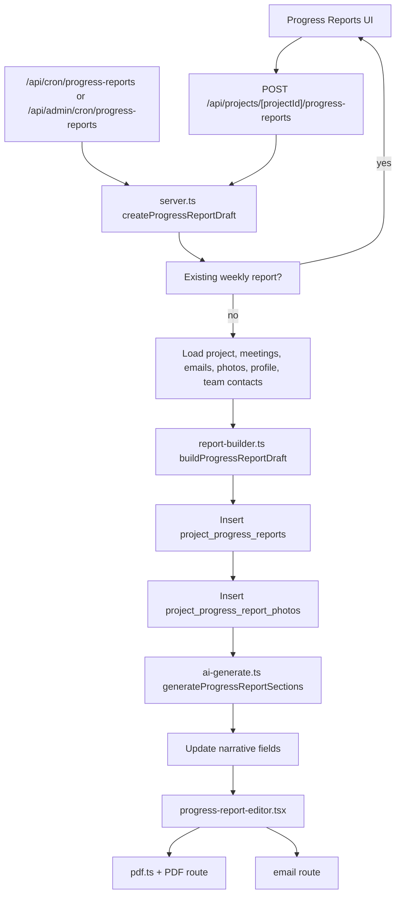

# Progress Reports Generation

This document maps how weekly progress reports are created, enriched, edited, and delivered.

## Source Of Truth

Progress reports are stored in `project_progress_reports`.

Selected report photos are stored separately in `project_progress_report_photos`, which links a report to existing `project_photos` rows and preserves report-specific ordering/captions.

## Generation Flow

## Core Files

`frontend/src/lib/progress-reports/server.ts`

Owns the backend service layer for reports. It reads and writes `project_progress_reports`, manages selected photo links, loads project team contacts, and calls the deterministic builder. `createProgressReportDraft()` is idempotent by project/week range, so cron retries and repeated button clicks return the existing report instead of creating duplicates.

`frontend/src/lib/progress-reports/report-builder.ts`

Builds the first deterministic draft from already-loaded source rows. It has no Supabase or AI calls. It extracts concise bullets from meetings, emails, and photos; builds past-week highlights, upcoming-week activities, and open items; chooses initial photos; and records a compact source snapshot.

`frontend/src/lib/progress-reports/ai-generate.ts`

Owns optional AI enrichment for the three narrative sections. It reloads current project context for the report week, falls back to recent project data when the week has no rows, calls the progress-report prompt, and validates that the model returns all required JSON fields before anything is persisted.

## API Entry Points

`frontend/src/app/api/projects/[projectId]/progress-reports/route.ts`

Project-scoped list/create route. `POST` creates the deterministic draft and then attempts AI enrichment. AI failure is non-fatal; the deterministic report still exists and the PM can regenerate manually.

`frontend/src/app/api/projects/[projectId]/progress-reports/[reportId]/ai-generate/route.ts`

Manual AI regeneration route for an existing report.

`frontend/src/app/api/cron/progress-reports/route.ts`

Scheduled weekly creation route. It calls the same idempotent service function used by the UI.

`frontend/src/app/api/admin/cron/progress-reports/route.ts`

Admin-triggered progress report draft creation.

`frontend/src/app/api/projects/[projectId]/progress-reports/[reportId]/route.ts`

Reads, updates, and deletes a single report. Manual editor saves update the report fields and replace selected photo links as a full ordered set.

`frontend/src/app/api/projects/[projectId]/progress-reports/[reportId]/pdf/route.ts`

Serves the generated report PDF.

`frontend/src/app/api/projects/[projectId]/progress-reports/[reportId]/email/route.ts`

Emails the report with the PDF attached.

## Frontend Control Points

`frontend/src/hooks/use-progress-reports.ts`

React Query hooks for create, update, delete, and list operations.

`frontend/src/app/(main)/[projectId]/progress-reports/progress-reports-client.tsx`

Project report list UI and create action surface.

`frontend/src/app/(main)/[projectId]/progress-reports/[reportId]/progress-report-editor.tsx`

Report editor, regenerate action, PDF action, send action, photo selection, and manual field editing.

`frontend/src/features/progress-reports/progress-reports-table-config.tsx`

Cross-project/table column and filter configuration.

## Data Inputs

Deterministic draft creation uses:

- `projects`: name, project number, start date, estimated completion
- `document_metadata`: meeting summaries, overview, action items, summary bullets
- `project_emails`: recent project email subjects and body previews
- `project_photos`: recent project photos
- `user_profiles`: current user full name
- `project_roles`, `project_role_members`, `project_directory_memberships`, `people`: report contacts

AI enrichment additionally uses:

- week-bounded meetings, emails, and photos
- pending/open change events
- pending/submitted change orders
- week-bounded RFIs
- week-bounded submittals

## Failure Behavior

Draft creation fails loudly when required project/source queries fail or the report insert fails.

AI enrichment fails loudly when the model returns unstructured or incomplete JSON, but route callers can treat enrichment as non-fatal after a deterministic draft has already been created.

Manual saves replace photo links wholesale so report photo ordering remains deterministic and removed photos do not linger.

## Guardrails

- Keep `report-builder.ts` pure: no Supabase calls, no AI calls.
- Keep persistence in `server.ts`: source loading, idempotency, DB inserts/updates.
- Keep prompt/output validation in `ai-generate.ts`.
- Do not let AI overwrite a report unless all three narrative fields are present.
- Do not create new draft paths that bypass `createProgressReportDraft()`, because that is where duplicate prevention lives.
- If new source tables are added, update both deterministic source loading and AI prompt context deliberately, then add source snapshot coverage if the data should be traceable.
