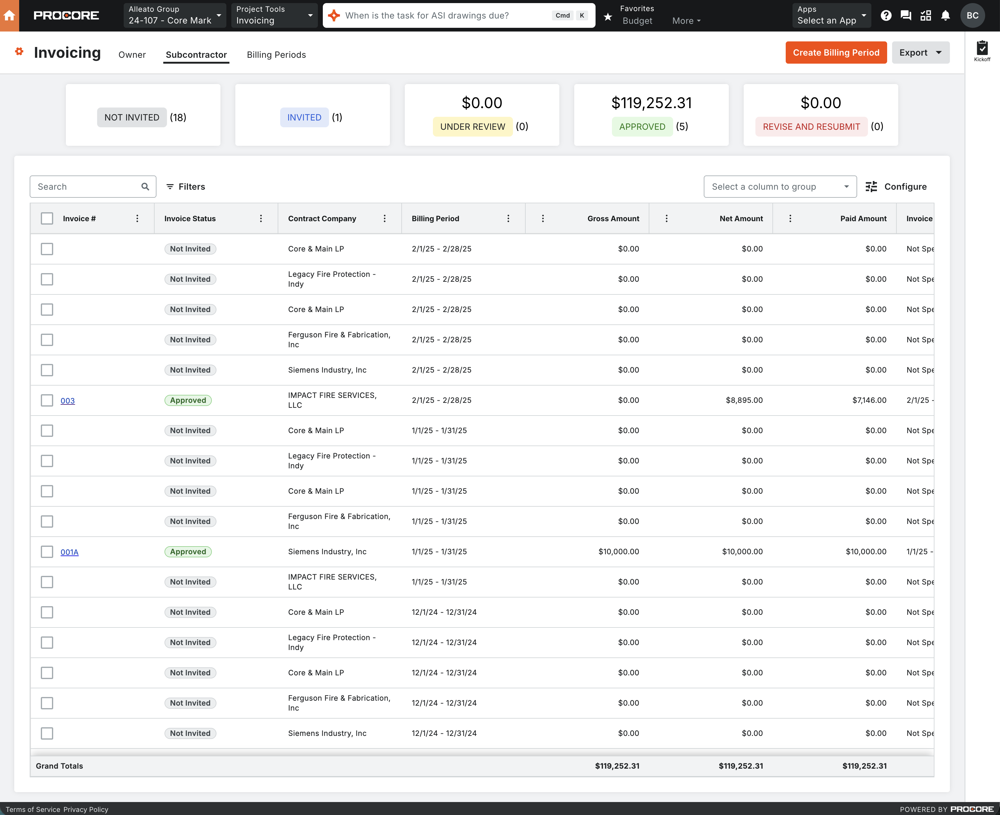
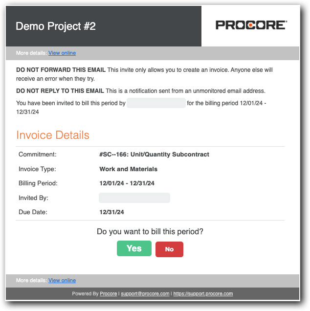

# Procore Research: Invoicing Gap Analysis (Corrected)

**Date:** 2026-04-09
**Question:** A prior procore-docs-rag run on invoicing looked incomplete. Re-run all three tiers and produce an honest gap list.
**Sources used:** Tier 1 (RAG, 4 queries) | Tier 2 (Manifest — recrawled) | Tier 3 (WebFetch — default-statuses FAQ)
**Reference URL (user):** `https://us02.procore.com/.../projects/562949954056757/tools/invoicing/subcontractor`

---

## Pages
- List View
- Detail View
- Create Invoice
- Create Payment

## Tabs
- Owner
- Subcontractor
- Billing Periods

## Actions

## Table Settings
- Filters
- Configure Columns
- Search
- Group

### Owner Invoices

### Subcontractor
It should be invoice number, then invoice status, contract company, billing period, gross amount, net amount, paid amount, invoice dates, contract, total contract amount, percent complete, and total amount. ERP status. It should also allow to filter by billing period, contract company, payment status, invoice status, and contract type. There should be the ability to group by invoice status, contract company, billing period, payment status, or contract type. And then there should be the KPI blocks above the tabs for the total amount under review, the total amount approved, and the total amount with the revise and resubmit status.


## 1. Why the earlier manifest was incomplete

The 2026-03-30 manifest had empty `rowActions`, `tabs`, `filters`, and `toolbarActions` containing only global nav. Classic incomplete-render signature per the skill's mandatory checks — crawler snapshotted before the SPA finished rendering.

**Recrawled today.** The new crawl added a fourth state (`po-invoices-list`) exposing the authoritative 15-column pay-app view.

## 2. Important correction to the first draft of this report

The first draft claimed our app only had a 3-column SOV (`SubcontractorSovTab.tsx`). **That was wrong.** There are two different views:

- **`SubcontractorSovTab.tsx`** (on the commitment detail) — a simple 3-column SOV *template* for the contract itself. Being simple is **correct**; it's the pre-billing template, not the pay app.
- **`/invoicing/subcontractor/[invoiceId]/page.tsx`** — the actual pay-app view, which **already** renders 11 of Procore's 15 SOV columns, and the `subcontractor_invoice_line_items` table has all the underlying fields.

So the real gap is much smaller than the first draft claimed.

---

## 3. Procore's actual structure (post-recrawl)

### 3.1 Invoicing list — Owner & Subcontractor tabs



```
Invoice #, Invoice Status, Contract Company, Billing Period,
Gross Amount, Net Amount, Paid Amount, Invoice Dates,
Contract, Total Contract Amount, % Complete, ERP Status
```

Filters: Billing Period, Contract Company, Payment Status, Invoice Status, Contract Type.

### 3.2 Invoice detail — Summary & SOV


### 3.3 Invite-to-bill email



### 3.4 Per-commitment Invoices tab (`po-invoices-list`) — 15 SOV columns

```
Invoice Position, Invoice #, Invoice Dates, Billing Date, Status,
Original Contract Sum, Net Change By Change Orders, Revised Contract Sum,
Total Completed and Stored To Date, Total Retainage, Total Earned Less Retainage,
Payment Due, Balance To Finish, % Complete, Attachments
```

### 3.5 Default subcontractor invoice statuses (Tier 3)

1. Draft
2. Under Review
3. Revise & Resubmit
4. Approved
5. Approved as Noted
6. Pending Owner Approval

Plus contact indicators: Invited, Not Invited, Accepted, Declined, SSOVs Not Approved, No Invoice Contacts.

### 3.6 Retainage behavior

- Set/released **per line item**.
- Flat percent + sliding-scale retention.
- Dedicated "Release of Retainage" invoice type.

### 3.7 Review workflow

- Admins approve/reject **each SOV line** with a per-line comment.
- Draft → Under Review → (Approved | Approved as Noted | Revise & Resubmit | Pending Owner Approval).
- Approved invoices reflect in the Budget tool.

---

## 4. Our implementation — what exists

| Area | File | State |
|---|---|---|
| Invoicing list | `frontend/src/app/(main)/[projectId]/invoicing/page.tsx` (1,253 lines) | Exists — needs column/filter audit |
| Subcontractor invoice detail | `.../invoicing/subcontractor/[invoiceId]/page.tsx` | **11 of 15 Procore SOV columns** already rendered |
| DB — `subcontractor_invoice_line_items` | migrations | Has `scheduled_value`, `work_completed_previous`, `work_completed_period`, `materials_stored`, `total_completed_stored`, `work_completed_pct`, `retainage_pct`, `retainage_amount`, `retainage_released`, `balance_to_finish`, `net_amount_this_period` |
| Owner invoice API | `api/projects/[projectId]/invoicing/owner/[invoiceId]` | Exists |
| Subcontractor invoice API | `api/projects/[projectId]/invoicing/subcontractor/invoices/[invoiceId]` | Exists |
| `approve-as-noted` endpoint | `.../approve-as-noted/route.ts` | **Exists** but was not wired to a UI button until this session |
| Commitment → SOV template | `components/commitments/tabs/SubcontractorSovTab.tsx` | 3 columns — correct for a template |
| Status enum (pre-session) | `invoice_status` | `draft`, `under_review`, `approved`, `approved_as_noted`, `revise_and_resubmit`, `paid`, `void`, `not_invited`, `invited` |

---

## 5. Real gap list (corrected)

| # | Area | Procore | Our App | Severity |
|---|---|---|---|---|
| 1 | **`pending_owner_approval` status** | Exists | Missing everywhere | **High** — fixed this session |
| 2 | **"Approve as Noted" button** | Part of reviewer actions | API existed but no UI button | **High** — fixed this session |
| 3 | **SOV read-only** | Admin and payee edit period values inline (work this period, stored, retainage) | Invoice detail page renders but cannot edit | **Critical** — next task |
| 4 | **Net Change By COs column** | Shown on pay-app SOV | Not rendered, no schema field on line item | High |
| 5 | **Per-line Approve / Reject + Comment** | Admin reviews each SOV line | Whole-invoice status only | **High** |
| 6 | **Line-item attachments** | Procore allows per-line attachments | Not supported | Medium |
| 7 | **"Release of Retainage" invoice type** | Dedicated create flow | Not implemented | Medium |
| 8 | **Sliding-scale retainage** | Supported | Only flat percent (`retainage_pct`) | Medium |
| 9 | **Invoice Contact invitation workflow** | Invited / Not Invited / Accepted / Declined | Partial (badge values exist, workflow does not) | High |
| 10 | **SSOV approval gate** | Blocks invoice until SSOV approved | Not enforced | Medium |
| 11 | **List-view column & filter parity** | 12 canonical columns + 5 filters | Needs audit of `invoicing/page.tsx` | Medium |
| 12 | **GC / Owner / Specialty terminology** | Procore swaps labels by company type | Not configurable | Low |
| 13 | **Crawler still misses Create dropdown options** | — | — | Investigate with `agent-browser` |

---

## 6. Changes made in this session

1. **Migration** `supabase/migrations/20260409000005_add_pending_owner_approval_status.sql` — adds `pending_owner_approval` to the `invoice_status` enum.
2. **`InvoiceStatusBadge.tsx`** — adds `pending_owner_approval` with a "Pending Owner Approval" label and `warning` variant.
3. **New route** `api/projects/[projectId]/invoicing/subcontractor/invoices/[invoiceId]/pending-owner-approval/route.ts` — `POST` transitions `under_review` → `pending_owner_approval` (mirrors the existing `approve-as-noted` endpoint).
4. **Invoice detail page** (`/invoicing/subcontractor/[invoiceId]/page.tsx`) — added **"Approve as Noted"** and **"Send to Owner"** buttons alongside Approve and Revise & Resubmit when the invoice is Under Review.

Both transitions now produce all 6 Procore subcontractor invoice statuses end-to-end.

---

## 7. Recommended next steps (priority order)

1. **Make the invoice SOV editable** — inline inputs for `work_completed_period`, `materials_stored`, `retainage_pct`. Add "Save" action, recompute totals. This is the next biggest gap.
2. **Per-line approval + comment** — add `approval_state` (`pending` | `approved` | `rejected`) and `reviewer_comment` columns on `subcontractor_invoice_line_items`; render controls when status is `under_review`.
3. **Net Change By COs column** — add `change_order_amount` to the line item, rollup into revised scheduled value.
4. **List-view audit** — diff `invoicing/page.tsx` columns and filters against §3.1.
5. **Invoice Contact invitation workflow** — commitment-level invitation state + list badges.
6. **Manual verification of the Create dropdown** — use `agent-browser` on the Procore URL to enumerate the create menu the crawler misses.

---

## 8. Sources

**Manifest (recrawled 2026-04-09):**
- `.claude/procore-manifests/invoicing/manifest.json`
- `.claude/procore-manifests/invoicing/dom/{list-owner,list-subcontractor,po-invoices-list,create-form}.html`

**Procore support:**
- https://v2.support.procore.com/faq-what-are-the-default-statuses-for-procore-invoices (fetched)
- https://v2.support.procore.com/product-manuals/invoicing-project/tutorials/set-or-release-retainage-on-a-subcontractor-invoice
- https://v2.support.procore.com/product-manuals/invoicing-project/tutorials/Set_and_Release_Retainage_on_an_Owner_Invoice
- https://v2.support.procore.com/product-manuals/invoicing-project/tutorials/create-an-invoice-for-release-of-retainage
- https://v2.support.procore.com/process-guides/invoice-administrator-guide/review--approve-invoices
- https://v2.support.procore.com/faq-what-is-sliding-scale-retention
