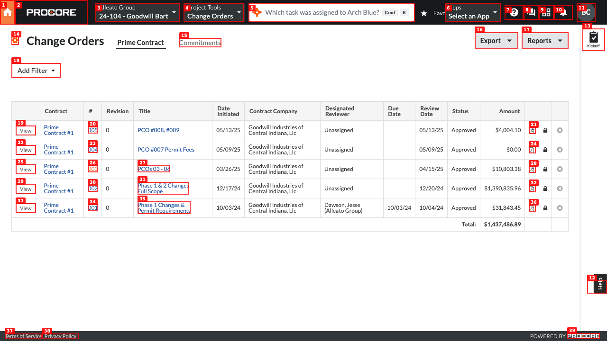
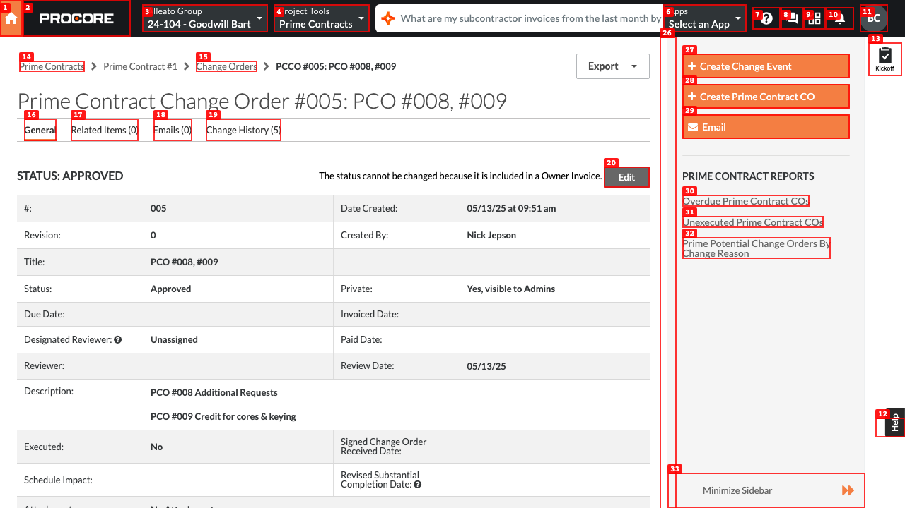
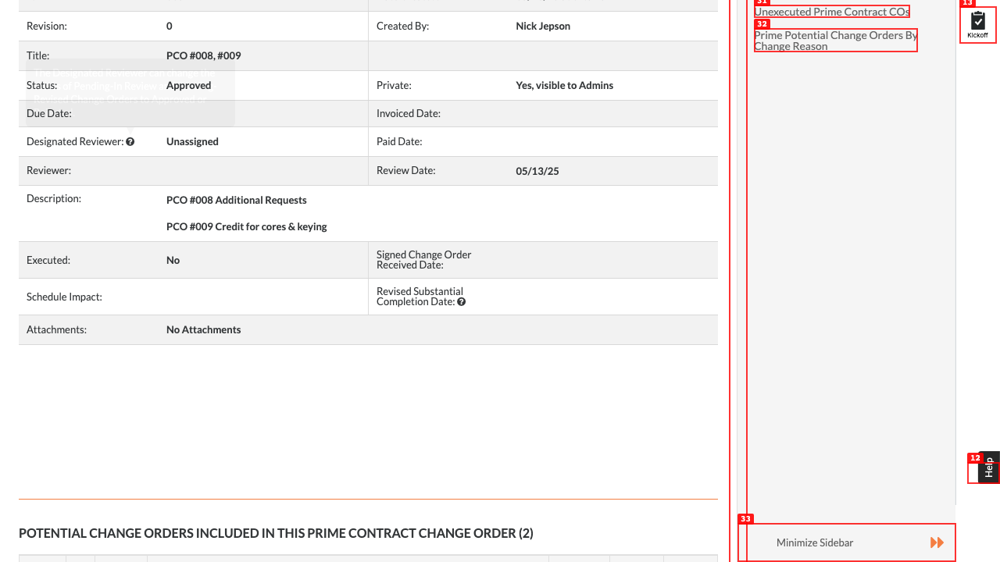
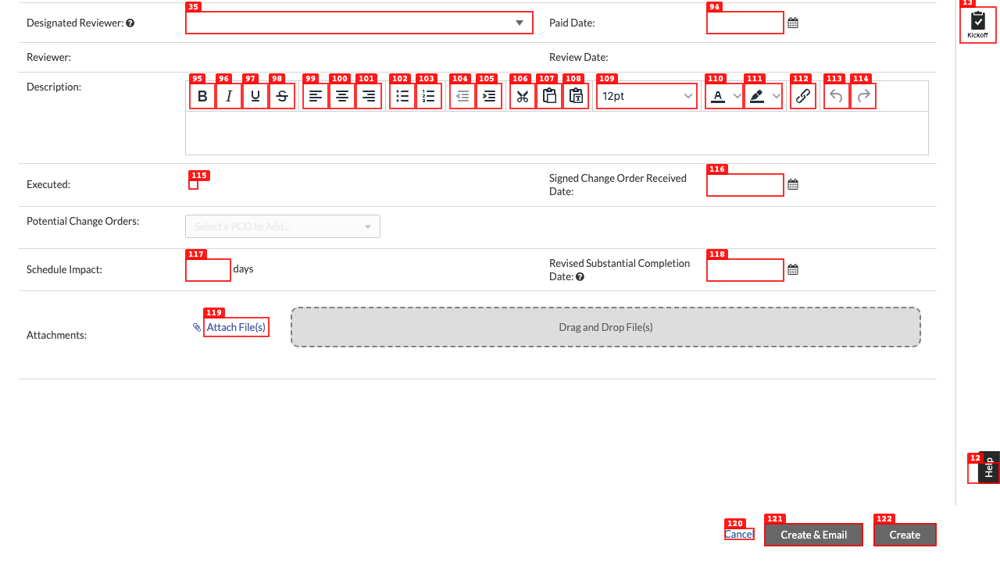
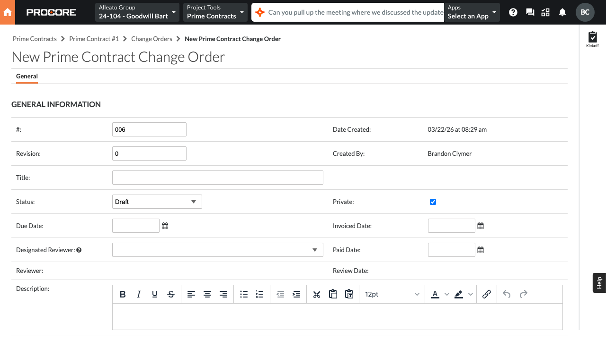
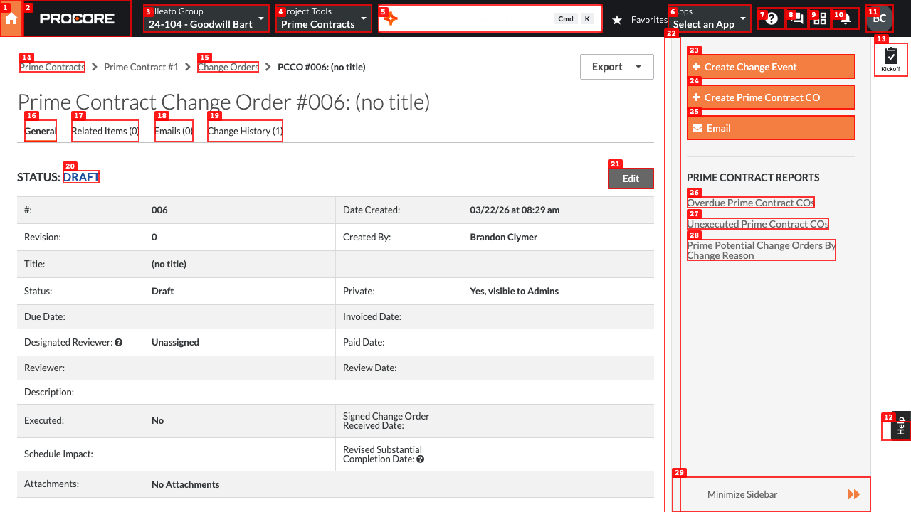
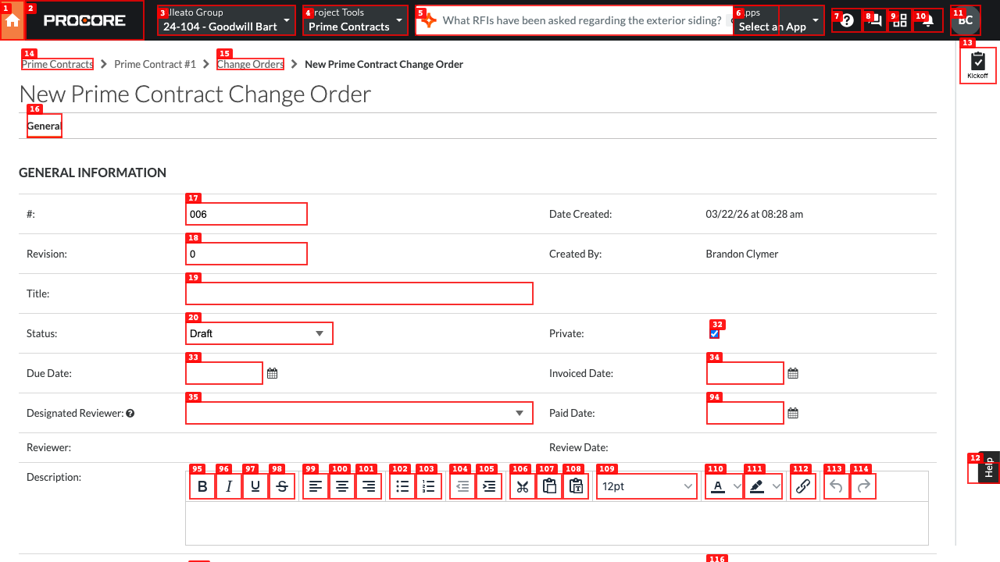

# Dogfood Report: Procore Change Orders

| Field | Value |
|-------|-------|
| **Date** | 2026-03-22 |
| **App URL** | https://us02.procore.com/562949954728542/project/change_orders/list |
| **Session** | procore-change-orders |
| **Scope** | Full Change Orders tool — list view (Prime Contract + Commitments tabs), create flow, detail view (General, Schedule of Values, Change History tabs), Configure tab, Reports |

## Summary

| Severity | Count |
|----------|-------|
| Critical | 0 |
| High | 0 |
| Medium | 2 |
| Low | 1 |
| **Total** | **3** |

> **Note:** A test record "PCCO#006 - TEST - PLEASE DELETE" was created on the live project during form validation testing. It is in Draft status with $0 amount and can be safely deleted by a project admin.

## Issues

---

### ISSUE-001: Blank section with persistent loading spinner on PCCO detail page

| Field | Value |
|-------|-------|
| **Severity** | medium |
| **Category** | functional / console |
| **URL** | https://us02.procore.com/562949954728542/project/prime_contracts/562949957345977/change_orders/change_order_packages/562949956482890 |
| **Repro Video** | N/A |

**Description**

On the Prime Contract Change Order detail page, there is a persistent loading spinner (``) between the general information table and the "Potential Change Orders" section. The spinner never resolves — even after the page is fully loaded. Below the spinner sits an empty `<table>` element with no content. This section appears to have been designed to show data (likely budget impact or ERP-related line items) but fails silently due to a console error.

The root cause is visible in the browser console: `Cannot find module '@particles/table'` (repeated across multiple page navigations). The `@particles/table` package fails to load, causing the dependent table component to render a stuck loading state rather than its intended content.

**Repro Steps**

1. Navigate to the Change Orders list: https://us02.procore.com/562949954728542/project/change_orders/list
   

2. Click "View" on any Prime Contract change order row (e.g., PCCO#005).
   

3. Scroll down past the general info table (Revision, Title, Status, Due Date, etc.).
   

4. **Observe:** A large blank white area with a loading spinner is present between the general info table and the "POTENTIAL CHANGE ORDERS INCLUDED IN THIS PRIME CONTRACT CHANGE ORDER" heading. The spinner never resolves after page load.

**Console evidence:**
```
[error] One or more required elements not found.
[warning] Missing @particles/table import try catch. Error: Cannot find module '@particles/table'
```

---

### ISSUE-002: Create PCCO form accepts empty submission with no validation

| Field | Value |
|-------|-------|
| **Severity** | medium |
| **Category** | functional / ux |
| **URL** | https://us02.procore.com/562949954728542/project/prime_contracts/562949957345977/change_orders/change_order_packages/new |
| **Repro Video** | videos/issue-002-validation.webm |

**Description**

The "New Prime Contract Change Order" form can be submitted completely empty by clicking the "Create" button. No validation fires, no error messages appear, and a CO is immediately created with the title `(no title)` in Draft status with $0 amount.

At minimum the Title field should be required. The form does visually indicate the Designated Reviewer field in red (red border styling), but clicking Create bypasses this entirely and creates the record anyway.

The newly created test record immediately appears in the "Unexecuted PCCOs and Unpaid Unassociated COs" report, which could cause confusion for project managers.

**Repro Steps**

1. Navigate to a Prime Contract CO detail page and click "Create Prime Contract CO" in the sidebar.
   

2. Without filling in any fields, scroll to the bottom of the form.
   

3. Click the "Create" button.
   

4. **Observe:** The form is immediately submitted and a new PCCO is created with title `(no title)` in Draft status. No validation errors are shown.
   

---

### ISSUE-003: No visible delete option for Draft PCCOs

| Field | Value |
|-------|-------|
| **Severity** | low |
| **Category** | ux |
| **URL** | https://us02.procore.com/562949954728542/project/prime_contracts/562949957345977/change_orders/change_order_packages/562949957362923 |
| **Repro Video** | N/A |

**Description**

Once a Prime Contract Change Order is created (even accidentally, e.g., via the no-validation issue above), there is no visible "Delete" or "Recycle" button on the detail page or in the Edit form. Users who accidentally create a blank CO have no obvious recovery path.

The only options visible on a Draft PCCO detail are: Edit, Create Change Event, Create Prime Contract CO, and Email. No destructive action is exposed in the UI even for Draft records that have never been reviewed or sent.

This compounds ISSUE-002 — not only can an empty CO be created accidentally, but there is no obvious way to remove it.

**Repro Steps**

1. Navigate to a Draft PCCO detail page.
   

2. **Observe:** The page shows an "Edit" button but no "Delete," "Recycle," or "Remove" option anywhere on the page or in the Edit form.

---

## Additional Observations (Not Issues)

These are behaviors worth noting for reference during Alleato implementation:

| Area | Observation |
|------|-------------|
| **List view tabs** | Two tabs: "Prime Contract" and "Commitments" — completely separate lists with different column sets |
| **Prime Contract tab default filter** | Page loads with "Status: Executed" pre-applied — Procore uses "Executed" to mean a physically signed/received CO, which is distinct from "Approved" |
| **Filter options** | Commitments tab filter: Status, Contract Company, Executed. Prime Contract tab: Status, Executed |
| **Reports dropdown** | 4 reports: Unexecuted Prime Contract COs, Overdue Prime Contract COs, Overdue Commitment COs, Prime Potential Change Orders By Change Reason |
| **Export button** | Triggers silent download (no dropdown, no confirmation dialog) |
| **Configure tab** | Two settings: "Show Line Items on Prime Contract CO PDFs" and "Show Line Items on Commitment CO PDFs" (both checkboxes) + Change Reason Behavior dropdown |
| **PCCO detail tabs** | General, Related Items, Emails, Change History |
| **Commitment CO detail tabs** | General, Schedule of Values, Related Items, Emails, Financial Markup, Change History, ERP Integration |
| **Change History** | Timestamped audit log with Action By, Changed field, From/To values — fully functional |
| **Schedule of Values** | Editable line item table on Commitment COs with budget code linking |
| **Overdue report** | Correct empty state: "There are no Overdue Prime Contract Change Orders for this project" |
| **Unexecuted report** | Shows Draft PCCOs and unpaid unassociated COs — correctly surfaces the test record |
| **Sidebar actions on PCCO** | Create Change Event, Create Prime Contract CO, Email + 3 report quick links |
| **Sidebar actions on Commitment CO** | Create Change Event, Re-send to ERP, Email + 3 commitment reports |
| **CO creation form fields** | #, Revision, Title, Status (dropdown with 10 states), Due Date, Designated Reviewer, Reviewer, Description (rich text), Executed (checkbox), Signed CO Received Date, Potential Change Orders (multi-select PCO picker), Schedule Impact (days + revised completion date), Attachments |
