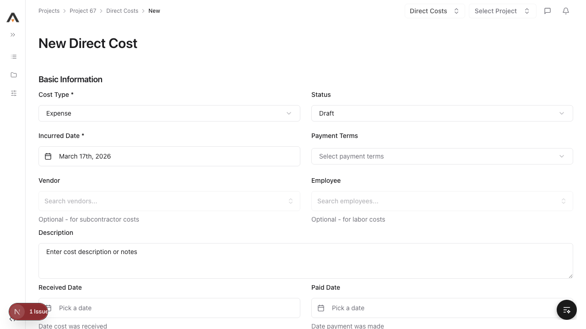
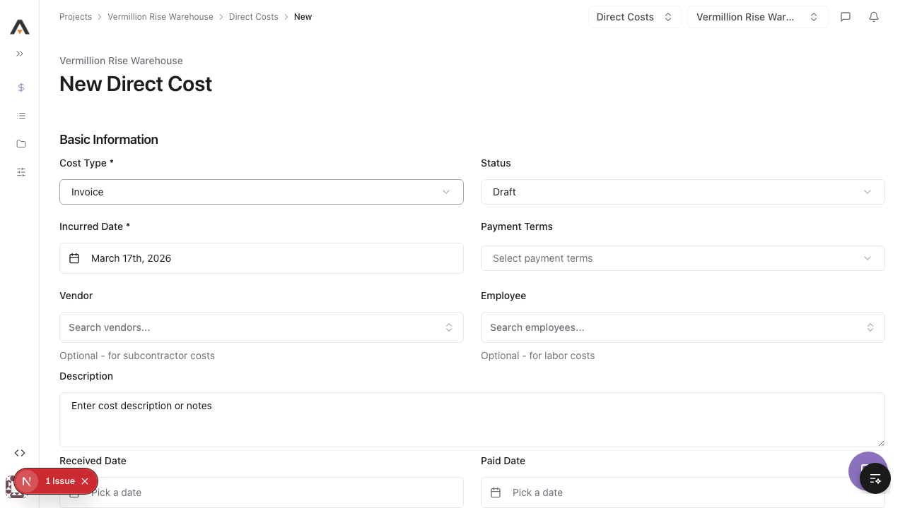
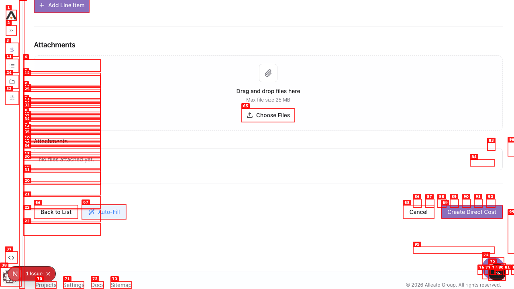
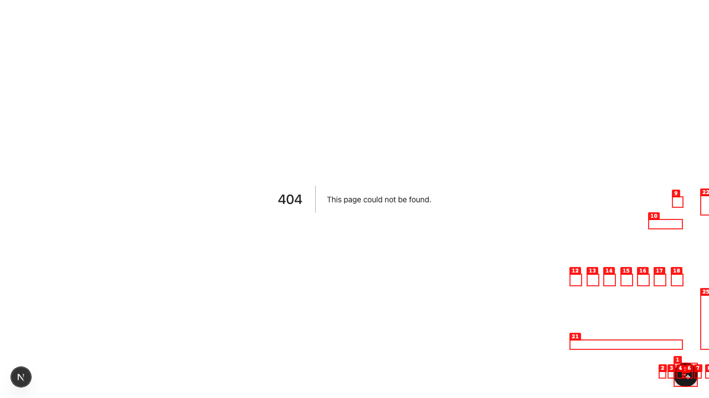
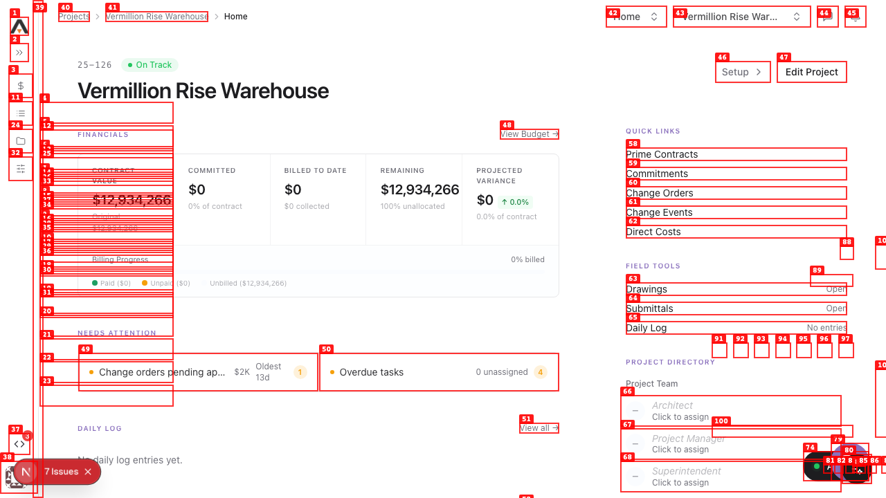
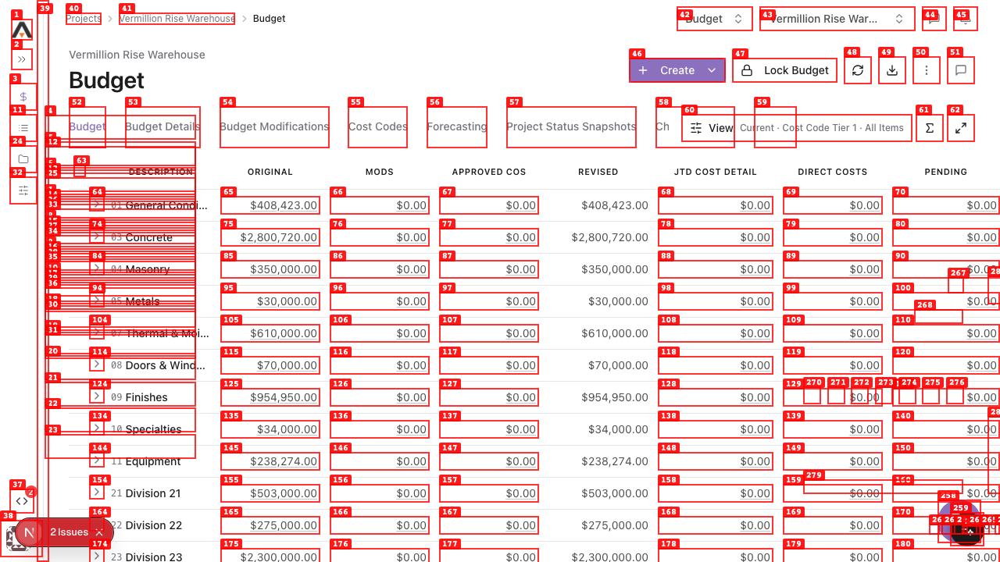
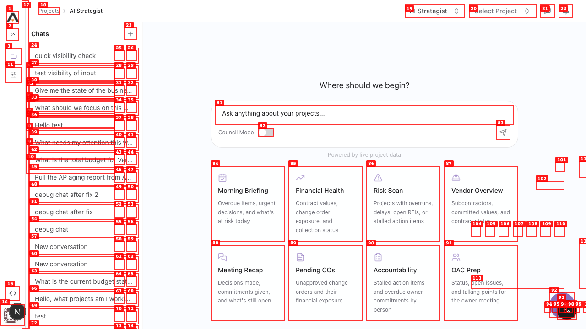
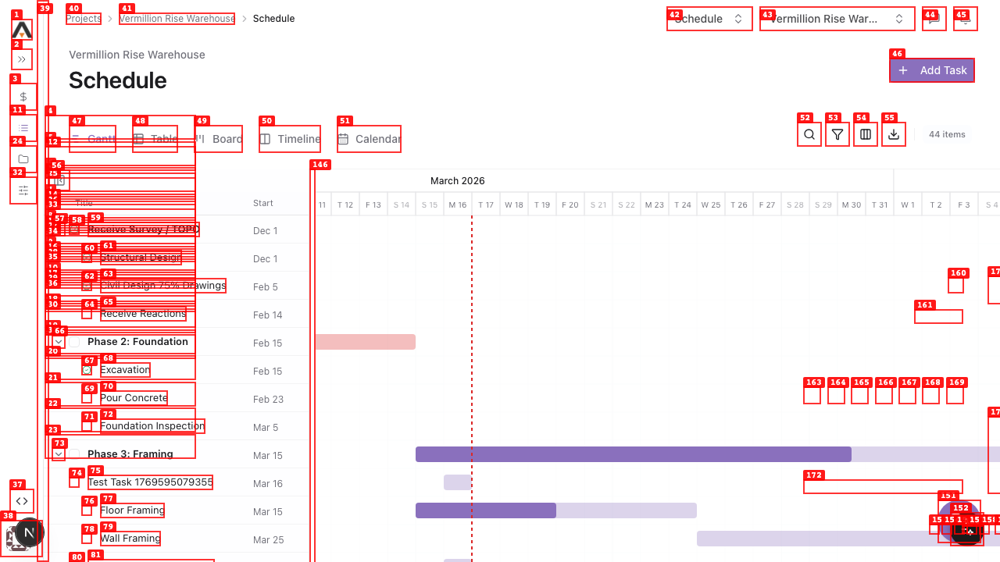

# Dogfood Report: Alleato PM

| Field | Value |
|-------|-------|
| **Date** | 2026-03-17 |
| **App URL** | http://localhost:3001/ |
| **Session** | localhost-3001 |
| **Scope** | Full app — Financial tools, Schedule, Drawings, AI Strategist, navigation |

## Summary

| Severity | Count |
|----------|-------|
| Critical | 0 |
| High | 2 |
| Medium | 3 |
| Low | 1 |
| **Total** | **6** |

## Issues

---

### ISSUE-001: Direct Costs form silently ignores required field validation

| Field | Value |
|-------|-------|
| **Severity** | high |
| **Category** | functional / ux |
| **URL** | http://localhost:3001/67/direct-costs/new |
| **Repro Video** | videos/issue-002-direct-costs-submit.webm |

**Description**

When a user opens the New Direct Cost form and clicks "Create Direct Cost" without filling the required "Incurred Date *" field, nothing happens — no validation error is shown, no toast appears, the form stays open with zero feedback. Users have no way to know which field is missing or that submission failed.

**Repro Steps**

1. Navigate to http://localhost:3001/67/direct-costs
   

2. Click "Create" → "New Direct Cost" to open the creation form
   

3. Leave the "Incurred Date *" field empty (do not fill it). Click "Create Direct Cost".
   

4. **Observe:** The form stays open with no error message, no toast notification, no field highlight. The required date field is unmarked and the button appears to do nothing.
   

---

### ISSUE-002: 360 Reporting sidebar link returns 404

| Field | Value |
|-------|-------|
| **Severity** | high |
| **Category** | functional |
| **URL** | http://localhost:3001/reporting |
| **Repro Video** | N/A |

**Description**

The "360 Reporting" link in the main sidebar navigates to `/reporting` which returns a Next.js 404 page. The route does not exist. Users clicking this prominent sidebar nav item hit a dead end with no recovery path (no back button, no suggestion to navigate elsewhere).

**Repro Steps**

1. On any project page, locate "360 Reporting" in the top sidebar navigation section.

2. Click "360 Reporting".

3. **Observe:** Browser navigates to http://localhost:3001/reporting which renders a blank 404 page — no layout, no sidebar, no way to get back without using the browser back button.
   

---

### ISSUE-003: React duplicate key console errors on every page

| Field | Value |
|-------|-------|
| **Severity** | medium |
| **Category** | console |
| **URL** | All pages (reproduced on home, budget, schedule, commitments, direct costs) |
| **Repro Video** | N/A |

**Description**

Three React "duplicate key" errors appear in the console on every page load. The same three UUIDs (9c0431e8-2028-4c26-af46-e1d2200de0c9, 0f5c4540-894c-4e92-b9cf-c0cf623cebd0, 41aca55b-aade-425b-8c2f-489bd1a9dab4) appear repeatedly — each set of three appears twice per load. React warns that "non-unique keys may cause children to be duplicated and/or omitted." This points to a list somewhere in the shared layout (likely the sidebar or a shared data list) that has duplicate entries.

**Repro Steps**

1. Open browser DevTools → Console.
2. Navigate to http://localhost:3001/67/budget (or any project page).
3. **Observe:** Console shows 6 "Encountered two children with the same key" errors with the same three UUIDs. These persist across all pages.
   

---

### ISSUE-004: React hydration mismatch and invalid HTML nesting errors

| Field | Value |
|-------|-------|
| **Severity** | medium |
| **Category** | console |
| **URL** | http://localhost:3001/67/budget |
| **Repro Video** | N/A |

**Description**

Two additional console error classes appear: (1) "A tree hydrated but some attributes of the server rendered HTML didn't match the client properties" — a React SSR/CSR hydration mismatch; (2) "In HTML, %s cannot be a descendant of <%s> / <%s> cannot contain a nested %s" — invalid HTML nesting. These can cause subtle rendering inconsistencies and potentially trigger error boundaries (during testing, the budget page briefly crashed into an error boundary state showing "Try Again" / "Go Back" buttons before recovering on refresh).

**Repro Steps**

1. Open browser DevTools → Console.
2. Navigate to http://localhost:3001/67/budget.
3. **Observe:** Console shows hydration mismatch warning and HTML nesting error alongside the duplicate key errors.
   

---

### ISSUE-005: AI Strategist conversation list contains developer test data

| Field | Value |
|-------|-------|
| **Severity** | medium |
| **Category** | content |
| **URL** | http://localhost:3001/ai-assistant |
| **Repro Video** | N/A |

**Description**

The AI Strategist chat history sidebar shows development/test conversations that should not be visible to users: "debug chat", "debug chat after fix", "debug chat after fix 2", "quick visibility check", "test visibility of input", "Hello test", "test", "test". These are conversations used during development testing. In production or demo contexts, seeing internal debug conversations breaks trust and looks unprofessional.

**Repro Steps**

1. Navigate to http://localhost:3001/ai-assistant.
2. **Observe:** The left sidebar conversation history contains multiple entries with debug/test names including "debug chat", "debug chat after fix 2", "quick visibility check", "test visibility of input", "test", "New conversation".
   

---

### ISSUE-006: Schedule page contains leftover test task entries

| Field | Value |
|-------|-------|
| **Severity** | low |
| **Category** | content |
| **URL** | http://localhost:3001/67/schedule |
| **Repro Video** | N/A |

**Description**

The Schedule page for the Vermillion Rise Warehouse project shows dozens of tasks with auto-generated test names like "Test Task 1769595079355", "Test Task 1769595083060", etc. These appear alongside real schedule tasks ("Receive Survey / TOPO", "Structural Design", etc.) and clutter the schedule view. These look like test data created during Playwright E2E test runs that was never cleaned up.

**Repro Steps**

1. Navigate to http://localhost:3001/67/schedule.
2. **Observe:** The Gantt/table view shows many tasks with names in the format "Test Task [numeric timestamp]" mixed in with real project tasks.
   

---
