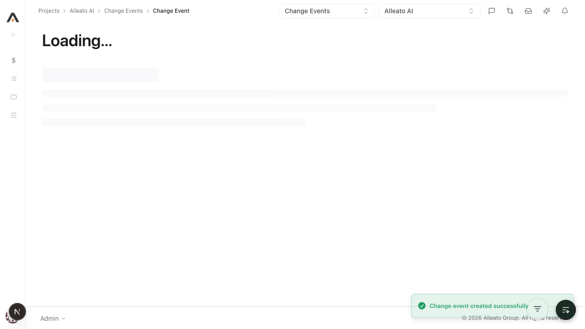
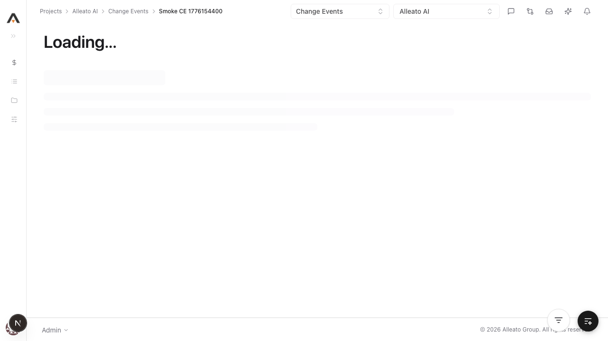

# Smoke Test Report: change-events

| Field | Value |
|-------|-------|
| **Date** | 2026-04-14 |
| **Tool** | change-events |
| **Project** | 767 |
| **URL** | http://localhost:3000/767/change-events |
| **Verdict** | FAIL |
| **Duration** | ~14 minutes |

---

## Summary

| Check | Count | Pass | Fail | Verdict |
|-------|-------|------|------|---------|
| API Endpoints | 20 | 17 | 0 | PASS |
| Page Loads | 4 | 4 | 0 | PASS |
| Visual / Design Smoke | 5 | 3 | 2 | FAIL |
| CRUD Tests | 5 | 2 | 1 | FAIL |
| DB Validation | 2 | 2 | 0 | PASS |
| Negative Path | 1 | 0 | 0 | SKIPPED |

---

## API Health

| Endpoint | Method | Status | Expected | Verdict |
|----------|--------|--------|----------|---------|
| /api/projects/767/change-events | GET | 200 | 200 | PASS |
| /api/projects/767/change-events/origin-options?type=emails | GET | 200 | 200 | PASS |
| /api/projects/767/change-events/rfqs | GET | 200 | 200 | PASS |
| /api/projects/767/change-events/rfqs/{rfqId} | GET | SKIP | 200 | SKIP |
| /api/projects/767/change-events/rfqs/{rfqId}/responses | GET | SKIP | 200 | SKIP |
| /api/projects/767/change-events/e441d155-03ec-4922-96ad-400c94db83dd | GET | 200 | 200 | PASS |
| /api/projects/767/change-events/e441d155-03ec-4922-96ad-400c94db83dd/commitment-pcos | GET | 200 | 200 | PASS |
| /api/projects/767/change-events/e441d155-03ec-4922-96ad-400c94db83dd/line-items | GET | 200 | 200 | PASS |
| /api/projects/767/change-events/e441d155-03ec-4922-96ad-400c94db83dd/line-items/7dc007e9-9afd-48f0-ba91-9d206cb4c60c | GET | 200 | 200 | PASS |
| /api/projects/767/change-events/e441d155-03ec-4922-96ad-400c94db83dd/prime-pcos | GET | 200 | 200 | PASS |
| /api/projects/767/change-events/e441d155-03ec-4922-96ad-400c94db83dd/prime-contract-change-orders | GET | 200 | 200 | PASS |
| /api/projects/767/change-events/e441d155-03ec-4922-96ad-400c94db83dd/pdf | GET | 200 | 200 | PASS |
| /api/projects/767/change-events/e441d155-03ec-4922-96ad-400c94db83dd/related-items/options?type=change_event | GET | 200 | 200 | PASS |
| /api/projects/767/change-events/e441d155-03ec-4922-96ad-400c94db83dd/related-items | GET | 200 | 200 | PASS |
| /api/projects/767/change-events/e441d155-03ec-4922-96ad-400c94db83dd/lineage | GET | 200 | 200 | PASS |
| /api/projects/767/change-events/e441d155-03ec-4922-96ad-400c94db83dd/history | GET | 200 | 200 | PASS |
| /api/projects/767/change-events/e441d155-03ec-4922-96ad-400c94db83dd/approvals | GET | 200 | 200 | PASS |
| /api/projects/767/change-events/e441d155-03ec-4922-96ad-400c94db83dd/attachments | GET | 200 | 200 | PASS |
| /api/projects/767/change-events/e441d155-03ec-4922-96ad-400c94db83dd/attachments/{attachmentId} | GET | SKIP | 200 | SKIP |
| /api/projects/767/change-events/e441d155-03ec-4922-96ad-400c94db83dd/attachments/{attachmentId}/download | GET | SKIP | 200 | SKIP |

---

## Page Loads

| Page | URL | Loaded | JS Errors | Screenshot | Verdict |
|------|-----|--------|-----------|------------|---------|
| List | /767/change-events | Yes | None | screenshots/page-list.png | PASS |
| New | /767/change-events/new | Yes | None | screenshots/page-new.png | PASS |
| Detail | /767/change-events/e441d155-03ec-4922-96ad-400c94db83dd | Yes | None | screenshots/page-detail.png | PASS |
| Edit | /767/change-events/e441d155-03ec-4922-96ad-400c94db83dd/edit | Yes | None | screenshots/page-edit.png | PASS |

---

## Visual / Design Smoke

| Page | Overlap | Truncation | Hidden/Broken Controls | Spacing/Layout | Screenshot | Verdict |
|------|---------|------------|--------------------------|----------------|------------|---------|
| List (initial) | No | No | No | Good | screenshots/page-list.png | PASS |
| New (initial) | No | No | No | Good | screenshots/page-new.png | PASS |
| Detail (post-create) | No | No | No | Good | screenshots/detail.png | PASS |
| Detail (post-edit) | N/A | N/A | Page crashed (500) | N/A | screenshots/detail-after-edit.png | FAIL |
| List (post-edit) | N/A | N/A | Page crashed (500) | N/A | screenshots/list-crash.png | FAIL |

---

## CRUD Tests

### Create

**Test:** 1.1.1 Create a change event with required fields only  
**Result:** PASS  
**Screenshot:** 

**Form Completion Coverage:**

| Field | Type | Filled In UI | Value Entered | Persisted |
|-------|------|--------------|---------------|-----------|
| Title | text | Yes | Smoke CE 1776154400 | Yes |
| Type | dropdown | Defaulted | Owner Change | Yes |
| Scope | dropdown | Defaulted | TBD | Yes |

**DB/API Validation:**

| Field | Value Entered | DB Value | Match |
|-------|--------------|----------|-------|
| id | (generated) | 18f4c111-4bff-4782-ac3c-19c395299f38 | Yes |
| title | Smoke CE 1776154400 | Smoke CE 1776154400 | Yes |
| type | Owner Change | Owner Change | Yes |
| scope | TBD | TBD | Yes |
| status | Open | Open | Yes |

### Read / Detail

**Result:** FAIL  
**Screenshot:** 

### Edit

**Result:** PASS  
**Pre-fill check:** YES (fields loaded with saved values in edit view)  
**Screenshot:** 

### Delete

**Result:** SKIPPED (blocked by post-edit 500 on list/detail surfaces)  
**Screenshot:** N/A

---

## Negative Path

**Empty form submit:** SKIPPED (blocked by post-edit 500 on /change-events/new)  
**Screenshot:** N/A

---

## Failures

### FAILURE-001: Change Events list/detail regress to 500 after CRUD mutation

| Field | Value |
|-------|-------|
| **Phase** | CRUD / Page |
| **Severity** | critical |
| **What happened** | After creating and updating a new Change Event, `/767/change-events` and `/767/change-events/{id}` rendered `Internal Server Error`, and authenticated API reads began returning 500 in-session. |
| **Expected** | List and detail views remain available after create/edit, and API continues returning 200 for normal reads. |

**Screenshot:** 

---

## Test Matrix Coverage

| Matrix Test ID | Name | Executed | Result |
|---------------|------|----------|--------|
| 1.1.1 | Create a change event with required fields only | Yes | PASS |
| 2.1.1 | List view loads with correct columns | Yes | PASS |
| 2.2.1 | Detail view loads all tabs | Partial | FAIL |
| 1.2.1 | Edit header fields | Yes | PASS |
| 1.2.4 | Edit opens pre-filled with saved values | Yes | PASS |
| 1.3.1 | Delete (soft) a single change event | No | SKIPPED |
| 1.1.3 | Create fails when title is missing | No | SKIPPED |

---

## Next Steps

- Fix the 500 regression in Change Events read surfaces (list/detail/API) and confirm they fail loudly with actionable errors instead of generic Internal Server Error.
- Re-run `/smoke-test change-events` after the fix to complete delete + negative-path coverage.
- If desired, run `/feature-audit change-events` after stability is restored for deeper parity checks.
