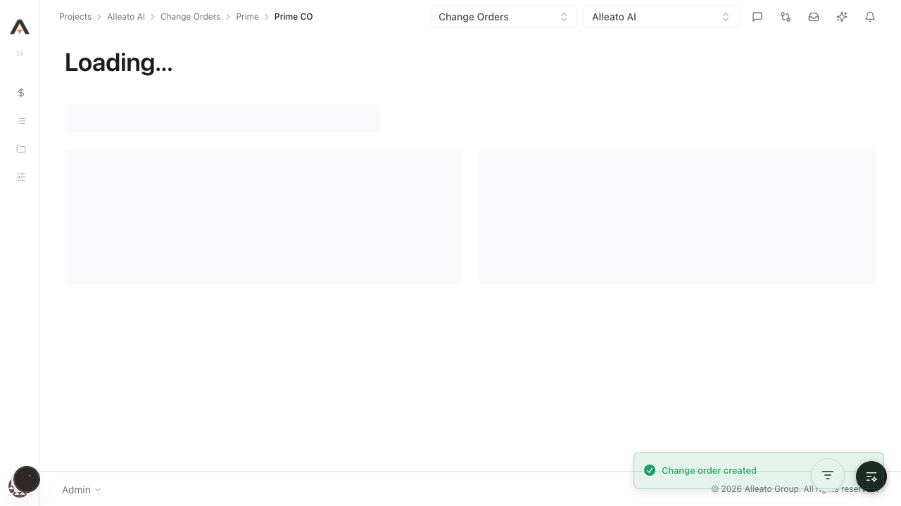
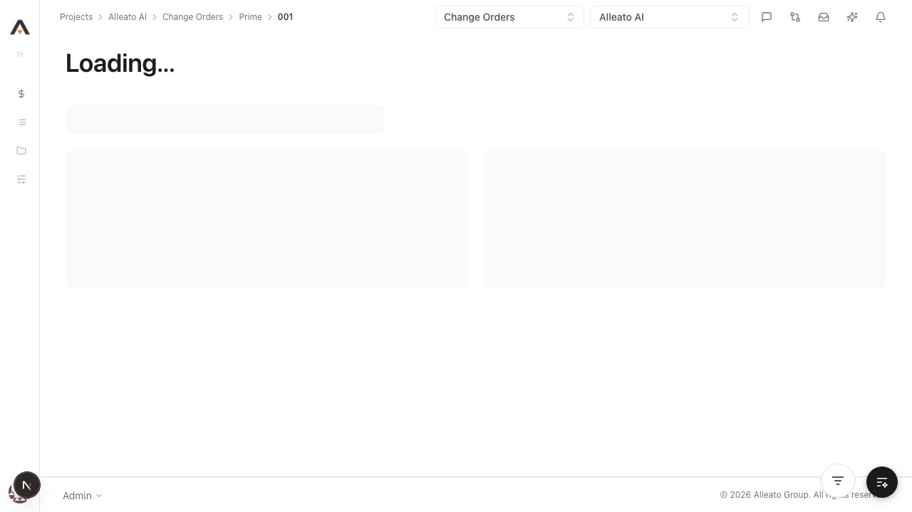
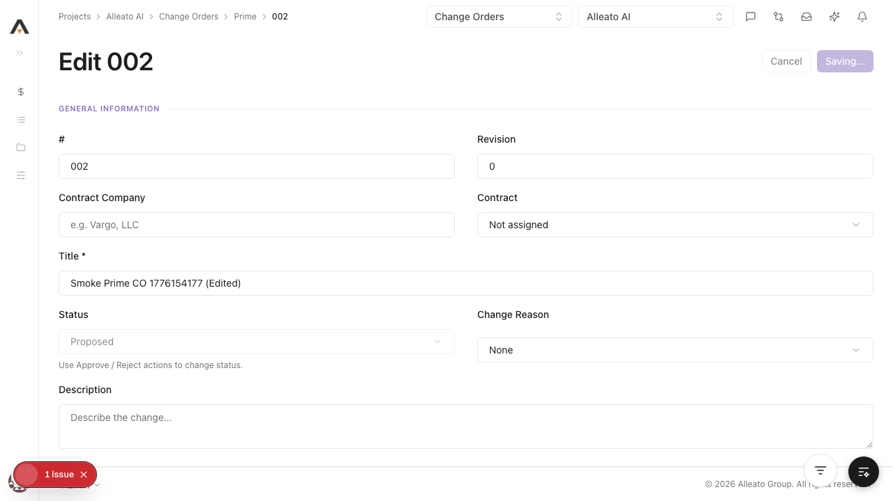
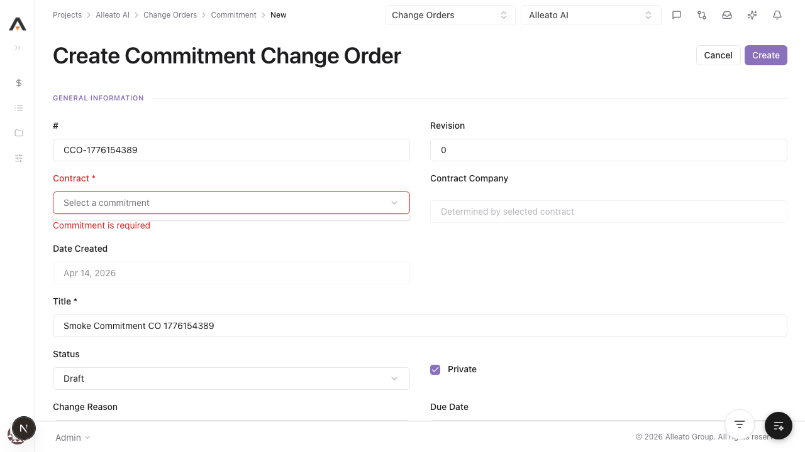
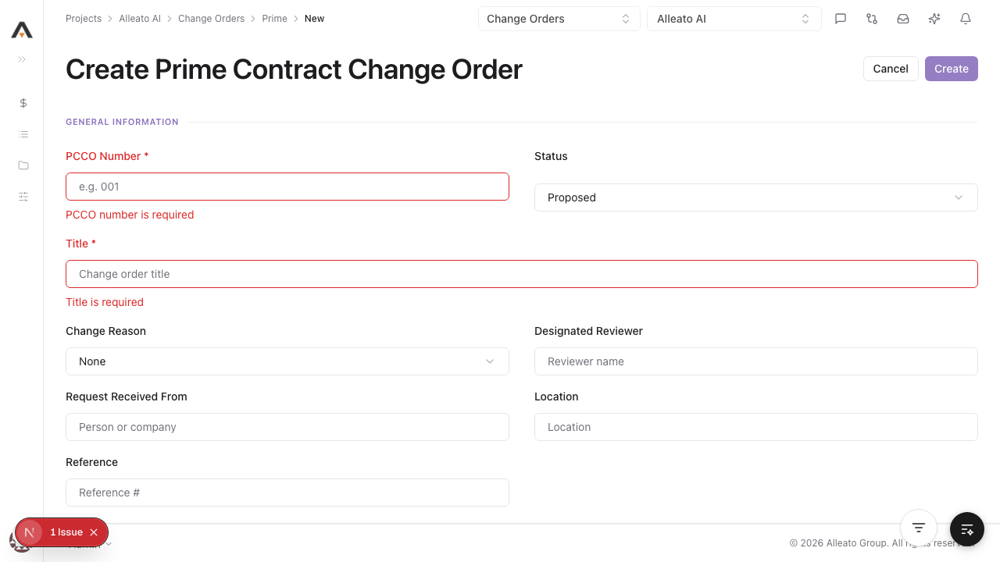

# Smoke Test Report: change-orders

| Field | Value |
|-------|-------|
| **Date** | 2026-04-14 |
| **Tool** | change-orders |
| **Project** | 767 |
| **URL** | http://localhost:3000/767/change-orders |
| **Verdict** | PARTIAL |
| **Duration** | ~26 minutes |

---

## Summary

| Check | Count | Pass | Fail | Verdict |
|-------|-------|------|------|---------|
| API Endpoints | 12 | 12 | 0 | PASS |
| Page Loads | 7 | 7 | 0 | PASS |
| Visual / Design Smoke | 3 | 3 | 0 | PASS |
| CRUD Tests | 8 | 5 | 3 | PARTIAL |
| DB Validation | 3 | 3 | 0 | PASS |
| Negative Path | 2 | 2 | 0 | PASS |

---

## API Health

| Endpoint | Method | Status | Expected | Verdict |
|----------|--------|--------|----------|---------|
| /api/projects/767/prime-contract-change-orders | GET | 200 | 200 | PASS |
| /api/projects/767/prime-contract-change-orders/export | GET | 200 | 200 | PASS |
| /api/projects/767/prime-contract-change-orders/1717 | GET | 200 | 200 | PASS |
| /api/projects/767/prime-contract-change-orders/1717/line-items | GET | 200 | 200 | PASS |
| /api/projects/767/prime-contract-change-orders/1717/attachments | GET | 200 | 200 | PASS |
| /api/projects/767/commitment-change-orders | GET | 200 | 200 | PASS |
| /api/projects/767/commitment-change-orders/export | GET | 200 | 200 | PASS |
| /api/projects/767/commitment-change-orders/838debdf-df9a-4cae-b1d6-958faa5d0db2 | GET | 200 | 200 | PASS |
| /api/projects/767/commitment-change-orders/838debdf-df9a-4cae-b1d6-958faa5d0db2/line-items | GET | 200 | 200 | PASS |
| /api/projects/767/commitment-change-orders/838debdf-df9a-4cae-b1d6-958faa5d0db2/attachments | GET | 200 | 200 | PASS |
| /api/projects/767/contracts/c94f5f65-af48-4461-b9a5-96087157ff02/change-orders | GET | 200 | 200 | PASS |
| /api/projects/767/change-events/e441d155-03ec-4922-96ad-400c94db83dd/prime-contract-change-orders | GET | 200 | 200 | PASS |

---

## Page Loads

| Page | URL | Loaded | JS Errors | Screenshot | Verdict |
|------|-----|--------|-----------|------------|---------|
| Change Orders List | /767/change-orders | Yes | None | screenshots/page-list.png | PASS |
| Prime CO New | /767/change-orders/prime/new | Yes | None | screenshots/page-prime-new.png | PASS |
| Commitment CO New | /767/change-orders/commitment/new | Yes | None | screenshots/page-commitment-new.png | PASS |
| Prime CO Detail | /767/change-orders/prime/1717 | Yes | None | screenshots/page-prime-detail.png | PASS |
| Commitment CO Detail | /767/change-orders/commitment/838debdf-df9a-4cae-b1d6-958faa5d0db2 | Yes | None | screenshots/page-commitment-detail.png | PASS |
| Legacy Edit Route | /767/change-orders/1717/edit | Yes | None | screenshots/page-legacy-edit.png | PASS |
| Prime Contracts Change Orders redirect | /767/prime-contracts/change-orders -> /767/change-orders?tab=prime | Yes | None | screenshots/page-prime-contracts-co.png | PASS |

---

## Visual / Design Smoke

| Page | Overlap | Truncation | Hidden/Broken Controls | Spacing/Layout | Screenshot | Verdict |
|------|---------|------------|--------------------------|----------------|------------|---------|
| List | None observed | None observed | None observed | Clean | screenshots/page-list.png | PASS |
| Prime Create | None observed | None observed | None observed | Clean | screenshots/page-prime-new.png | PASS |
| Prime Detail | None observed | None observed | None observed | Clean | screenshots/page-prime-detail.png | PASS |

---

## CRUD Tests

### Create

**Test:** 1.1.1 Create a prime CO with required fields only  
**Result:** PASS  
**Screenshot:** 

**DB Validation:**
- Created `id=1718`, `pcco_number=002`, `title="Smoke Prime CO 1776154177"`, `status=proposed`.

### Read / Detail

**Result:** PASS  
**Screenshot:** 

### Edit

**Result:** PASS  
**Pre-fill check:** YES (fields populated in `?edit=1` mode)  
**Screenshot:** 

### Delete

**Result:** FAIL  
**Reason:** API guard blocks deletion for `proposed` and `approved` statuses (`409`), allowing only `draft/pending/rejected`. This prevented cleanup for smoke-created records.  
**Screenshot:** 

---

## Negative Path

**Empty prime create submit:** PASS (`PCCO number is required`, `Title is required`)  
**Commitment create without contract:** PASS (`Commitment is required`)  
**Screenshot:** 

---

## Failures

### FAILURE-001: Commitment create flow not completed via browser automation

| Field | Value |
|-------|-------|
| **Phase** | CRUD |
| **Severity** | medium |
| **What happened** | Commitment create requires contract selection from custom combobox; session got trapped in listbox state repeatedly, and create remained blocked by required contract validation. |
| **Expected** | Contract selected and commitment record created from UI. |

**Screenshot:** 

### FAILURE-002: Delete policy blocks smoke cleanup for created prime COs

| Field | Value |
|-------|-------|
| **Phase** | CRUD |
| **Severity** | medium |
| **What happened** | Deleting smoke-created prime COs returned `409`: only `draft/pending/rejected` are deletable; created status was `proposed` then `approved`. |
| **Expected** | Either deletable smoke record path, or smoke test should avoid status transitions that lock deletion. |

### FAILURE-003: Dev route-manifest 500 on API detail fetch after CRUD sequence

| Field | Value |
|-------|-------|
| **Phase** | API |
| **Severity** | high |
| **What happened** | GET on `/api/projects/767/prime-contract-change-orders/1719` returned Next.js 500 HTML with `ENOENT ... [__metadata_id__]/route/app-paths-manifest.json`. |
| **Expected** | Stable JSON response for detail route. |

---

## Test Matrix Coverage

| Matrix Test ID | Name | Executed | Result |
|---------------|------|----------|--------|
| 1.1.1 | Create a prime CO with required fields only | Yes | PASS |
| 1.1.3 | Create fails when PCCO Number is missing | Yes | PASS |
| 1.1.4 | Create fails when Title is missing | Yes | PASS |
| 1.3.1 | Edit header fields via detail page Edit button | Yes | PASS |
| 1.3.2 | Edit opens pre-filled with all saved values | Yes | PASS |
| 1.4.1 | Edit commitment CO fields | Yes | PASS |
| 1.4.2 | Edit commitment CO status | Yes | PASS |
| 1.2.1 | Create a commitment CO with required fields | Partial | FAIL |
| 2.1.1 | Prime tab loads correct columns | Yes | PASS |
| 2.1.2 | Commitments tab loads correct columns | Yes | PASS |
| 2.1.4 | Tab state persists in URL | Yes | PASS |
| 2.2.1 | Detail view loads all tabs | Yes | PASS |
| 2.2.2 | General tab shows detail fields | Yes | PASS |
| 2.2.4 | Line items visible/empty state on General tab | Yes | PASS |
| 4.1.3 | Approve action | Yes (API) | PASS |
| 4.1.4 | Reject requires reason | Yes (API) | PASS |

---

## Next Steps

- Fix the route-manifest 500 instability (cache/route compilation issue) and re-run this smoke test.
- Stabilize commitment contract picker automation path (or provide deterministic selector support).
- Add a smoke-safe delete test path that creates records in a deletable status.
