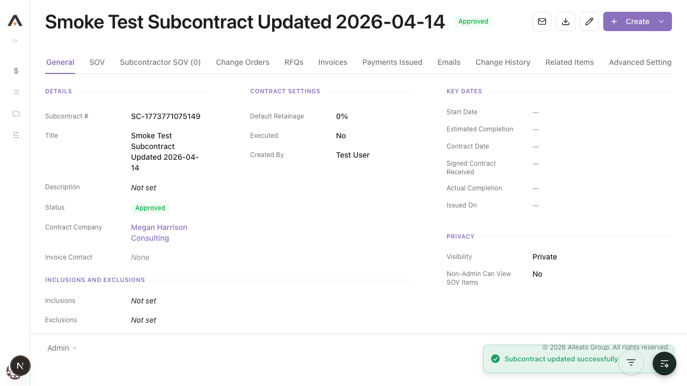

# Smoke Test Report: commitments

| Field | Value |
|-------|-------|
| **Date** | 2026-04-14 03:14:47 EDT |
| **Tool** | commitments |
| **Project** | 767 |
| **URL** | http://localhost:3001/767/commitments |
| **Verdict** | PASS |
| **Duration** | ~24 minutes |

---

## Summary

| Check | Count | Pass | Fail | Verdict |
|-------|-------|------|------|---------|
| API Endpoints | 5 | 5 | 0 | PASS |
| Page Loads | 9 | 9 | 0 | PASS |
| Visual / Design Smoke | 5 | 5 | 0 | PASS |
| CRUD Tests | 6 | 6 | 0 | PASS |
| DB Validation | 2 | 2 | 0 | PASS |
| Negative Path | 1 | 1 | 0 | PASS |

---

## API Health

| Endpoint | Method | Status | Expected | Verdict |
|----------|--------|--------|----------|---------|
| `/api/projects/767/commitments/218cdb4f-4cf1-483b-bf23-6454d8e00229/change-events` | GET | 200 | 200 | PASS |
| `/api/projects/767/commitments/218cdb4f-4cf1-483b-bf23-6454d8e00229/line-items` | GET | 200 | 200 | PASS |
| `/api/projects/767/commitments/218cdb4f-4cf1-483b-bf23-6454d8e00229/pcos` | GET | 200 | 200 | PASS |
| `/api/projects/767/commitments/218cdb4f-4cf1-483b-bf23-6454d8e00229/subcontractor-sov` | GET | 200 | 200 | PASS |
| `/api/projects/767/commitments/export` | POST | 200 | 200 | PASS |

---

## Page Loads

| Page | URL | Loaded | JS Errors | Screenshot | Verdict |
|------|-----|--------|-----------|------------|---------|
| List | `/767/commitments` | Yes | None observed during page render | `screenshots/list.png` | PASS |
| Recycle Bin | `/767/commitments/recycle-bin` | Yes | None observed during page render | `screenshots/recycle-bin.png` | PASS |
| Detail (seeded subcontract) | `/767/commitments/218cdb4f-4cf1-483b-bf23-6454d8e00229` | Yes | None observed during page render | `screenshots/detail-existing.png` | PASS |
| Edit | `/767/commitments/218cdb4f-4cf1-483b-bf23-6454d8e00229/edit` | Yes | None blocking render | `screenshots/edit-page.png` | PASS |
| New | `/767/commitments/new` | Yes | None observed during page render | `screenshots/new-page.png` | PASS |
| Configure | `/767/commitments/configure` | Yes | None observed during page render | `screenshots/configure-page.png` | PASS |
| Settings | `/767/commitments/settings` | Yes | None observed during page render | `screenshots/settings-page.png` | PASS |
| New PCO | `/767/commitments/218cdb4f-4cf1-483b-bf23-6454d8e00229/pcos/new` | Yes | None observed during page render | `screenshots/pco-new-page.png` | PASS |
| Invoice Detail | `/767/commitments/218cdb4f-4cf1-483b-bf23-6454d8e00229/invoices/9` | Yes | None observed during page render | `screenshots/invoice-detail.png` | PASS |

---

## Visual / Design Smoke

| Page | Overlap | Truncation | Hidden/Broken Controls | Spacing/Layout | Screenshot | Verdict |
|------|---------|------------|--------------------------|----------------|------------|---------|
| Commitments list | None observed | None observed | Core table controls visible | Clean table density and totals row visible | `screenshots/list.png` | PASS |
| Commitment detail | None observed | None observed | Header actions and tab strip visible | Detail sections rendered correctly | `screenshots/detail-existing.png` | PASS |
| Invoices tab | None observed | None observed | Tab content visible | Empty/list state rendered without breakage | `screenshots/invoices-tab.png` | PASS |
| Payments Issued tab | None observed | None observed | Tab content visible | Empty/list state rendered without breakage | `screenshots/payments-tab.png` | PASS |
| Invoice detail | None observed | None observed | Summary tab and navigation rendered | Financial rollup and general info rendered correctly | `screenshots/invoice-detail.png` | PASS |

---

## CRUD Tests

### Create

**Test:** `1.1.1` Create a new Subcontract with required fields only  
**Result:** PASS  
**Screenshot:** 

**Form Completion Coverage:**

| Field | Type | Filled In UI | Value Entered | Persisted |
|-------|------|--------------|---------------|-----------|
| Contract Number | Text | Pre-seeded by form | `SC-1773771075149` | Yes |
| Title | Text | Yes | `Smoke Test Subcontract 2026-04-14` | Yes |
| Contract Company | Select | Yes | `Megan Harrison Consulting` | Yes |

**DB Validation:**

| Field | Value Entered | DB Value | Match |
|-------|--------------|----------|-------|
| contract_number | `SC-1773771075149` | `SC-1773771075149` | Yes |
| title | `Smoke Test Subcontract 2026-04-14` | `Smoke Test Subcontract 2026-04-14` | Yes |
| status | expected default `Draft` | `Draft` | Yes |
| contract_company_id | selected company | `4dd6126f-6cba-4b72-8053-553caf99b4da` | Yes |

### Read / Detail

**Result:** PASS  
**Screenshot:** 

The created commitment loaded at `/767/commitments/31feeb91-537f-4267-a5be-5a3b356cf83b` and the detail view rendered correctly.

### Edit

**Result:** PASS  
**Pre-fill check:** All editable controls show saved values? YES  
**Screenshot:** 

Executed checks:
- `1.2.1` changed title to `Smoke Test Subcontract Updated 2026-04-14`
- `1.2.2` changed status from `Draft` to `Approved`
- `1.2.3` changed title again, clicked `Cancel`, and verified the unsaved value did not persist

**Post-edit DB Validation:**

| Field | Value Entered | DB Value | Match |
|-------|--------------|----------|-------|
| title | `Smoke Test Subcontract Updated 2026-04-14` | `Smoke Test Subcontract Updated 2026-04-14` | Yes |
| status | `Approved` | `Approved` | Yes |

### Delete

**Result:** PASS  
**Screenshot:** 

Executed check:
- `1.3.1` deleted the smoke-test record from the commitments list

Verification:
- Record no longer appeared on `/767/commitments`
- Record appeared on `/767/commitments/recycle-bin`

---

## Negative Path

**Empty form submit:** PASS  
**Screenshot:** 

Executed check:
- `1.1.3` left `Title` blank, selected a valid contract company, submitted, and confirmed the inline error `Title is required`

Cause/detection/prevention:
- Cause prevented: missing required title on create
- Detection: inline validation on the form
- Prevention step confirmed: no silent save; submission remained on the form with a visible validation error

---

## Failures

No functional failures were reproduced in the executed commitments flows.

---

## Test Matrix Coverage

| Matrix Test ID | Name | Executed | Result |
|---------------|------|----------|--------|
| 1.1.1 | Create a new Subcontract with required fields only | Yes | PASS |
| 1.1.3 | Create Subcontract fails with missing required fields | Yes | PASS |
| 1.2.1 | Edit an existing commitment — change title | Yes | PASS |
| 1.2.2 | Edit commitment — change status | Yes | PASS |
| 1.2.3 | Edit — cancel discards changes | Yes | PASS |
| 1.3.1 | Delete a single commitment | Yes | PASS |
| 2.1 | Commitments list view loads with correct columns | Yes | PASS |
| 2.2 | Commitment detail view loads | Yes | PASS |
| 6.2 | Subcontractor SOV tab renders with submitted data | Yes | PASS |
| 8.1 | Invoices tab shows linked invoices | Yes | PASS |
| 9.1 | Payments Issued tab shows linked payments | Yes | PASS |
| 8.1a | Navigate to seeded commitment invoice detail route | Yes | PASS |

---

## Next Steps

- Keep `SMOKE-COMM-767-001` seeded via `npm run seed:commitments:invoice-fixture` before future commitments smoke runs.
- If you want broader coverage, add a second fixture for a purchase-order-backed subcontractor invoice and include delete-cancel as a dedicated smoke assertion.
