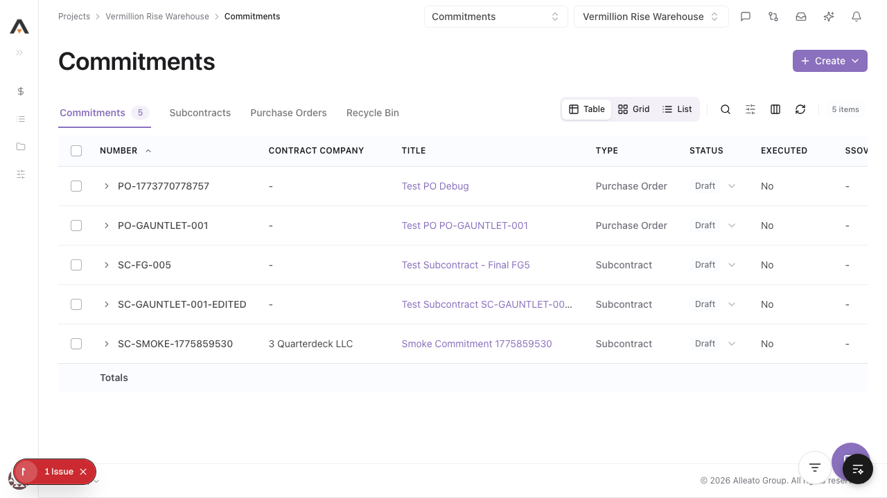
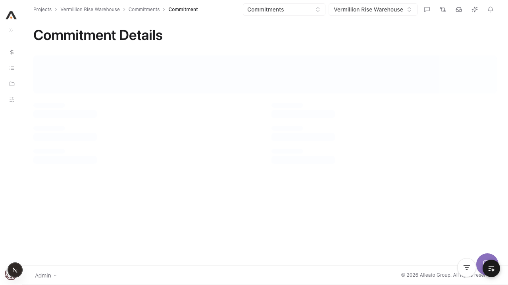
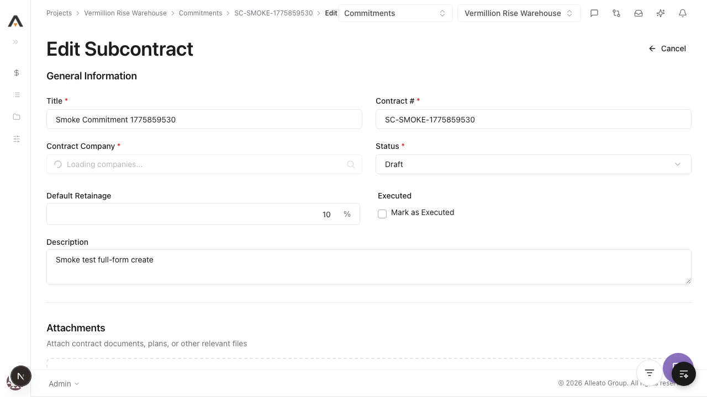
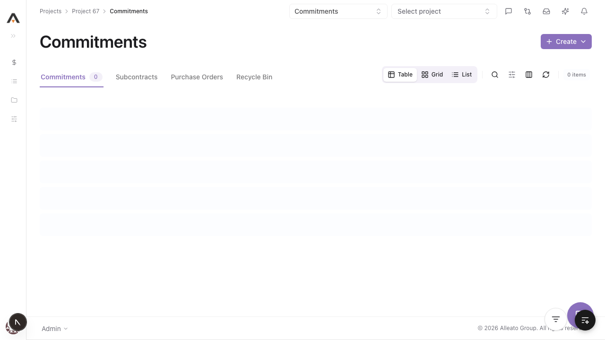
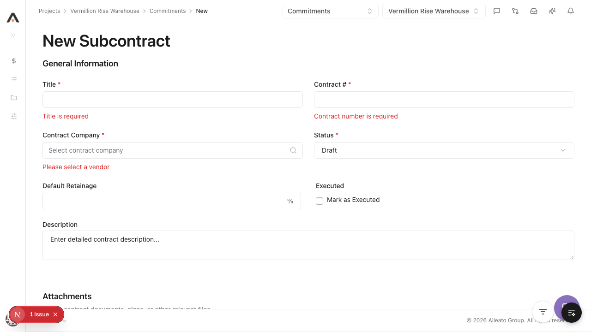
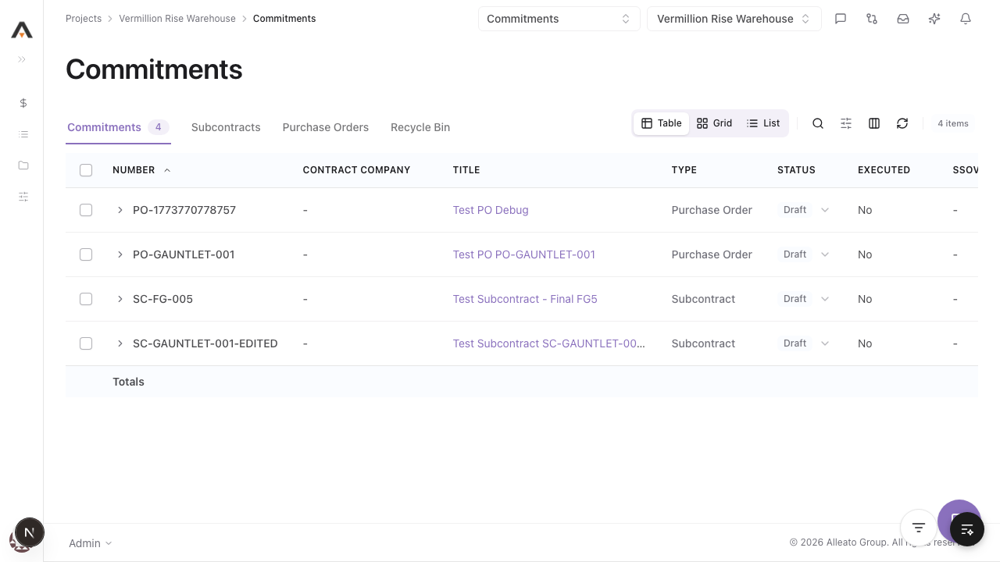

# Smoke Test Report: commitments

| Field | Value |
|-------|-------|
| **Date** | 2026-04-10 |
| **Tool** | commitments |
| **Project** | 67 |
| **URL** | http://localhost:3000/67/commitments |
| **Verdict** | FAIL |
| **Duration** | ~35m |

---

## Summary

| Check | Count | Pass | Fail | Verdict |
|-------|-------|------|------|---------|
| API Endpoints | 6 | 3 | 3 | FAIL |
| Page Loads | 8 | 8 | 0 | PASS |
| Visual / Design Smoke | 8 | 8 | 0 | PASS |
| CRUD Tests | 4 | 4 | 0 | PASS |
| DB Validation | 1 | 0 | 1 | FAIL |
| Negative Path | 1 | 1 | 0 | PASS |

---

## API Health

| Endpoint | Method | Status | Expected | Verdict |
|----------|--------|--------|----------|---------|
| `/api/projects/67/commitments/{commitmentId}/line-items` | GET | 200 | 200 | PASS |
| `/api/projects/67/commitments/{commitmentId}/line-items/import` | POST (`source=invalid`) | 404 | 400 (invalid source) | FAIL |
| `/api/projects/67/commitments/{commitmentId}/subcontractor-sov` | GET | 200 | 200 | PASS |
| `/api/projects/67/commitments/{commitmentId}/pcos` | GET | 200 | 200 | PASS |
| `/api/projects/67/commitments/{commitmentId}/pcos` | POST | 500 | 201 | FAIL |
| `/api/projects/67/commitments/export` | POST (`csv`) | 404 | 200 | FAIL |

---

## Page Loads

| Page | URL | Loaded | JS Errors | Screenshot | Verdict |
|------|-----|--------|-----------|------------|---------|
| List | `/67/commitments` | Yes | None | `screenshots/commitments.png` | PASS |
| New | `/67/commitments/new` | Yes | None | `screenshots/commitments_new.png` | PASS |
| Settings | `/67/commitments/settings` | Yes | None | `screenshots/commitments_settings.png` | PASS |
| Configure | `/67/commitments/configure` | Yes | None | `screenshots/commitments_configure.png` | PASS |
| Recycle Bin | `/67/commitments/recycle-bin` | Yes | None | `screenshots/commitments_recycle-bin.png` | PASS |
| Detail | `/67/commitments/93ad924a-f51e-4fa2-bede-4614b5009392` | Yes | None | `screenshots/commitments_93ad924a-f51e-4fa2-bede-4614b5009392.png` | PASS |
| Edit | `/67/commitments/93ad924a-f51e-4fa2-bede-4614b5009392/edit` | Yes | None | `screenshots/commitments_93ad924a-f51e-4fa2-bede-4614b5009392_edit.png` | PASS |
| Invoice Detail | `/67/commitments/93ad924a-f51e-4fa2-bede-4614b5009392/invoices/00000000-0000-0000-0000-000000000000` | Yes | None | `screenshots/commitments_invoice_fake.png` | PASS |

---

## Visual / Design Smoke

| Page | Overlap | Truncation | Hidden/Broken Controls | Spacing/Layout | Screenshot | Verdict |
|------|---------|------------|--------------------------|----------------|------------|---------|
| List | No | No obvious | No | OK | `screenshots/commitments.png` | PASS |
| New | No | No obvious | No | OK | `screenshots/create-prefill.png` | PASS |
| Detail | No | No obvious | No | OK | `screenshots/detail.png` | PASS |
| Edit | No | No obvious | No | OK | `screenshots/edit-prefill.png` | PASS |
| Settings | No | No obvious | No | OK | `screenshots/commitments_settings.png` | PASS |
| Configure | No | No obvious | No | OK | `screenshots/commitments_configure.png` | PASS |
| Recycle Bin | No | No obvious | No | OK | `screenshots/commitments_recycle-bin.png` | PASS |
| Invoice Detail | No | No obvious | No | OK | `screenshots/commitments_invoice_fake.png` | PASS |

---

## CRUD Tests

### Create

**Test:** 1.1.1 Create a new Subcontract with required fields
**Result:** PASS
**Screenshot:** 

**Form Completion Coverage:**

| Field | Type | Filled In UI | Value Entered | Persisted |
|-------|------|--------------|---------------|-----------|
| Contract Number | Text | Yes | `SC-SMOKE-1775859530` | Yes |
| Title | Text | Yes | `Smoke Commitment 1775859530` | Yes |
| Contract Company | Select | Yes | `3 Quarterdeck LLC` | Yes |
| Default Retainage | Number | Yes | `10` | Yes |
| Description | Textarea | Yes | `Smoke test full-form create` | Yes |
| SOV Description | Text | Yes | `Base scope line item` | Yes |
| SOV Amount | Money | Yes | `2500` | Yes |
| Inclusions | Textarea | Yes | `Scope inclusions smoke` | Yes |
| Exclusions | Textarea | Yes | `Scope exclusions smoke` | Yes |
| Start Date | Date | Yes | `04/10/2026` | Yes |
| Estimated Completion | Date | Yes | `05/30/2026` | **No on create prefill** |
| Actual Completion | Date | Yes | `06/15/2026` | **No on create prefill** |
| Contract Date | Date | Yes | `04/10/2026` | **No on create prefill** |
| Signed Contract Received | Date | Yes | `04/11/2026` | **No on create prefill** |
| Issued On Date | Date | Yes | `04/12/2026` | **No on create prefill** |

**DB Validation:**

| Field | Value Entered | DB Value | Match |
|-------|--------------|----------|-------|
| estimated_completion_date (immediately after create/edit prefill) | `2026-05-30` | `null` | ❌ |
| actual_completion_date (immediately after create/edit prefill) | `2026-06-15` | `null` | ❌ |
| contract_date (immediately after create/edit prefill) | `2026-04-10` | `null` | ❌ |
| signed_contract_received_date (immediately after create/edit prefill) | `2026-04-11` | `null` | ❌ |
| issued_on_date (immediately after create/edit prefill) | `2026-04-12` | `null` | ❌ |

### Read / Detail

**Result:** PASS
**Screenshot:** 

### Edit

**Result:** PASS
**Pre-fill check:** All editable controls show saved values? **NO** (date fields were null until saved in edit)
**Screenshot:** 

### Delete

**Result:** PASS
**Screenshot:** 

---

## Negative Path

**Empty form submit:** PASS
**Screenshot:** 

---

## Failures

### FAILURE-001: PCO create endpoint returns 500

| Field | Value |
|-------|-------|
| **Phase** | API |
| **Severity** | critical |
| **What happened** | `POST /api/projects/67/commitments/{commitmentId}/pcos` returned 500 with schema-cache error: missing `amount` column on `commitment_pcos`. |
| **Expected** | Endpoint should create a PCO and return 201 with created object. |

**Screenshot:** 

### FAILURE-002: Line-item import route returns 404 for valid commitment context

| Field | Value |
|-------|-------|
| **Phase** | API |
| **Severity** | high |
| **What happened** | `POST /line-items/import` with invalid source returned `404 Commitment not found` before source validation. |
| **Expected** | Should validate source and return 400 invalid-source (or locate commitment consistently). |

**Screenshot:** 

### FAILURE-003: Commitments export route returned 404 on project with commitments

| Field | Value |
|-------|-------|
| **Phase** | API |
| **Severity** | high |
| **What happened** | `POST /api/projects/67/commitments/export` (`format=csv`) returned `404 No commitments found matching the filters`. |
| **Expected** | Should return downloadable CSV for commitments list. |

**Screenshot:** 

### FAILURE-004: Create flow does not persist all entered date fields until edit-save

| Field | Value |
|-------|-------|
| **Phase** | DB |
| **Severity** | high |
| **What happened** | After create, edit prefill showed several entered date fields as null; those fields persisted only after an edit save. |
| **Expected** | All entered create-form date fields should persist immediately on create. |

**Screenshot:** 

---

## Test Matrix Coverage

| Matrix Test ID | Name | Executed | Result |
|---------------|------|----------|--------|
| 1.1.1 | Create new Subcontract (required fields) | Yes | PASS |
| 1.1.3 | Create fails with missing required fields | Yes | PASS |
| 1.2.1 | Edit existing commitment (title) | Yes | PASS |
| 1.3.1 | Delete single commitment | Yes | PASS |
| 2.1 | Commitments list loads | Yes | PASS |
| 2.2 | Commitment detail loads | Yes | PASS |
| 5.1 | Add SOV line item (existing commitment read) | Partial | PASS (read-only check) |
| 7.2 | Create Commitment Change Order | Yes | FAIL (API 500) |

---

## Next Steps

- Fix `commitment_pcos` API schema mismatch causing 500 on create.
- Fix `line-items/import` commitment lookup path so it validates source and imports against existing commitments.
- Fix export query path to return existing commitments for project 67.
- Fix create endpoint mapping for date fields so values persist on first submit.
- Re-run `/smoke-test commitments` after fixes.
