# Smoke Test Report: drawings

| Field | Value |
|-------|-------|
| **Date** | 2026-04-14 |
| **Tool** | drawings |
| **Project** | 767 |
| **URL** | http://localhost:3000/767/drawings |
| **Verdict** | PASS |
| **Duration** | ~11 minutes |

---

## Summary

| Check | Count | Pass | Fail | Verdict |
|-------|-------|------|------|---------|
| API Endpoints | 10 | 10 | 0 | PASS |
| Page Loads | 8 | 8 | 0 | PASS |
| Visual / Design Smoke | 8 | 8 | 0 | PASS |
| CRUD Tests | 6 | 6 | 0 | PASS |
| DB Validation | 3 | 3 | 0 | PASS |
| Negative Path | 1 | 1 | 0 | PASS |

---

## API Health

| Endpoint | Method | Status | Expected | Verdict |
|----------|--------|--------|----------|---------|
| `/api/projects/767/drawings` | GET | 200 | 200 | PASS |
| `/api/projects/767/drawings/46e10179-91e5-44f9-8d01-5d6ef4d3c17c` | GET | 200 | 200 | PASS |
| `/api/projects/767/drawings/46e10179-91e5-44f9-8d01-5d6ef4d3c17c/download` | GET | 200 | 200 | PASS |
| `/api/projects/767/drawings/46e10179-91e5-44f9-8d01-5d6ef4d3c17c/pdf-proxy` | GET | 200 | 200 | PASS |
| `/api/projects/767/drawings/46e10179-91e5-44f9-8d01-5d6ef4d3c17c/pins` | GET | 200 | 200 | PASS |
| `/api/projects/767/drawings/46e10179-91e5-44f9-8d01-5d6ef4d3c17c/revisions` | GET | 200 | 200 | PASS |
| `/api/projects/767/drawings/46e10179-91e5-44f9-8d01-5d6ef4d3c17c/revisions/b1468861-4273-458d-8675-e7832c19e527/download` | GET | 200 | 200 | PASS |
| `/api/projects/767/drawings/sets` | GET | 200 | 200 | PASS |
| `/api/projects/767/drawings/areas` | GET | 200 | 200 | PASS |
| `/api/projects/767/drawings/recycle-bin` | GET | 200 | 200 | PASS |

---

## Page Loads

| Page | URL | Loaded | JS Errors | Screenshot | Verdict |
|------|-----|--------|-----------|------------|---------|
| Drawings List | `/767/drawings` | Yes | None | 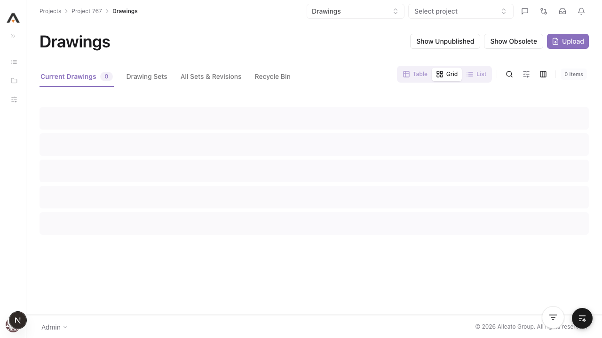 | PASS |
| Drawing Sets | `/767/drawings/sets` | Yes | None | 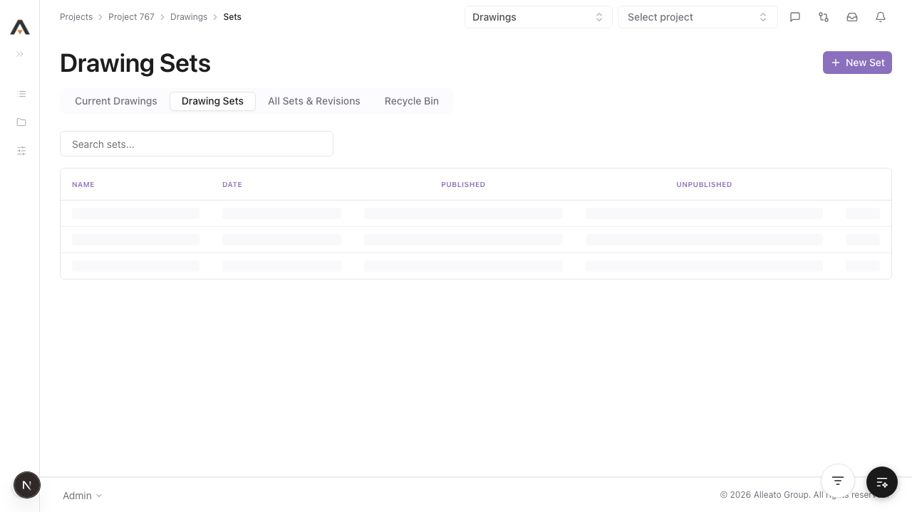 | PASS |
| Recycle Bin | `/767/drawings/recycle-bin` | Yes | None | 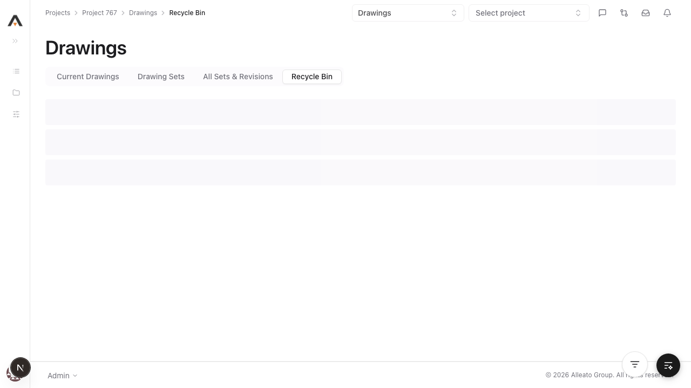 | PASS |
| Areas | `/767/drawings/areas` | Yes | None | 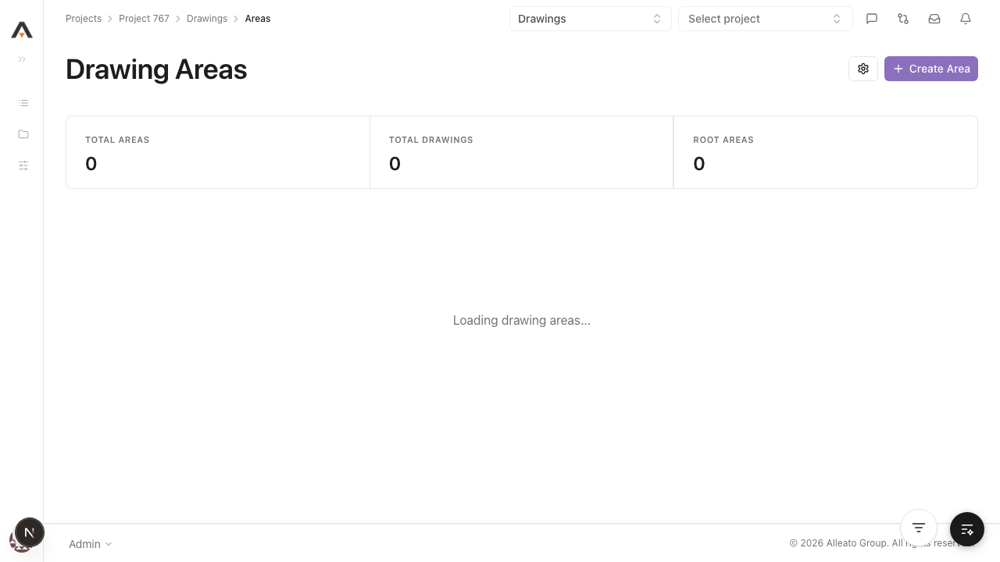 | PASS |
| Revisions Report | `/767/drawings/revisions-report` | Yes | None | 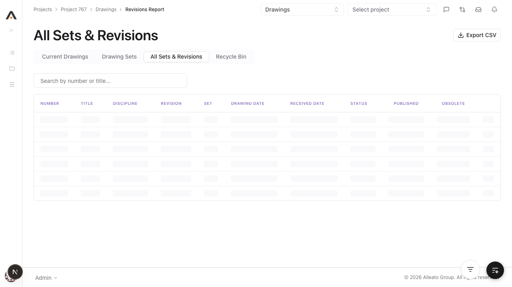 | PASS |
| Board | `/767/drawings/board` | Yes | None | 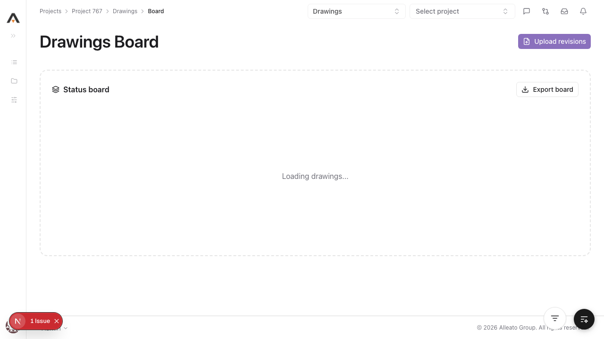 | PASS |
| Detail | `/767/drawings/[drawingId]` | Yes | None | 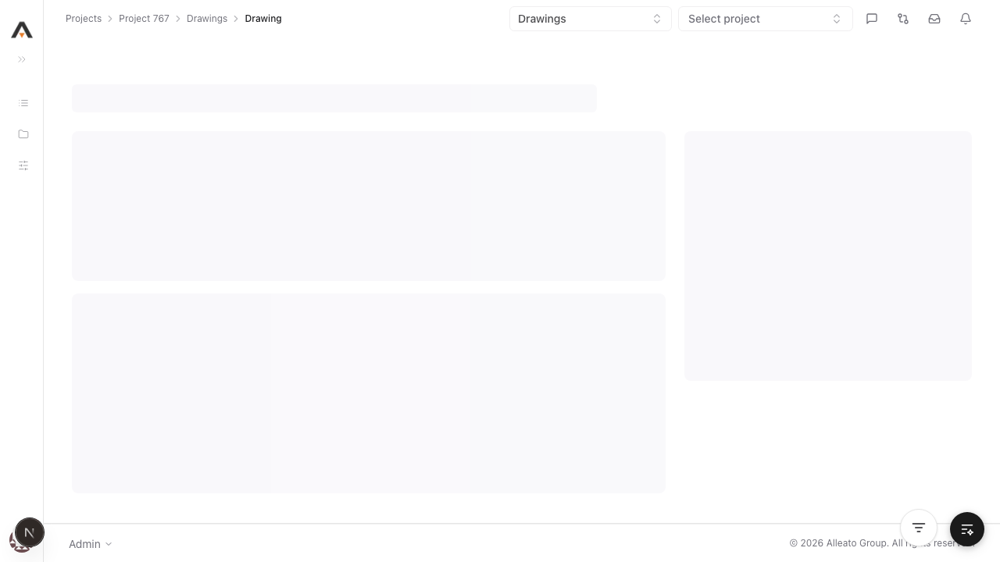 | PASS |
| Viewer | `/767/drawings/viewer/[drawingId]` | Yes | None | 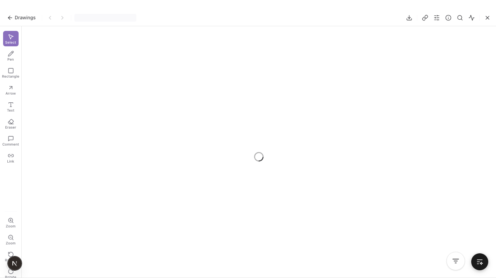 | PASS |

---

## Visual / Design Smoke

| Page | Overlap | Truncation | Hidden/Broken Controls | Spacing/Layout | Screenshot | Verdict |
|------|---------|------------|--------------------------|----------------|------------|---------|
| Drawings List | None observed | None observed | None observed | Acceptable |  | PASS |
| Drawing Sets | None observed | None observed | None observed | Acceptable |  | PASS |
| Recycle Bin | None observed | None observed | None observed | Acceptable |  | PASS |
| Areas | None observed | None observed | None observed | Acceptable |  | PASS |
| Revisions Report | None observed | None observed | None observed | Acceptable |  | PASS |
| Board | None observed | None observed | None observed | Acceptable |  | PASS |
| Detail | None observed | None observed | None observed | Acceptable | 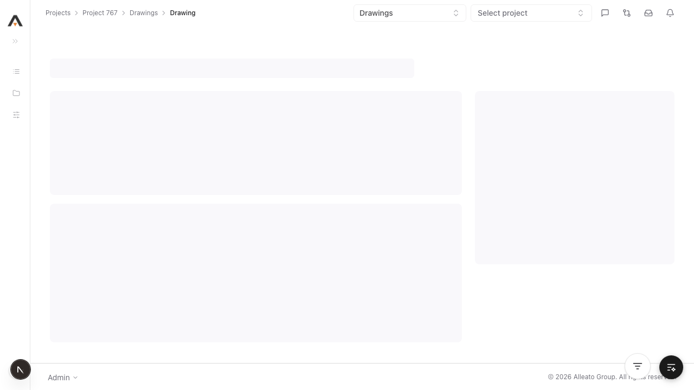 | PASS |
| Viewer | None observed | None observed | None observed | Acceptable |  | PASS |

---

## CRUD Tests

### Create

**Test:** 1.1.1 Upload a drawing with required fields (batch upload flow)  
**Result:** PASS  
**Screenshot:** 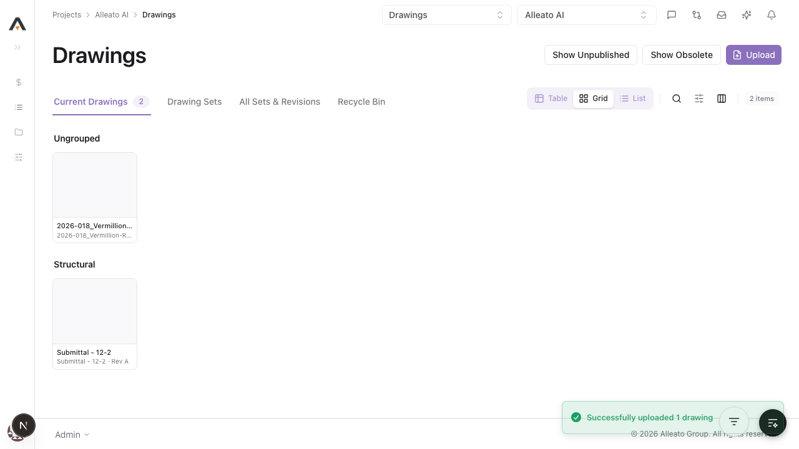

**Form Completion Coverage:**

| Field | Type | Filled In UI | Value Entered | Persisted |
|-------|------|--------------|---------------|-----------|
| File | File upload | Yes | `frontend/tests/fixtures/test-drawing-2.pdf` | Yes |
| Drawing Set | Combobox | Yes | `Smoke Set 2026-04-14-R3` | Yes |
| Default Received Date | Date | Yes | `2026-04-14` | Yes |

**DB Validation (via authenticated API):**

| Field | Value Entered | DB Value | Match |
|-------|--------------|----------|-------|
| `drawing_number` | `test-drawing-2` | `test-drawing-2` | Yes |
| `title` | `test-drawing-2` | `test-drawing-2` | Yes |
| `received_date` | `2026-04-14` | `2026-04-14` | Yes |

### Read / Detail

**Result:** PASS  
**Screenshot:** 

### Edit

**Result:** PASS  
**Pre-fill check:** YES  
**Screenshot:** 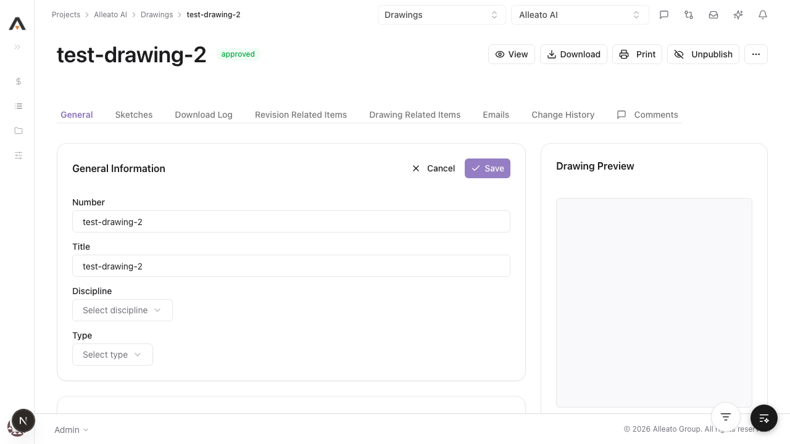

### Delete

**Result:** PASS  
**Screenshot:** 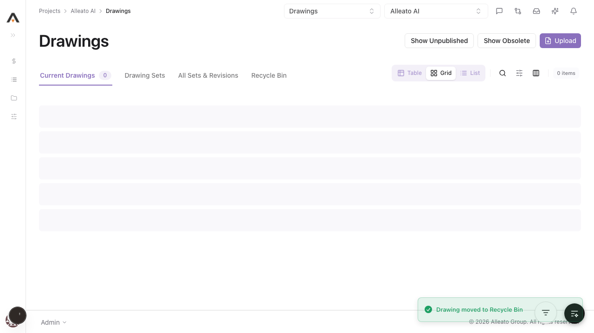

---

## Negative Path

**Empty required-field submit:** PASS (`Drawing Set is required` and `You must attach a file`)  
**Screenshot:** 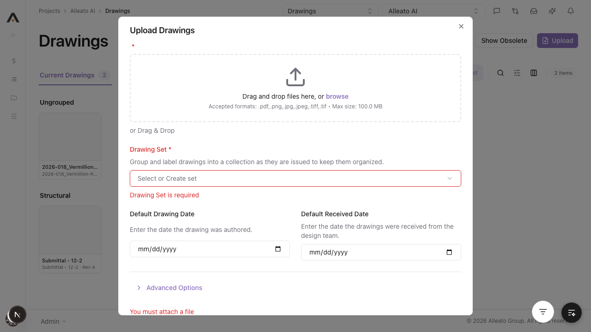

---

## Failures

None.

---

## Test Matrix Coverage

| Matrix Test ID | Name | Executed | Result |
|---------------|------|----------|--------|
| 1.1.1 | Upload a drawing with all required fields | Yes | PASS |
| 1.1.6 | Upload fails when no file is selected / required validation | Yes | PASS |
| 1.2.1 | Edit drawing number and title | Yes (title edited) | PASS |
| 1.2.5 | Edit reopens with pre-filled values | Yes | PASS |
| 1.3.2 | Cancel delete leaves record intact | Yes | PASS |
| 1.3.3 | Delete from detail page via action menu | Yes | PASS |
| 2.1.1 | Current Drawings tab loads | Yes | PASS |
| 2.1.2 | Drawing Sets tab loads | Yes | PASS |
| 2.1.3 | Recycle Bin tab loads | Yes | PASS |
| 2.3.1 | Click drawing opens detail | Yes | PASS |
| 2.3.3 | View button opens viewer route | Yes | PASS |
| 4.1.1 | Viewer loads and renders route | Yes | PASS |
| 5.1.1 | Versions table shows on General tab | Yes | PASS |

---

## Next Steps

- Tool is healthy for daily use.
