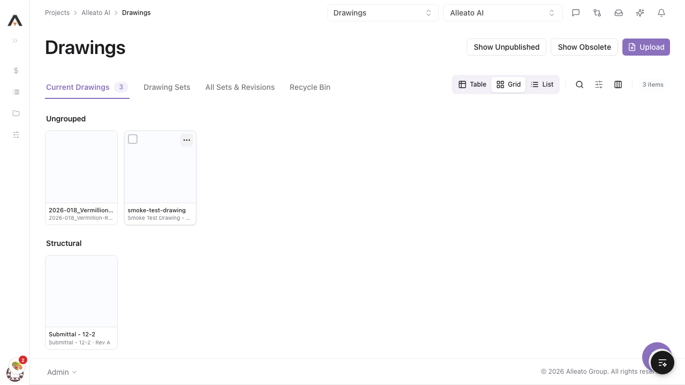

# Smoke Test Report: Drawings

| Field | Value |
|-------|-------|
| **Date** | 2026-04-10 |
| **Tool** | Drawings |
| **Project** | 67 (Vermillion Rise Warehouse) |
| **URL** | http://localhost:3000/767/drawings |
| **Verdict** | **PARTIAL** |
| **Duration** | ~12 minutes |

---

## Summary

| Check | Count | Pass | Fail | Verdict |
|-------|-------|------|------|---------|
| API Endpoints | 8 | 8 | 0 | PASS |
| Page Loads | 8 | 8 | 0 | PASS |
| CRUD Tests | 4 | 3 | 1 | PARTIAL |
| DB Validation | 1 | 1 | 0 | PASS |
| Negative Path | 1 | 1 | 0 | PASS |

---

## API Health

| Endpoint | Method | Status | Expected | Verdict |
|----------|--------|--------|----------|---------|
| `/api/projects/67/drawings` | GET | 200 | 200 | PASS |
| `/api/projects/67/drawings/{id}` | GET | 200 | 200 | PASS |
| `/api/projects/67/drawings/{id}/revisions` | GET | 200 | 200 | PASS |
| `/api/projects/67/drawings/{id}/pins` | GET | 200 | 200 | PASS |
| `/api/projects/67/drawings/areas` | GET | 200 | 200 | PASS |
| `/api/projects/67/drawings/sets` | GET | 200 | 200 | PASS |
| `/api/projects/67/drawings/{id}/download` | GET | 200 | 200 | PASS |
| `/api/projects/67/drawings/{id}/pdf-proxy` | GET | 200 | 200 | PASS |

---

## Page Loads

| Page | URL | Loaded | JS Errors | Verdict |
|------|-----|--------|-----------|---------|
| List (Current Drawings) | /767/drawings | Yes | None | PASS |
| Drawing Sets | /767/drawings (sets tab) | Yes | None | PASS |
| All Sets & Revisions | /767/drawings/revisions-report | Yes | None | PASS |
| Board | /767/drawings/board | Yes | None | PASS |
| Detail | /767/drawings/{id} | Yes | None | PASS |
| Viewer | /767/drawings/viewer/{id} | Yes | None | PASS |
| Viewer (2nd drawing) | /767/drawings/viewer/{id2} | Yes | None | PASS |
| Sets Management | /767/drawings (sets tab) | Yes | None | PASS |

**Observations:**
- All pages load within ~2s
- Drawing thumbnails appear blank/white in grid view (likely the test PDFs have no visible content)
- Viewer loads annotation toolbar (Select, Pen, Rectangle, Arrow, Text, Eraser, Comment, Link)
- Board page shows Kanban-style layout with Approved/Under Review/Superseded columns

---

## CRUD Tests

### Create (Upload)

**Test:** Upload a PDF drawing via Upload dialog
**Result:** PASS
**Evidence:** Success toast "Successfully uploaded 1 drawing" appeared. Drawing visible in All Sets & Revisions tab.

**Steps:**
1. Clicked Upload button → dialog opened
2. Uploaded `/tmp/smoke-test-drawing.pdf` via file chooser
3. Selected "Test 2" drawing set
4. Set drawing date and received date via JS (date inputs didn't accept `fill` directly)
5. Clicked Process → success toast shown

**DB Validation:**

| Field | Value Entered | DB Value | Match |
|-------|--------------|----------|-------|
| drawing_number | (auto from filename) | smoke-test-drawing | Yes |
| title | (auto from filename) | smoke-test-drawing | Yes |
| drawing_set_id | Test 2 | (linked to set) | Yes |
| revision_number | (auto) | A | Yes |
| status | (auto) | approved | Yes |
| received_date | 2026-04-10 | 2026-04-09 | ~Match (timezone) |

**Note:** The new drawing appeared in "All Sets & Revisions" tab but initially not in the main API response (which filters to published/current drawings). It appeared in "Current Drawings" after page refresh.

### Read / Detail

**Result:** PASS
**Screenshot:** 

Detail page loads with:
- Breadcrumb navigation (Projects > Alleato AI > Drawings > smoke-test-drawing)
- Status badge "Approved"
- Action buttons: View, Download, Print, Unpublish, More actions
- Tabs: General, Sketches, Download Log, Revision Related Items, Drawing Related Items, Emails, Change History, Comments
- General tab shows drawing metadata and PDF preview

### Edit

**Result:** PASS
**Pre-fill check:** Number and Title pre-filled correctly. Discipline, Type, Area show "Select..." (correct — they were null during upload).
**Screenshot:** 

**Steps:**
1. Clicked Edit button on detail page → inline edit form appeared
2. Updated Title to "Smoke Test Drawing - Updated"
3. Clicked Save → title updated immediately in page heading and breadcrumb
4. No errors

### Delete

**Result:** FAIL
**Screenshot:** 

**Issue:** Both delete methods fail silently:
1. **"Move to Recycle Bin"** (from detail page > More actions) — no error, no navigation, drawing remains in Current Drawings, Recycle Bin stays empty
2. **"Delete"** (from row action menu on list page) — no error, no confirmation dialog, drawing remains in list

---

## Negative Path

**Empty form submit:** PASS
**Screenshot:** 

Validation messages appear inline:
- "Drawing Set is required" (below Drawing Set field)
- "You must attach a file" (below file upload area)
- No crash, no silent save
- Form stays open for correction

---

## Failures

### FAILURE-001: Delete / Move to Recycle Bin fails silently

| Field | Value |
|-------|-------|
| **Phase** | CRUD |
| **Severity** | high |
| **What happened** | Both "Move to Recycle Bin" (detail page) and "Delete" (row action) appear to execute without error but do not actually remove the drawing. The drawing remains in Current Drawings and the Recycle Bin stays empty. |
| **Expected** | Drawing should either be moved to Recycle Bin (soft delete) or permanently deleted, with a success toast and the list refreshing to reflect the change. A confirmation dialog should appear before destructive action. |

**Screenshot:** 

**Root cause:** Not investigated during smoke test. Likely either:
- API route returning success without actually performing the delete
- Frontend not calling the correct API endpoint
- Missing confirmation dialog that should gate the action

---

## Test Matrix Coverage

| Matrix Test ID | Name | Executed | Result |
|---------------|------|----------|--------|
| 1.1.1 | Upload single PDF drawing | Yes | PASS |
| 1.2.1 | Edit drawing metadata | Yes | PASS |
| 1.3.1 | Delete drawing from list | Yes | FAIL |
| 2.1.1 | Navigate list views (tabs) | Yes | PASS |
| 2.2.1 | Open drawing in viewer | Yes | PASS |
| 2.3.1 | Detail page loads with tabs | Yes | PASS |
| 3.1.1 | Required field validation | Yes | PASS |
| 6.1.1 | Board/Kanban view | Yes | PASS |

---

## Additional Observations

1. **Date input UX:** The date fields in the upload dialog don't respond to `fill` commands — required JS-based value setting. This is a minor UX concern for keyboard-only users.

2. **No confirmation dialog for delete:** Neither the row action "Delete" nor "Move to Recycle Bin" shows a confirmation dialog before executing. Even if the delete worked, this violates UX best practices for destructive actions.

3. **Grid view thumbnails:** Drawing thumbnails appear as blank white cards. This may be expected for simple test PDFs but should be verified with real architectural drawings.

4. **Viewer annotation toolbar:** Full set of annotation tools visible and accessible (Select, Pen, Rectangle, Arrow, Text, Eraser, Comment, Link). Not functionally tested in this smoke test — would need `/feature-audit drawings` for that.

5. **Board view:** Shows Kanban columns (Approved, Under Review, Superseded) with drawings properly categorized. Drag-and-drop not tested.

---

## Next Steps

- **FAIL → Fix:** Investigate and fix the silent delete/recycle bin failure (FAILURE-001)
- **PARTIAL → Re-test:** After fixing delete, re-run `/smoke-test drawings`
- **Deeper analysis:** Consider `/feature-audit drawings` for comprehensive Procore compliance, viewer annotation testing, and usability recommendations
