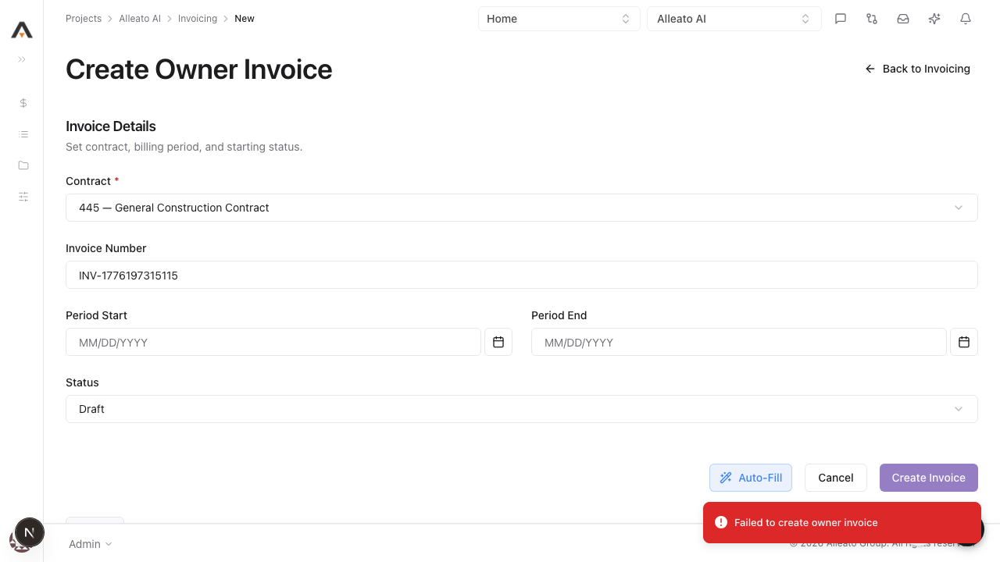
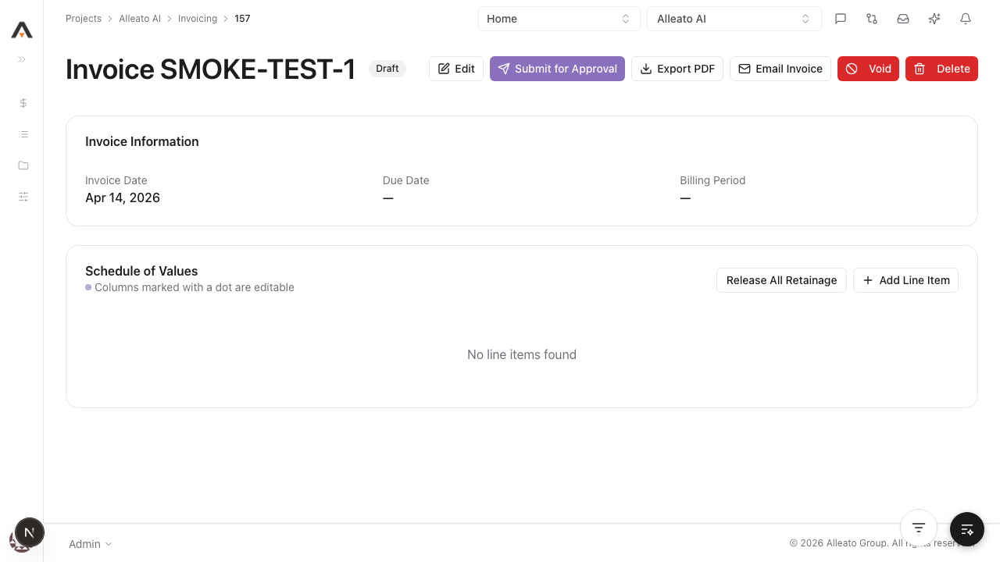
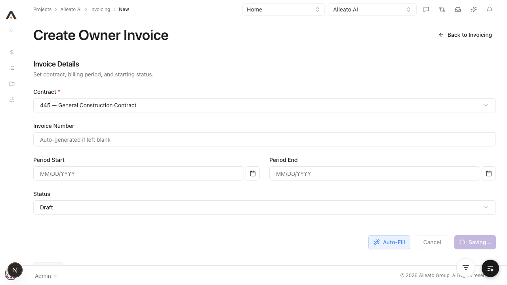

# Smoke Test Report: invoicing

| Field | Value |
|-------|-------|
| **Date** | 2026-04-14 |
| **Tool** | invoicing |
| **Project** | 767 |
| **URL** | http://localhost:3000/767/invoices |
| **Verdict** | FAIL |
| **Duration** | ~14 minutes |

---

## Summary

| Check | Count | Pass | Fail | Verdict |
|-------|-------|------|------|---------|
| API Endpoints | 15 | 14 | 1 | FAIL |
| Page Loads | 6 | 5 | 1 | FAIL |
| Visual / Design Smoke | 5 | 5 | 0 | PASS |
| CRUD Tests | 4 | 3 | 1 | FAIL |
| DB Validation | 3 | 3 | 0 | PASS |
| Negative Path | 1 | 0 | 1 | FAIL |

---

## Summary Notes

- The owner invoice backend CRUD path is healthy when called directly with an authenticated session cookie.
- The owner invoice UI create form is not healthy: submit stays on the form and shows a generic failure toast even when visible required fields are populated.
- The owner invoice PDF endpoint is broken for a real invoice id and returns `404 Invoice not found`.
- The negative-path validation is not failing loudly. Blank invoice submission did not surface inline validation.

---

## API Health

| Endpoint | Method | Status | Expected | Verdict |
|----------|--------|--------|----------|---------|
| `/api/projects/767/invoicing/owner` | GET | 200 | 200 | PASS |
| `/api/projects/767/invoicing/subcontractor` | GET | 200 | 200 | PASS |
| `/api/projects/767/invoicing/subcontractor/invoices` | GET | 200 | 200 | PASS |
| `/api/projects/767/invoicing/billing-periods` | GET | 200 | 200 | PASS |
| `/api/projects/767/invoicing/settings` | GET | 200 | 200 | PASS |
| `/api/projects/767/invoicing/payments` | GET | 200 | 200 | PASS |
| `/api/projects/767/invoicing/owner/157` | GET | 200 before cleanup | 200 | PASS |
| `/api/projects/767/invoicing/owner/157/line-items` | GET | 200 | 200 | PASS |
| `/api/projects/767/invoicing/owner/157/pdf` | GET | 404 | 200 | FAIL |
| `/api/projects/767/invoicing/billing-periods/dee1ce21-356f-4d88-9879-545afbf004c7` | GET | 200 | 200 | PASS |
| `/api/projects/767/invoicing/payments/1` | GET | 200 | 200 | PASS |
| `/api/projects/767/invoicing/subcontractor/invoices/9` | GET | 200 | 200 | PASS |
| `/api/projects/767/invoicing/subcontractor/invoices/9/change-history` | GET | 200 | 200 | PASS |
| `/api/projects/767/invoicing/subcontractor/invoices/9/emails` | GET | 200 | 200 | PASS |
| `/api/projects/767/invoicing/subcontractor/invoices/9/related-items` | GET | 200 | 200 | PASS |

Notes:
- `/api/projects/767/invoicing/subcontractor/invoices/9/related-items/options` returned `400 {"error":"Invalid related item type"}` without a required query param, so it was excluded from pass/fail counts as a parameterized endpoint rather than a pure health endpoint.
- The PDF route returned `{"error":"Invoice not found"}` for invoice `157` even though the base detail route for the same invoice returned `200`.

---

## Page Loads

| Page | URL | Loaded | JS Errors | Screenshot | Verdict |
|------|-----|--------|-----------|------------|---------|
| Owner list | `/767/invoices` | Yes | None | `screenshots/invoices-list.png` | PASS |
| Subcontractor tab | `/767/invoices?tab=subcontractor` | Yes | None | `screenshots/invoices-subcontractor-tab.png` | PASS |
| Billing Periods tab | `/767/invoices?tab=billing-periods` | Yes | None | `screenshots/invoices-billing-periods-tab.png` | PASS |
| Owner create form | `/767/invoicing/new` | Yes | `500` resource errors + uncontrolled/controlled select warning | `screenshots/create-page.png` | FAIL |
| Owner invoice detail | `/767/invoicing/157` | Yes | None | `screenshots/owner-invoice-detail.png` | PASS |
| Subcontractor detail | `/767/invoicing/subcontractor/9` | Yes | None | `screenshots/subcontractor-detail-page.png` | PASS |

---

## Visual / Design Smoke

| Page | Overlap | Truncation | Hidden/Broken Controls | Spacing/Layout | Screenshot | Verdict |
|------|---------|------------|--------------------------|----------------|------------|---------|
| Owner list | None observed | None observed | None observed | Clean | `screenshots/invoices-list.png` | PASS |
| Subcontractor tab | None observed | None observed | None observed | Clean | `screenshots/invoices-subcontractor-tab.png` | PASS |
| Billing Periods tab | None observed | None observed | None observed | Clean | `screenshots/invoices-billing-periods-tab.png` | PASS |
| Subcontractor list page | None observed | None observed | None observed | Clean | `screenshots/subcontractor-list-page.png` | PASS |
| Subcontractor detail page | None observed | None observed | None observed | Clean | `screenshots/subcontractor-detail-page.png` | PASS |

---

## CRUD Tests

### Create

**Test:** 1.1.1 Create owner invoice with required fields only
**Result:** FAIL
**Screenshot:** 

What happened:
- Filling the visible required fields in the UI and clicking `Create Invoice` stayed on `/767/invoicing/new`.
- The UI showed a generic `Failed to create owner invoice` toast.
- Browser console captured `Failed to load resource: the server responded with a status of 500` plus a select controlled/uncontrolled warning.

**Form Completion Coverage:**

| Field | Type | Filled In UI | Value Entered | Persisted |
|-------|------|--------------|---------------|-----------|
| Contract | Combobox | Yes | `445 — General Construction Contract` | No |
| Invoice Number | Text | Yes | `INV-1776197315115` | No |
| Status | Combobox | Yes | `Draft` | No |
| Period Start | Date | No | blank | No |
| Period End | Date | No | blank | No |

**DB Validation:**

| Field | Value Entered | DB Value | Match |
|-------|--------------|----------|-------|
| UI-created owner invoice | `INV-1776197315115` | No row created | No |

Control check:
- Direct authenticated API POST to `/api/projects/767/invoicing/owner` with the same project and a valid prime contract id returned `201` and created invoice `157`. This isolates the failure to the frontend create flow rather than the backend route.

### Read / Detail

**Result:** PASS
**Screenshot:** 

Notes:
- API-created owner invoice `157` loaded successfully at `/767/invoicing/157`.
- Existing subcontractor invoice `9` loaded successfully at `/767/invoicing/subcontractor/9`.

### Edit

**Result:** PASS (API path)
**Pre-fill check:** UI pre-fill not verified because the UI create flow failed before a stable UI edit path could be exercised.

Evidence:
- `PATCH /api/projects/767/invoicing/owner/157` returned `200`.
- `invoice_number` updated from `SMOKE-TEST-1` to `SMOKE-TEST-1-EDITED`.
- `notes` updated to `smoke edit`.

### Delete

**Result:** PASS (API path)

Evidence:
- `DELETE /api/projects/767/invoicing/owner/157` returned `200 {"message":"Invoice deleted successfully"}`.
- Follow-up `GET /api/projects/767/invoicing/owner/157` returned `404 {"error":"Invoice not found"}`.

---

## Negative Path

**Empty form submit:** FAIL
**Screenshot:** 

What happened:
- Submitting the owner create form with a blank invoice number did not show an inline validation message.
- The screenshot shows the form entering a `Saving...` state instead of failing loudly at the field level.

Expected:
- Inline validation should appear immediately on the invoice number field and no network submission should proceed.

---

## Failures

### FAILURE-001: Owner invoice UI create flow is broken

| Field | Value |
|-------|-------|
| **Phase** | CRUD |
| **Severity** | critical |
| **What happened** | The owner invoice create page accepted visible required values, stayed on the form, and showed a generic failure toast instead of creating the record. |
| **Expected** | The form should create the invoice, redirect back into invoicing, and show the new row in the owner tab. |

**Screenshot:** 

Cause / detection gap / prevention:
- Cause: frontend form state is not producing a valid create request even though the backend route works directly.
- Detection gap: there is no frontend smoke coverage protecting the create form against combobox state drift or malformed payload submission.
- Prevention step: add an automated owner-invoice create E2E that asserts the POST returns `201`, the redirect occurs, and the new invoice appears in the owner list.

### FAILURE-002: Negative-path validation does not fail loudly

| Field | Value |
|-------|-------|
| **Phase** | Negative |
| **Severity** | high |
| **What happened** | Blank invoice-number submission did not show inline validation and instead moved into a saving state. |
| **Expected** | The form should block submit locally and show a field-level validation message. |

**Screenshot:** 

Cause / detection gap / prevention:
- Cause: client-side validation and submit-state handling are out of sync.
- Detection gap: there is no explicit test for required-field validation on the create form.
- Prevention step: add a UI test that submits the blank form and asserts both visible validation text and zero network mutation attempts.

### FAILURE-003: Owner invoice PDF route returns 404 for a valid invoice

| Field | Value |
|-------|-------|
| **Phase** | API |
| **Severity** | high |
| **What happened** | `GET /api/projects/767/invoicing/owner/157/pdf` returned `404 {"error":"Invoice not found"}` while the base detail route for invoice `157` returned `200`. |
| **Expected** | The PDF route should resolve the same invoice and return a generated document or a clear prerequisite error. |

**Screenshot:** 

Cause / detection gap / prevention:
- Cause: the PDF route scopes or resolves the invoice differently than the primary detail route.
- Detection gap: PDF generation is not covered by route-level smoke tests against a real invoice id.
- Prevention step: add a route test that creates an owner invoice fixture and asserts `/pdf` does not return `404`.

---

## Test Matrix Coverage

| Matrix Test ID | Name | Executed | Result |
|---------------|------|----------|--------|
| 1.1.1 | Create owner invoice with required fields only | Yes | FAIL |
| 1.1.4 | Create fails when Invoice Number is blank | Yes | FAIL |
| 1.2.1 | Edit a draft invoice | Partial (API only) | PASS |
| 1.3.1 | Delete a draft invoice | Partial (API only) | PASS |
| 2.1.1 | Owner tab loads with correct columns | Yes | PASS |
| 2.1.2 | Subcontractor tab loads | Yes | PASS |
| 2.1.3 | Billing Periods tab loads | Yes | PASS |
| 2.2.1 | Navigate to invoice detail from row click | Partial (direct route) | PASS |

---

## Next Steps

- Fix the owner invoice create form before treating invoicing as release-ready.
- Add a browser test that covers owner invoice create success, blank-field validation, and redirect/list confirmation.
- Fix the owner invoice PDF route to resolve the same invoice scope as the base detail route.

---

## Remediation Addendum

**Updated:** 2026-04-14

Targeted fixes were applied after this report was written:

- The stale owner create page at `/767/invoicing/new` now normalizes blank optional form values before submit, so Postgres no longer receives invalid empty-string dates.
- The owner create API route now normalizes optional write fields at the boundary and classifies database errors instead of returning a generic 500.
- The owner invoice PDF route now uses the correct `prime_contracts.contract_company_id` join field and preserves real query errors instead of collapsing them into a false 404.

Focused re-verification after the fixes:

| Check | Result |
|-------|--------|
| `/767/invoicing/new` submit with Auto-Fill redirects successfully | PASS |
| `GET /api/projects/767/invoicing/owner/{latestId}/pdf` | PASS (`200 application/pdf`) |

Residual risk:
- The old `/invoicing/*` and newer `/invoices/*` owner-invoice surfaces are still duplicated. That drift caused the original failure and should be consolidated behind a single canonical create flow.
