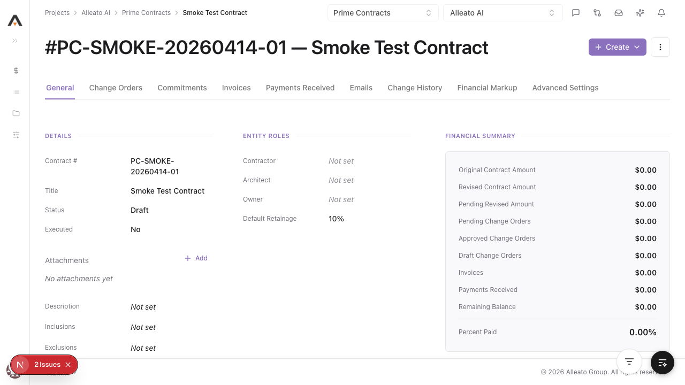
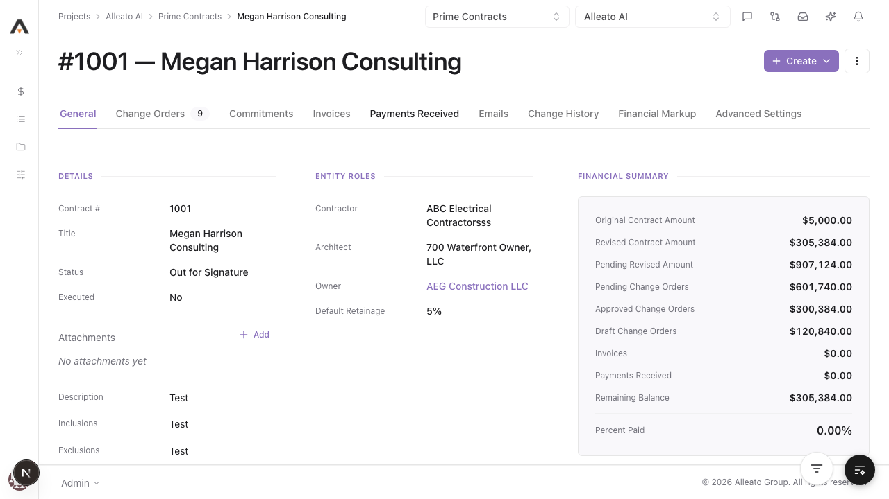
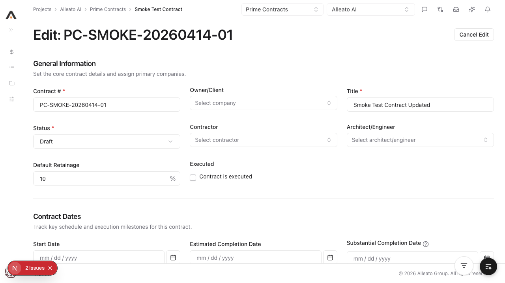
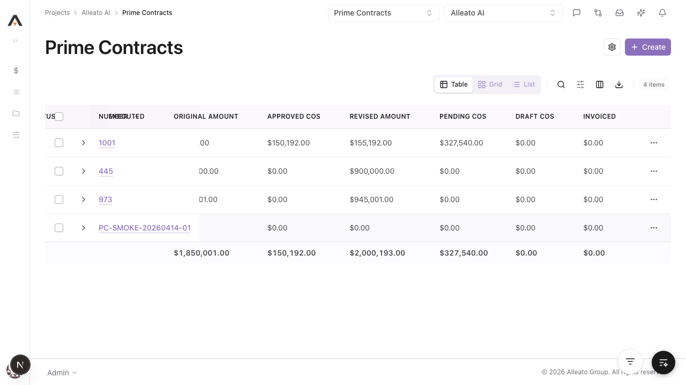
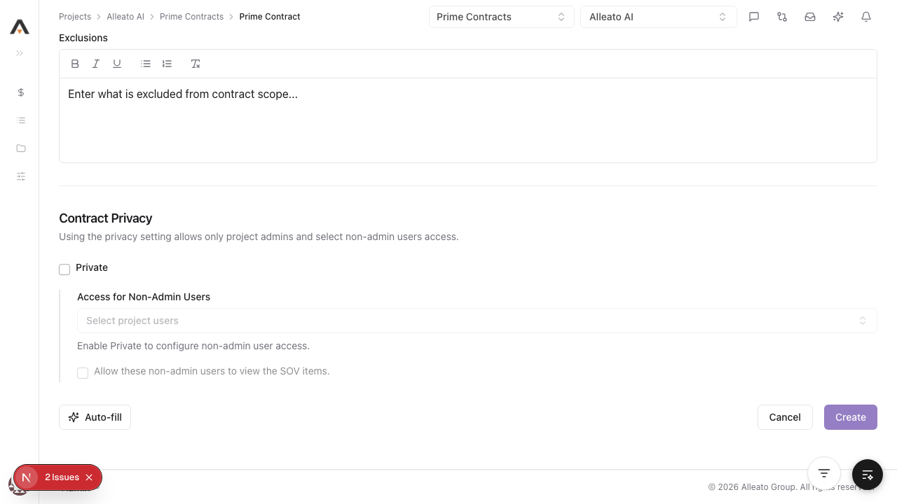
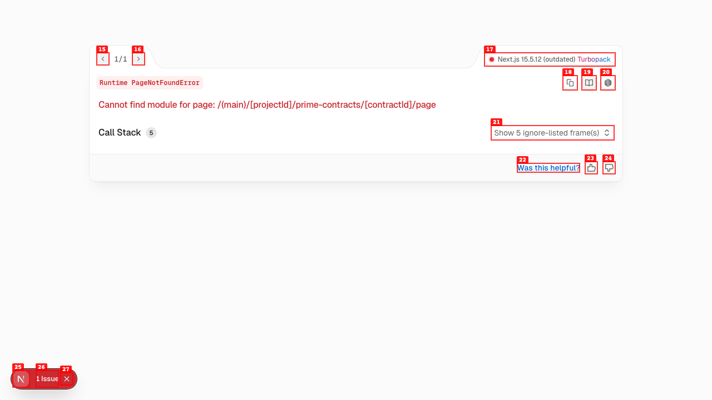

# Smoke Test Report: prime-contracts

| Field | Value |
|-------|-------|
| **Date** | 2026-04-14 |
| **Tool** | prime-contracts |
| **Project** | 767 |
| **URL** | http://localhost:3002/767/prime-contracts |
| **Verdict** | PARTIAL |
| **Duration** | ~18m |

---

## Summary

| Check | Count | Pass | Fail | Verdict |
|-------|-------|------|------|---------|
| API Endpoints | 8 | 8 | 0 | PASS |
| Page Loads | 4 | 3 | 1 | PARTIAL |
| Visual / Design Smoke | 4 | 4 | 0 | PASS |
| CRUD Tests | 4 | 4 | 0 | PASS |
| DB Validation | 3 | 3 | 0 | PASS |
| Negative Path | 1 | 1 | 0 | PASS |

---

## API Health

| Endpoint | Method | Status | Expected | Verdict |
|----------|--------|--------|----------|---------|
| `/api/projects/767/contracts` | GET | 200 | 200 | PASS |
| `/api/projects/767/contracts/settings` | GET | 200 | 200 | PASS |
| `/api/projects/767/contracts/d0132bca-0b0a-498d-aa1b-7114ff43d9e4` | GET | 200 | 200 | PASS |
| `/api/projects/767/contracts/d0132bca-0b0a-498d-aa1b-7114ff43d9e4/line-items` | GET | 200 | 200 | PASS |
| `/api/projects/767/contracts/d0132bca-0b0a-498d-aa1b-7114ff43d9e4/change-orders` | GET | 200 | 200 | PASS |
| `/api/projects/767/contracts/d0132bca-0b0a-498d-aa1b-7114ff43d9e4/payment-applications` | GET | 200 | 200 | PASS |
| `/api/projects/767/contracts/d0132bca-0b0a-498d-aa1b-7114ff43d9e4/payments` | GET | 200 | 200 | PASS |
| `/api/projects/767/contracts/d0132bca-0b0a-498d-aa1b-7114ff43d9e4/attachments` | GET | 200 | 200 | PASS |

---

## Page Loads

| Page | URL | Loaded | JS Errors | Screenshot | Verdict |
|------|-----|--------|-----------|------------|---------|
| List | `/767/prime-contracts` | Yes | Agentation connection warnings only | `screenshots/list.png` | PASS |
| New | `/767/prime-contracts/new` | Yes | None blocking | `screenshots/new.png` | PASS |
| Configure | `/767/prime-contracts/configure` | Yes | None blocking | `screenshots/configure-error.png` | PASS |
| Detail | `/767/prime-contracts/d0132bca-0b0a-498d-aa1b-7114ff43d9e4` | Intermittent | Runtime `PageNotFoundError` observed on first hit in dev | `screenshots/detail-error.png` | FAIL |

---

## Visual / Design Smoke

| Page | Overlap | Truncation | Hidden/Broken Controls | Spacing/Layout | Screenshot | Verdict |
|------|---------|------------|--------------------------|----------------|------------|---------|
| List | None observed | None blocking | Controls visible | Clean table layout | `screenshots/list.png` | PASS |
| New | None observed | None blocking | Form controls visible | Clean section spacing | `screenshots/new.png` | PASS |
| Configure | None observed | None blocking | Settings controls visible | Clean settings layout | `screenshots/configure-error.png` | PASS |
| Detail tabs | None observed | None blocking | Tabs clickable | Stable layout once loaded | `screenshots/detail-tabs.png` | PASS |

---

## CRUD Tests

### Create

**Test:** 1.1.1 Create a contract with required fields only  
**Result:** PASS  
**Screenshot:** 

**Form Completion Coverage:**

| Field | Type | Filled In UI | Value Entered | Persisted |
|-------|------|--------------|---------------|-----------|
| Contract # | Text | Yes | `PC-SMOKE-20260414-01` | Yes |
| Title | Text | Yes | `Smoke Test Contract` | Yes |
| Status | Select | Defaulted | `Draft` | Yes |
| Default Retainage | Number | Defaulted | `10` | Yes |

**DB Validation:**

| Field | Value Entered | DB Value | Match |
|-------|--------------|----------|-------|
| `contract_number` | `PC-SMOKE-20260414-01` | `PC-SMOKE-20260414-01` | Yes |
| `title` | `Smoke Test Contract` | `Smoke Test Contract` | Yes |
| `status` | `Draft` | `draft` | Yes |
| `retention_percentage` | `10` | `10` | Yes |

### Read / Detail

**Result:** PASS  
**Screenshot:** 

### Edit

**Result:** PASS  
**Pre-fill check:** All editable controls show saved values? YES  
**Screenshot:** 

### Delete

**Result:** PASS  
**Screenshot:** 

---

## Negative Path

**Empty form submit:** PASS  
**Screenshot:** 

---

## Failures

### FAILURE-001: First-hit detail/API route compilation failure in Next dev

| Field | Value |
|-------|-------|
| **Phase** | Page / API |
| **Severity** | medium |
| **What happened** | On the first hit to contract detail-related routes, Next dev returned `500` with `Runtime PageNotFoundError` / `Cannot find module for page` for both the detail page and several `/api/projects/767/contracts/...` endpoints. After the modules compiled, the same endpoints returned `200`. |
| **Expected** | First-hit navigation and API reads should succeed without transient 500s. |

**Cause:** Turbopack/Next dev intermittently served contract route requests before the route module was available.  
**Detection gap:** No startup/readiness check exercises prime-contract detail routes before manual testing begins.  
**Prevention step:** Add a route warm-up or browser smoke bootstrap that loads prime-contract detail and nested API routes after dev startup, and fail loudly if any first-hit request returns `500`.

**Screenshot:** 

### FAILURE-002: List view stays stale immediately after delete until refresh

| Field | Value |
|-------|-------|
| **Phase** | CRUD |
| **Severity** | medium |
| **What happened** | Deleting the smoke contract returned `404 Contract not found` on follow-up fetch as expected, but the list still showed the deleted row until a manual reload. After reload, the row disappeared and the count dropped from `4` to `3`. |
| **Expected** | The deleted row should disappear from the list immediately after a successful delete. |

**Cause:** The delete mutation succeeded server-side, but the list query did not invalidate/refetch before the page was re-rendered.  
**Detection gap:** The smoke path did not have a post-delete assertion tied to the visible row count until manual verification.  
**Prevention step:** Invalidate the prime-contracts list query on delete success and add a UI test asserting the row disappears without a manual refresh.

**Screenshot:** 

---

## Test Matrix Coverage

| Matrix Test ID | Name | Executed | Result |
|---------------|------|----------|--------|
| 1.1.1 | Create a contract with required fields only | Yes | PASS |
| 1.1.3 | Create fails when title is missing | Yes | PASS |
| 1.1.4 | Create fails when contract number is missing | Yes | PASS |
| 1.2.1 | Edit header fields | Yes | PASS |
| 1.2.5 | Edit opens pre-filled with saved values | Yes | PASS |
| 1.3.1 | Delete a single contract from list | Yes | PASS |
| 2.1.1 | List view loads with correct columns | Yes | PASS |
| 2.3.1 | Detail view loads all tabs | Yes | PASS |
| 5.1.1 | SOV table renders on General tab | Yes | PASS |

---

## Next Steps

- Investigate and harden first-hit route readiness in Next dev for prime-contract detail and nested API routes.
- Invalidate/refetch the list query after delete so the row removal is visible without manual reload.
- Re-run `/smoke-test prime-contracts` after those two fixes to confirm the verdict moves from PARTIAL to PASS.
