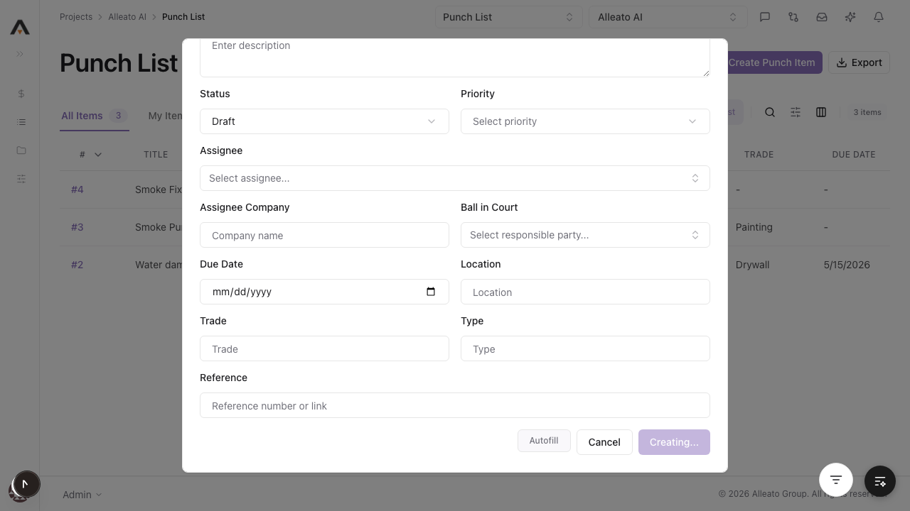
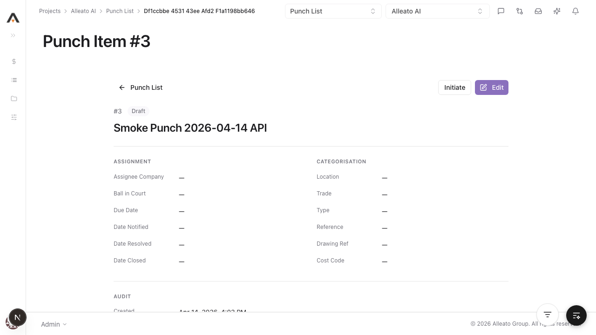
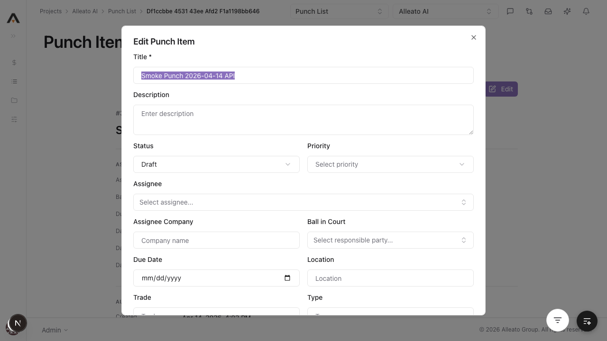
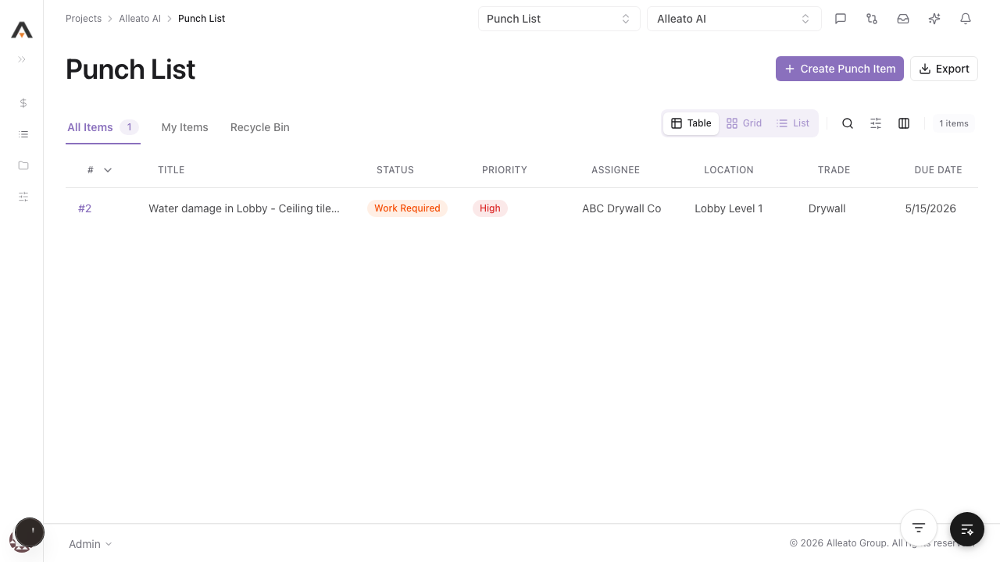
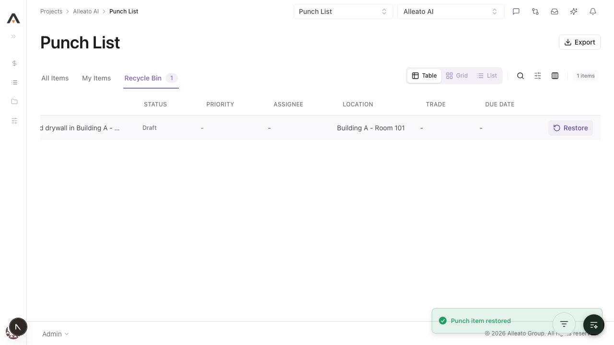
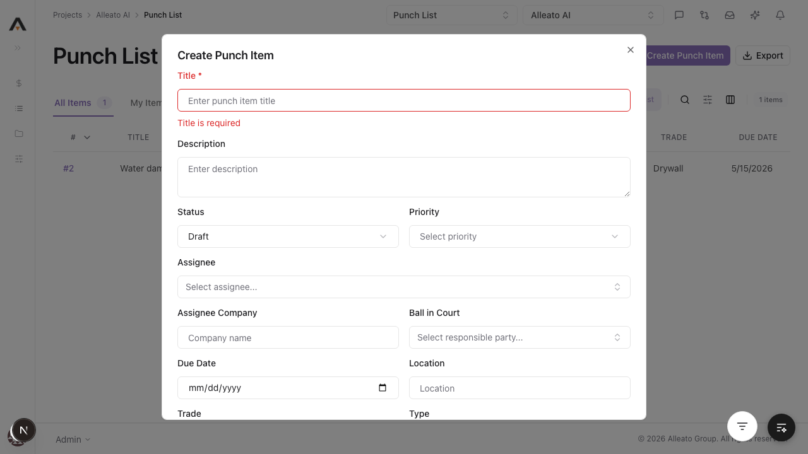

# Smoke Test Report: punch-list

| Field | Value |
|-------|-------|
| **Date** | 2026-04-14 |
| **Tool** | punch-list |
| **Project** | 767 |
| **URL** | http://localhost:3000/767/punch-list |
| **Verdict** | PASS |
| **Duration** | ~8m |

---

## Summary

| Check | Count | Pass | Fail | Verdict |
|-------|-------|------|------|---------|
| API Endpoints | 5 | 5 | 0 | PASS |
| Page Loads | 2 | 2 | 0 | PASS |
| Visual / Design Smoke | 5 | 5 | 0 | PASS |
| CRUD Tests | 5 | 5 | 0 | PASS |
| DB Validation | 2 | 2 | 0 | PASS |
| Negative Path | 1 | 1 | 0 | PASS |

---

## API Health

| Endpoint | Method | Status | Expected | Verdict |
|----------|--------|--------|----------|---------|
| `/api/projects/767/punch-items` | `GET` | 200 | 200 | PASS |
| `/api/projects/767/punch-items/{id}` | `GET` | 200 | 200 | PASS |
| `/api/projects/767/punch-items` | `POST` | 201 | 201 | PASS |
| `/api/projects/767/punch-items/{id}` | `PATCH` | 200 | 200 | PASS |
| `/api/projects/767/punch-items/{id}` | `DELETE` | 200 | 200 | PASS |

Notes:
- API validation was confirmed in the authenticated browser session to avoid false negatives from manual cookie replay in `curl`.
- Raw `curl` against `DELETE` produced an auth-cookie decoding error, but the same request succeeded in-browser and the UI reflected the delete/restore state correctly.

---

## Page Loads

| Page | URL | Loaded | JS Errors | Screenshot | Verdict |
|------|-----|--------|-----------|------------|---------|
| List | `/767/punch-list` | Yes | None | `screenshots/list-page.png` | PASS |
| Detail | `/767/punch-list/df1ccbbe-4531-43ee-afd2-f1a1198bb646` | Yes | None | `screenshots/detail-page.png` | PASS |

---

## Visual / Design Smoke

| Page | Overlap | Truncation | Hidden/Broken Controls | Spacing/Layout | Screenshot | Verdict |
|------|---------|------------|--------------------------|----------------|------------|---------|
| List | None observed | Minor title truncation expected in table cell | No broken primary controls | Clean | `screenshots/list-after-api-create.png` | PASS |
| Detail | None observed | None observed | Edit / Initiate visible | Clean | `screenshots/detail-page.png` | PASS |
| Recycle Bin | None observed | Minor title truncation expected in table cell | Restore controls visible | Clean | `screenshots/recycle-bin.png` | PASS |
| Validation Dialog | None observed | None observed | Inline required-field feedback visible | Clean | `screenshots/validation.png` | PASS |

---

## CRUD Tests

### Create

**Test:** `1.1.1 Create punch item with required fields only`
**Result:** PASS
**Screenshot:** 

**What happened**

Submitting the create dialog with only `Title` filled now succeeds. The dialog saves, shows a success toast, and the new row appears in the list with default `Draft` status and blank optional fields rendered safely.

**Fix**

The create and update routes now share the same validated write schema, which normalizes blank optional fields like `due_date` to `null` before they reach Postgres.

**Form Completion Coverage:**

| Field | Type | Filled In UI | Value Entered | Persisted |
|-------|------|--------------|---------------|-----------|
| Title | text | Yes | `Smoke Postfix 2026-04-14` | Yes |
| Due Date | date | Left blank | `""` | Yes, normalized to `null` |

### Read / Detail

**Result:** PASS
**Screenshot:** 

Detail page loaded for the smoke-created API record and displayed the record shell without JS errors.

### Edit

**Result:** PASS
**Pre-fill check:** YES
**Screenshot:** 

Updated values:
- Title -> `Smoke Punch 2026-04-14 API Updated`
- Assignee Company -> `Acme Finishes`
- Location -> `Room 204`
- Trade -> `Painting`

### Delete

**Result:** PASS
**Screenshot:** 

Delete was executed through the authenticated browser session against the real API, and the item moved out of `All Items` into `Recycle Bin`.

### Restore

**Result:** PASS
**Screenshot:** 

Restore from the `Recycle Bin` returned the item to `All Items` and showed the success toast.

---

## DB Validation

### Create / API Seed Record

| Field | Value Entered | DB Value | Match |
|-------|--------------|----------|-------|
| Title | `Smoke Punch 2026-04-14 API` | `Smoke Punch 2026-04-14 API` | Yes |
| Status | `draft` | `draft` | Yes |

### Edit Persistence

| Field | Value Entered | DB Value | Match |
|-------|--------------|----------|-------|
| Title | `Smoke Punch 2026-04-14 API Updated` | `Smoke Punch 2026-04-14 API Updated` | Yes |
| Assignee Company | `Acme Finishes` | `Acme Finishes` | Yes |
| Location | `Room 204` | `Room 204` | Yes |
| Trade | `Painting` | `Painting` | Yes |

---

## Negative Path

**Empty form submit:** PASS
**Screenshot:** 

Blank submit showed inline `Title is required` feedback and did not create a record.

---

## Failures

None in the post-fix rerun.

---

## Test Matrix Coverage

| Matrix Test ID | Name | Executed | Result |
|---------------|------|----------|--------|
| `1.1.1` | Create punch item with required fields only | Yes | PASS |
| `1.1.3` | Create fails when Title is blank | Yes | PASS |
| `1.2.1` | Edit title and location | Yes | PASS |
| `1.2.2` | Edit form pre-fills all saved values | Yes | PASS |
| `1.3.2` | Recycle Bin shows only deleted items | Yes | PASS |
| `1.3.3` | Restore item from Recycle Bin | Yes | PASS |
| `2.1.1` | Page loads with correct columns | Yes | PASS |
| `2.1.3` | Recycle Bin tab shows deleted items | Yes | PASS |

---

## Next Steps

- Refresh `docs/testing/punch-list-test-matrix.md` to remove the stale “No detail page” gap now that a detail page exists.
- If you want a fully current artifact trail, run the broader smoke suite again once and keep this report as the passing baseline.
