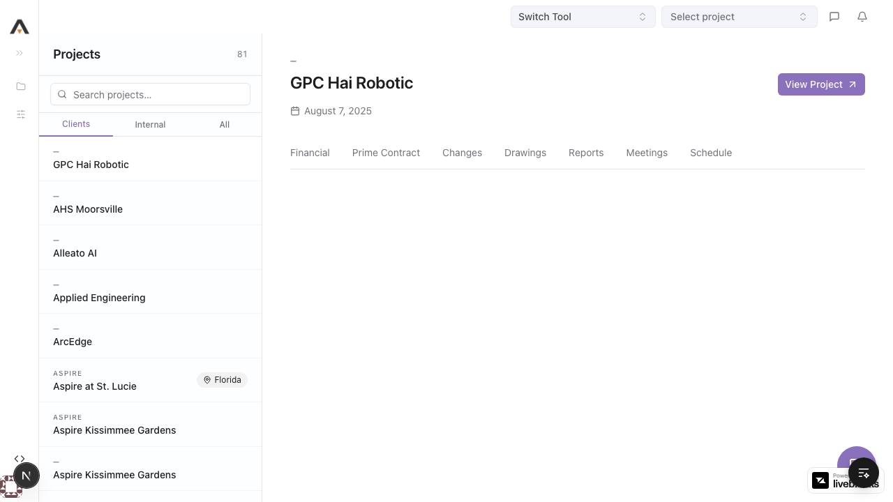
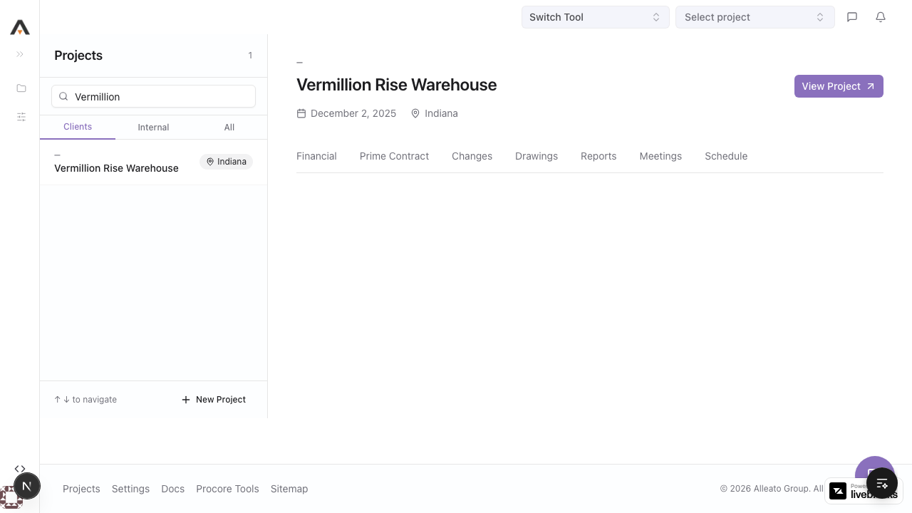
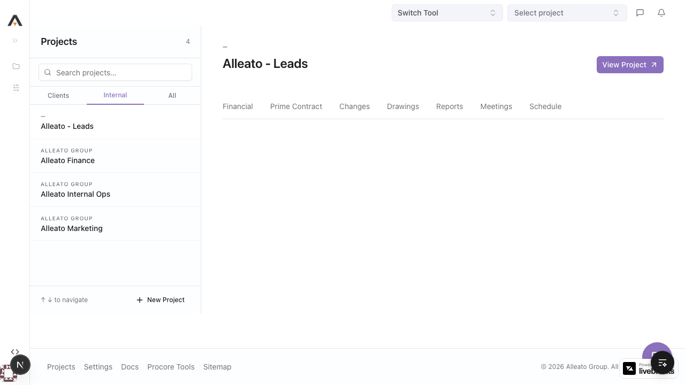
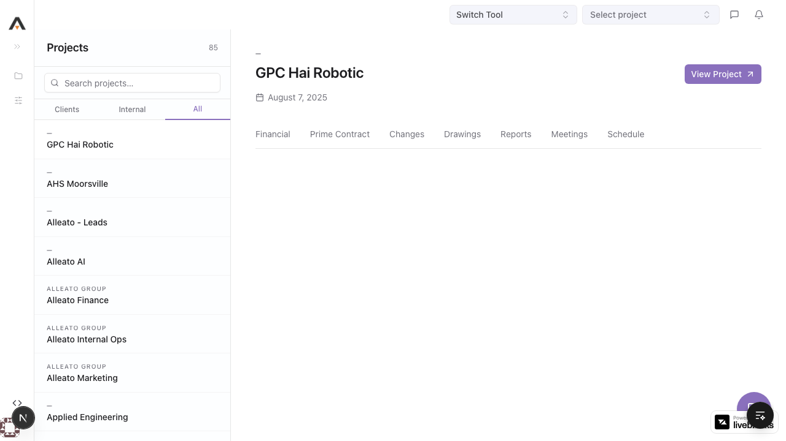
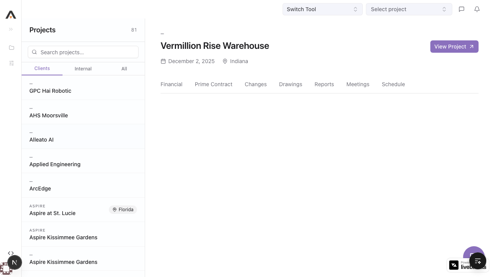
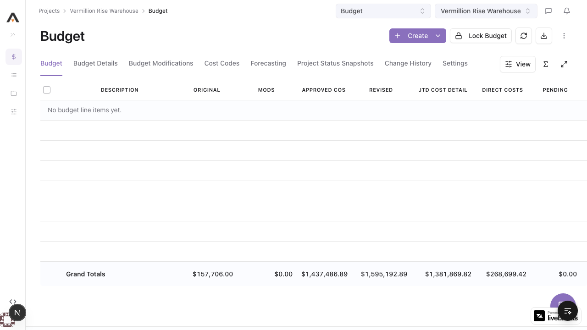
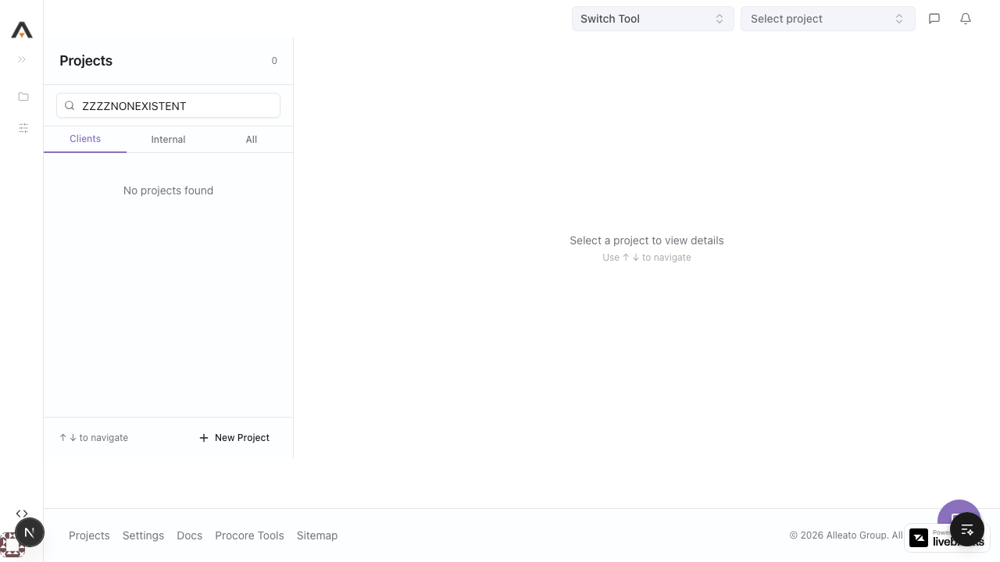
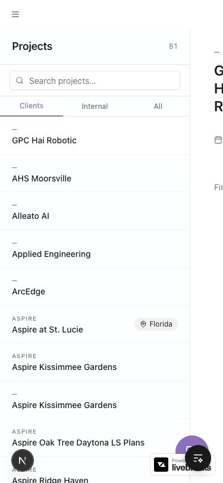

# Feature Verification: Project Homepage

**Date:** 2026-03-22
**Feature URL:** http://localhost:3000/
**Status:** ⚠️ PARTIAL PASS

---

## Summary

| Check | Result |
|-------|--------|
| User Flows | 6/7 passing correctly |
| Sub-features Tested | Search, scope tabs, project selection, navigation tabs, empty state, footer |
| Database Validation | N/A (read-only page, data verified via API) |
| API Health | GET /api/projects works (81 client + 4 internal = 85 total) |
| Design System | Passes all critical checks — no hardcoded colors, no arbitrary spacing violations, no forbidden shadows |
| Console Errors | 1 React key warning, 2 unrelated 500 errors (budget page, not homepage) |
| Issues Found | 0 critical · 0 high · 2 medium · 1 low |
| Issues Fixed | 0 (no critical/high issues) |

---

## Flow Results

### Flow 1: Page Load & Auto-selection
**Expected:** Projects list loads, first project auto-selected, detail panel shows
**Actual:** Page loads with 81 projects (Clients scope), "GPC Hai Robotic" auto-selected, detail panel shows name, date, location, View Project button, and 7 feature tabs
**Verdict:** ✅ PASS

**Screenshot:** 

---

### Flow 2: Search
**Expected:** Typing filters list in real-time, counter updates
**Actual:** Searching "Vermillion" filtered to 1 result, counter updated to "1", detail panel updated to show Vermillion Rise Warehouse with correct metadata (December 2, 2025 · Indiana)
**Verdict:** ✅ PASS

**Screenshot:** 

---

### Flow 3: Scope Tabs (Clients / Internal / All)
**Expected:** Each tab filters correctly, counter updates
**Actual:**
- **Clients:** 81 projects (default)
- **Internal:** 4 projects (Alleato - Leads, Alleato Finance, Alleato Internal Ops, Alleato Marketing)
- **All:** 85 projects (81 + 4)
- Active tab styled with underline, counter updates correctly
**Verdict:** ✅ PASS

**Screenshots:**
- 
- 

---

### Flow 4: Project Selection
**Expected:** Clicking a project updates right panel with correct details
**Actual:** Clicked "Vermillion Rise Warehouse" → right panel updated with correct name, date (December 2, 2025), location (Indiana), View Project button, and all 7 feature tabs. List scrolled to show selected project.
**Verdict:** ✅ PASS

**Screenshot:** 

---

### Flow 5: Navigation Tabs
**Expected:** Clicking a feature tab navigates to the correct project route
**Actual:** Clicked "Financial" tab → navigated to `/67/budget` (correct project ID for Vermillion Rise Warehouse). Budget page loaded with correct breadcrumbs and data.
**Verdict:** ✅ PASS

**Screenshot:** 

---

### Flow 6: Empty Search State
**Expected:** No-match search shows empty messages, New Project still accessible
**Actual:** Searching "ZZZZNONEXISTENT" showed:
- Counter: "0"
- Left panel: "No projects found"
- Right panel: "Select a project to view details" with "Use ↑ ↓ to navigate" hint
- "New Project" button remained accessible in footer
**Verdict:** ✅ PASS

**Screenshot:** 

---

### Flow 7: Mobile Responsive Layout
**Expected:** Two-panel layout adapts gracefully to mobile viewport (375×812)
**Actual:** Right panel partially visible and overlapping on the right edge. Both panels try to render side by side, causing the detail panel to peek in from the right. Not a usable mobile experience.
**Verdict:** ❌ FAIL

**Screenshot:** 

---

## Console Analysis

| Type | Message | Severity | Homepage-related? |
|------|---------|----------|-------------------|
| Error | `Each child in a list should have a unique "key" prop` in `MainLayout` | Medium | Yes — in the main layout component |
| Error | `Failed to load resource: 400` | Low | Unknown origin |
| Error | `Budget data fetch error: HTTP 500` | N/A | No — occurs on budget page navigation |
| Error | `Failed to load resource: 500` (×2) | N/A | No — occurs on budget page |

---

## Design System Audit

### Code Audit Results

| Check | Result |
|-------|--------|
| Hardcoded colors (bg-gray, text-gray, bg-white, etc.) | ✅ None found |
| Arbitrary spacing (p-[N], m-[N], gap-[N]) | ✅ None found |
| Forbidden shadows (shadow-md, shadow-lg, shadow-xl) | ✅ None found |
| Deprecated page patterns (ProjectToolPage, DataTablePage) | ✅ None found |
| Chat UI violations (Bot icon, Minimize2) | ✅ None found |

### Component Usage

| Component | Usage | Correct? |
|-----------|-------|----------|
| `Button` from `@/components/ui/button` | View Project, New Project | ✅ |
| `Badge` from `@/components/ui/badge` | State location badges | ✅ |
| `Input` from `@/components/ui/input` | Search field | ✅ |
| `cn()` from `@/lib/utils` | Conditional classes | ✅ |
| `Link` from `next/link` | Feature tab navigation | ✅ |

### Color Tokens

| Element | Token Used | Compliant? |
|---------|-----------|------------|
| Background | `bg-background`, `bg-muted/40` | ✅ |
| Text | `text-foreground`, `text-muted-foreground` | ✅ |
| Borders | `border-border`, `border-border/40` | ✅ |
| Hover | `hover:bg-muted/70`, `hover:text-foreground` | ✅ |

### Notes
- Page does NOT use `PageShell` — uses custom two-panel layout. This is acceptable since the homepage is a unique layout that doesn't fit any `PageShell` variant.
- Eyebrow text uses `text-[10px] tracking-[0.1em]` — matches the `Eyebrow` component pattern from the design system, acceptable.

---

## Issues

### ISSUE-001 — Mobile layout overflow — MEDIUM — OPEN

**What should happen:** On mobile (375×812), the homepage should either show only the project list (with detail panel accessible via tap) or stack the panels vertically.
**What actually happened:** Both panels render side-by-side at fixed widths, causing the right detail panel to partially overflow and peek in from the right edge. The layout is not usable on mobile.
**Why this matters:** Mobile users cannot effectively use the homepage. The detail panel is partially visible but not interactive.

**Screenshot:** 

---

### ISSUE-002 — React key warning in MainLayout — MEDIUM — OPEN

**What should happen:** All list children should have unique `key` props.
**What actually happened:** Console error: `Each child in a list should have a unique "key" prop. Check the render method of MainLayout.`
**Why this matters:** Missing keys can cause rendering bugs and performance issues with React's reconciliation algorithm. While not visually broken today, it indicates a code quality issue in the layout component.

---

### ISSUE-003 — No visual highlight on selected project row — LOW — OPEN

**What should happen:** The currently selected project row in the left panel should have a clearly visible selected state (e.g., distinct background color, left border accent).
**What actually happened:** The selected row uses `bg-background` while unselected rows also appear to have a similar background. The visual distinction between selected and unselected rows is subtle — the selected state is hard to identify at a glance, especially when scrolled away from the row.
**Why this matters:** Users may lose track of which project is currently selected, especially when scrolling through a long list.

---

## Recommendations

1. **MEDIUM — Fix mobile layout (ISSUE-001):** Add responsive breakpoints to hide the right panel on mobile and show it as a full-screen overlay or stacked view when a project is selected. Consider using the existing sidebar pattern for mobile.

2. **MEDIUM — Fix React key warning (ISSUE-002):** Check `frontend/src/app/(main)/layout.tsx` for list renders missing key props.

3. **LOW — Improve selected row contrast (ISSUE-003):** Consider using `bg-muted` or adding a left border accent (`border-l-2 border-primary`) on the selected row to make the selection state more obvious.

---

## Video

[Homepage flows recording](videos/homepage-flows.webm)
